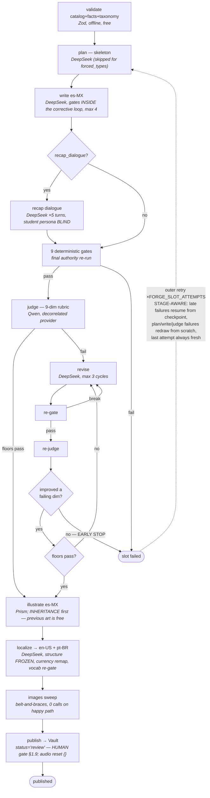
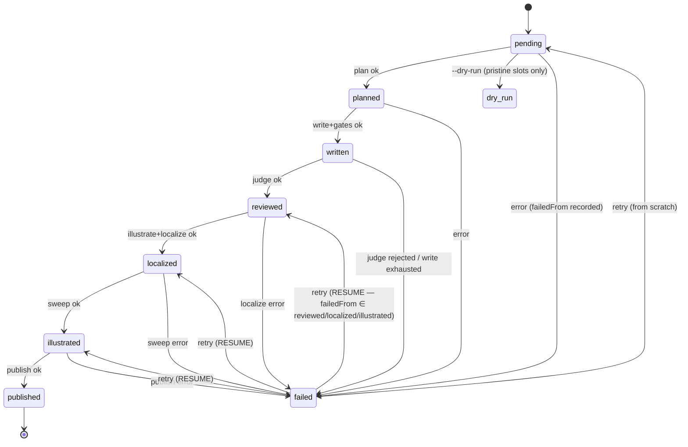
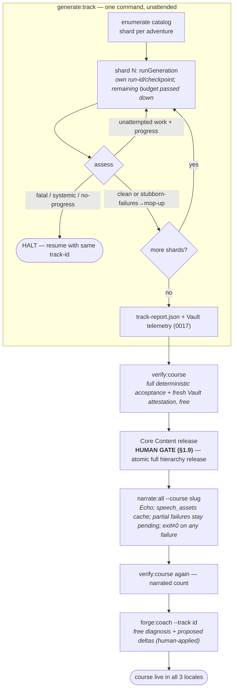

# COURSE_ENGINE.md — Forge: the Course & Lesson Generation Engine

> **Authority:** engine spec doc (level 6 in /AGENTS.md §1.1), sibling of
> /LESSON_ENGINE.md. Authoritative for the content hierarchy, the curriculum
> catalog format, the generation pipeline, its quality gates and its providers.
> The lesson DOCUMENT contract itself lives in /LESSON_ENGINE.md — Forge
> produces documents that validate against it, byte for byte.
>
> **Status:** v1 — hierarchy live in Vault (0007), pipeline implemented in
> `coursegen/`, three production course catalogs authored (`financial-education`,
> `entrepreneurship`, `investing`) with per-course competency graphs wired into
> PLAN → WRITE → REVIEW prompts.
> Generation runs are OPERATOR-TRIGGERED (CLI) and cost real money — they are
> never started by CI or by any automatic process (/AGENTS.md sign-off rule).
> **Last updated:** 2026-08-09 · Language: English (project rule).

---

## §1 Design synthesis (where each idea comes from)

| Source | What Forge adopts |
|---|---|
| LF-Business coursegen | Two-call author protocol (PLAN → WRITE), palette prompt rendered from the type taxonomy, zod-gated corrective retries, deterministic plan repair before burning tokens, per-lesson checkpoint/resume, token budget kill-switch, cost ledger per call |
| LF-Brain | Closed taxonomy YAML validated by schema, `catalog` as a coverage oracle (generation stops when every slot is filled, not at N megabytes), **Piaget vocabulary hard-gates**, `facts.yaml` canonical ground truth (never trust the model with a number), deterministic-first gate cascade, independent-provider judge to decorrelate errors |
| LittleFounders v1 | The Adventures narrative spine (worlds as progression), curriculum blueprint fields (concept / objective / vocabulary / prior knowledge / micro-objective per lesson), and its FAILURES: hierarchy must be DB data (never hardcoded dicts), XP must be real, unlock rules must be server-computed in exactly one place |
| [Duolingo method](https://blog.duolingo.com/duolingo-teaching-method/) + [spaced-repetition research](https://research.duolingo.com/papers/settles.acl16.pdf) | Compact interactive practice, evidence-driven review, and delayed retrieval rather than completion-as-mastery |
| [Brilliant learning paths](https://brilliant.org/help/features/what-are-learning-paths/) | Foundation-before-transfer sequencing and explicit progress evidence for the responsible adult or educator |
| [Little Language Lessons](https://blog.google/products-and-platforms/products/education/little-language-lessons/) | Contextual micro-practice is useful, but generated content remains inside structured contracts and independent validation |
| [Understand Anything](https://github.com/Egonex-AI/Understand-Anything) + [Marble taxonomy](https://github.com/withmarbleapp/os-taxonomy) | Separate deterministic orchestration from semantic generation; use prerequisite-graph patterns only, never third-party taxonomy content or licenses as a hidden curriculum corpus |

What Forge deliberately does NOT have: RAG over uploaded documents. Our niche
advantage is that the **catalog + facts ARE the ground truth** — curated,
versioned, reviewed. The grounding rule is "nothing that isn't derivable from
the blueprint, the facts table and the character canon."

## §2 Content hierarchy (Vault, migration 0007)

```
courses ── adventures ── sagas ── topics ── lessons ── lesson_documents (×3 locales)
```

- Every level is a REAL table with `position`, `slug`, per-locale `title`
  (jsonb `{en-US,es-MX,pt-BR}`) and `status`. No hardcoded taxonomy anywhere.
- `adventures.theme` — closed, extensible scene id (`archipelago | forest |
  city | valley | kingdom | cosmos`) rendered by the frontend's data-driven
  scene registry (CSS-drawn worlds, v1 heritage, Arcade-styled).
- `topics` carry the pedagogy: `concept_md`, `learning_objective`,
  `key_vocabulary`, `prior_knowledge` (all jsonb per-locale).
- `lessons` carry play metadata: `xp_total`, `estimated_minutes`,
  `difficulty`, `cast`. `lesson_documents(lesson_id, locale)` carries the
  split contract: `document` (client-safe, stripped) + `answer_keys`
  (server-only: `{segment_id → answer}`; **no RLS SELECT policy exists for
  it — service-role only**, Core grades with it).
- `lesson_progress(user_id, lesson_id)`: `best_score`, `passed`, `attempts`,
  `xp_earned`, `completed_at`. Core is the only writer; completing a lesson
  also feeds `learning_stats` (XP/minutes/lessons/streak).
- **Unlock rule (single source of truth = Core):** lessons unlock strictly in
  global order (adventure → saga → topic → lesson position); the "next lesson"
  pointer is the first non-passed lesson; everything before it stays
  replayable; an adventure unlocks when every lesson of the previous one is
  passed. No client re-derivation — the course-tree endpoint returns
  `locked/available/current/passed` per node.

## §3 The curriculum catalog (coverage oracle)

Lives in `coursegen/curriculum/<course-slug>/`, YAML, Zod-validated
(`npm run catalog:check` in coursegen):

- **`taxonomy.yaml`** — closed vocabulary: themes, age tiers, subjects, and
  the **forbidden-vocabulary lists per age tier per locale** (Piaget gate;
  tier1 6-7 y tier2 8-10 forbid: porcentaje/interés compuesto/deuda/crédito/
  acciones/inversión…, with en-US and pt-BR equivalents). HARD-FAIL gate.
- **`facts.yaml`** — canonical numeric ground truth (MXN/USD/BRL denominations,
  reference prices for kid-world goods, simple-interest examples used by
  `interest_peek`). Every number in a generated money exercise must either
  come from here or be pure arithmetic the gate can re-verify.
- **`catalog.yaml`** — the complete map: course → adventures (8) → sagas (4
  each) → topics (~6 per saga) → lesson blueprints (4 per topic). Blueprint =
  `{ position, slug, micro_objective, concept_ids, suggested_families,
  difficulty, narrative_beat }`. **8×4×6×4 ≈ 768 lesson slots ≈ one lesson a
  day for ~2 years.** The catalog is the STOP CONDITION: a run is complete
  when every slot has a published document ×3 locales, never before.

### §3.0 Course badge identity (mandatory release contract)

Every planned course MUST define its own badge in `catalog.yaml`:

```yaml
course:
  slug: financial-education
  badge_asset: course-badges/financial-education.png
```

The value must be exactly `course-badges/<course-slug>.png`. The developer
supplies the corresponding asset in `frontend/public/course-badges/`; Forge's
`catalog:check` fails when the field is missing or does not match the slug.
Core persists the asset path with the course and exposes it to Learn and public
profiles. A published course must have a non-null badge path in Vault.

The badge is not merely decoration: it is the stable course identity shown on
course cards, the featured-course composition, course orientation, and a
learner's public completion collection. Core grants the completion badge only
after every currently non-archived lesson in that course has a passed
`lesson_progress` record. Badge assets are read-only media; replacing one is a
deliberate product change and must preserve the stable slug/path contract.

### §3.1 Spaced-review layer (pedagogy: spacing effect + retrieval practice + interleaving)

> **Enforced, not assumed.** `src/catalog/progression.ts` (run inside
> `catalog:check`) proves a catalog describes a LEARNABLE path before any paid
> call: it opens at difficulty 1 (`cold-start`), never jumps difficulty by more
> than one step across the whole walk including saga seams (`ramp-cliff`), every
> teaching saga is retrieved again at more than one distinct distance with the
> first retrieval inside 12 topics (`retention-*`), no more than 4 consecutive
> lessons share a shape (`monotony`), and one topic never piles on more than 6
> facts or spans more than 2 difficulty steps. Measured over the authored corpus
> — 4,254 blueprints, 4 courses — 0 errors, 1 warning.

Review is DERIVED content — every review blueprint cites the teaching topics it
consolidates (`review_of`), so Forge grounds it in already-validated concepts
and the quality floor is inherited, not re-invented. Review share is capped by
design at ~37% of the walk (the kid-optimal 25–35%+capstones band): doubling
the catalog with review alone would saturate learners — if the catalog must
grow past this, grow TEACHING breadth (e.g. tier2 sagas 6→8 topics), never the
review ratio.

Three rungs, all inside the existing worlds:

| Rung | Where | Shape | Kind |
|---|---|---|---|
| Repaso de saga | topics 7–8 of every saga | 7: "El Cofre del Repaso" — pure retrieval of the saga's 6 topics, light playful types (2–3 min). 8: "Reto Entrelazado" — interleaves this saga with EARLIER sagas/adventures | `review_spaced`, `review_interleaved` |
| La Gran Misión | saga 5 of every adventure | 6 topics × 4 lessons: cumulative narrative quest re-playing the whole world's concepts + callbacks to previous worlds; gentle difficulty, high celebration | saga `review`, topics `review_quest` |
| Natural spacing | emergent | a concept returns days later (rung 1), weeks later (rung 2), months later (later worlds' interleaved retos) | — |

Catalog fields: topics carry optional `kind: teaching | review_spaced |
review_interleaved | review_quest` (default `teaching`) and `review_of:
[topic/saga slug paths]` (required for review kinds; must resolve). Sagas carry
optional `kind: teaching | review`. Review lessons: difficulty ≤ teaching
median, `suggested_families` lean on story/choice/arrange/money/storyplay,
micro-objectives are RETRIEVAL objectives ("recuerda y aplica X sin re-enseñar").
The plan/write prompts receive the source topics' concepts and objectives and
the instruction "consolidate — never introduce new concepts".

### §3.1a Executable competency graph

`npm run graph:check` derives a stable DAG for every authored production
course (or `npm run graph:check -- <course-slug>` for one course) before any
provider call. Every topic becomes a competency node with
its age tier, objective, vocabulary, fact anchors and observable evidence;
teaching topics form the cold-start sequence, declared prerequisites become
hard/soft edges, and review citations become retrieval edges. The check fails
on a missing reference, duplicate, teaching topic without objective/vocabulary,
retrieval node without a source, or any cycle. It is an inspection and
validation layer, not a second content source or an inferred learner model.

The graph is operational, not decorative: Forge derives a compact incoming-edge
slice for each lesson topic and injects it into PLAN, WRITE and the independent
REVIEW judge. Hard prerequisites constrain what may be assumed, sequence edges
ground the opening in prior competencies, and retrieval edges require review
lessons to revisit their cited sources. The catalog remains the sole authored
curriculum authority; graph output is deliberately derived so an edit cannot
make the two sources silently diverge.

Current graph checks cover all three production courses. Financial Education
contains 328 topic competencies (216 teaching, 112 retrieval) and 1,015
validated edges; the other production courses are checked by the same loader
and prompt contract before generation.

**Totals:** tier1 adventures (1–5): 4 teaching sagas × 8 topics (6 teaching +
2 review) + review saga × 6 topics = 152 lessons each. tier2 adventures (6–8)
use the sanctioned teaching-breadth expansion — 8 teaching topics per saga
(review shifts to positions 9–10) = 184 lessons each. **Course total: 5×152 +
3×184 = 1,312 lessons (864 teaching + 448 review, 34% consolidation ≈ 3.6
years at 1/day).**

### §3.1b The course sequence (execution order)

| # | Course (slug) | Tier | Shape | Lessons | Requires |
|---|---|---|---|---|---|
| 1 | Educación Financiera (`financial-education`) | tier1×5 + tier2×3 | 5×152 + 3×184 | 1,312 (1,208 published — see note below) | — |
| 2 | Emprendimiento (`entrepreneurship`) | tier4×8 | 8×68 | 544 | financial-education |
| 3 | Inversiones (`investing`) | tier4×8 | 8×68 | 544 | financial-education, entrepreneurship |

- **PIVOT (2026-08-12/13, WALKTHROUGH decision log):** Emprendimiento e
  Inversiones were fully re-authored from tier1-3 (6-12) to a single new
  **tier4 (12-18)**, replacing their entire prior catalogs (never generated —
  0 rows in production for either course, so no learner content was lost).
  Owner rationale: Financial Education's language, while judged "good," read
  too young; tier4 asks for a matured register and real teen-anchored
  analogies (a subscription auto-renewing for compounding, a gig-app's payout
  cut for fees/margin, loot-box odds for risk/expected value, follower growth
  for compound growth) instead of Financial Education's storybook framing.
  Both courses also shrank from >1,400 lessons to a **450-550 target (544
  delivered)** — half the lessons-per-topic (2, not 4) on the assumption each
  lesson runs longer/denser (there is no literal duration field in the
  blueprint; density comes from richer `micro_objective`/`narrative_beat`,
  and Forge's write stage estimates `estimated_minutes` itself from the
  resulting document). Shape per adventure: 4 teaching sagas × (6 teaching
  topics + `review_spaced` + `review_interleaved`, 2 lessons/topic = 16) + 1
  review saga at position 5 (2 `review_quest` topics × 2 lessons = 4) = 68
  lessons × 8 adventures = 544/course. Both catalogs are `catalog:check`/
  `graph:check` clean (0 errors) and pass a `--require-images --dry-run` at
  $0 — authored, not yet generated (no paid Forge run executed).
- **tier4 (12-18, formal-operational, maturing toward adult reasoning):** the
  Piaget vocabulary ceiling is effectively OFF — full financial/business
  vocabulary is fair game (deuda, crédito, presupuesto, margen de negocio,
  ROI). The ONE exception, unchanged from this course's original tier3 and
  explicitly NOT relaxed for the 16-18 end of the band (owner decision): the
  investing-only hard ceiling on high-risk trading jargon — apalancamiento,
  derivados, opciones financieras, venta en corto, margen de crédito, trading
  intradía, forex, criptomonedas-como-inversión. Simulations only — nothing
  transactional, ever (§1.9/COPPA posture); one full adventure in each course
  is dedicated to safety (business-deal red flags for Emprendimiento,
  investment-fraud literacy for Inversiones). See `contentPlaybook.ts`
  `tierReasoningGuidance('tier4')` for the full register/analogy brief
  injected into every write/judge prompt at this tier.
- **Known gap, not resolved by this pivot (flagged in ROADMAP.md):** a
  learner finishing Financial Education (~6-10) now has no course to start
  until 12 — Emprendimiento/Inversiones no longer cover the 10-12 band
  Inversiones' old tier3 used to serve. Product-sequencing decision pending.
- **`course.requires`** (catalog.yaml, optional `[course-slugs]`): the
  course-level prerequisite edge for future placement/unlock. Topic-level
  `prerequisites` paths stay within-course.
- `catalog:check` validates EVERY course directory under `coursegen/curriculum/`.

### §3.2 Concept metadata — mastery, placement and parent visibility

(Adapted from Marble's os-taxonomy patterns — structure only, no text reuse.)

- **`parent_check`** (optional, teaching topics; es-MX authoring locale): ONE
  natural-language mastery gut-check a parent can ask, with a `{{name}}`
  placeholder ("Si {{name}} recibiera dinero en su cumpleaños, ¿podría explicar
  por qué conviene guardar una parte?"). Surfaces in the future parent
  dashboard — a direct implementation of the §1.9 parent-visibility invariant.
- **`prerequisites`** (optional, topics): `[{path, strength: 'hard'|'soft',
  reason}]`. The linear walk already implies "previous lesson" as a hard edge —
  these entries model the NON-obvious edges, especially cross-domain ones
  (counting/arithmetic → money mechanics; reading a chart → red-flag audits),
  which curriculum graphs habitually under-model. Every edge carries a
  one-sentence human-readable `reason` (debuggability + judge grounding).
  `hard` = a true gate for future placement; `soft` = a sequencing nudge.
- These two fields power onboarding/placement (**built; rewritten 2026-08-24**):
  guest accounts start with zero signup friction (GoTrue anonymous sign-in),
  a one-time onboarding wizard activates day-1 streak, and a mandatory
  per-course **adaptive** placement quiz (`backend/src/services/placementAlgorithm.ts`).

  **The model.** A learner is one number: the frontier `k`, "knows the first
  `k` topics of the ordered teaching path". Placement is a binary search for
  `k` over pre-authored probes (`topics.placement_probe`, migration `0042`,
  authored offline by Forge — `coursegen/src/pipeline/placementProbe.ts` —
  never per learner, so no minor PII ever reaches a provider). Evidence is
  bounded strictly: `lo` = 1 + the highest index answered correctly, `hi` =
  the lowest index answered incorrectly, `k = min(lo, hi)`. Taking the MIN is
  what keeps a non-monotonic learner safe — evidence of NOT knowing always
  outranks evidence of knowing. `k` is then capped at the earliest `hard`
  prerequisite (`topics.prerequisites`) not satisfied by everything credited
  before it.

  **Signals are priors, never verdicts.** Age, education level, claimed level
  and the optional conversational intake decide exactly one thing: where the
  FIRST question is asked. They never enter `k`. For a learner whose answers
  are consistent with a single frontier the placement is identical whatever
  the signals said — asserted in `placementAlgorithm.test.ts`, because
  "placement is by knowledge, not by age" is a product promise.

  **The conversational intake** (`oracle/src/tutor/placementIntake.ts`, called
  by Core service-to-service) is offered to learners **12 and over only**, the
  /ORACLE.md §0 carve-out. It turns the learner's own words into one prior
  fraction; a model that hallucinates, or is talked into saying 1.0, moves one
  question and changes nothing else. It is OPTIONAL infrastructure: an Oracle
  that is down costs a nicer opening question and never a placement (§1.14).

  **The learner gets the last word.** The result screen offers to move the
  placement EARLIER (freely, down to zero) — never later than the evidence
  earned. A placement a learner cannot argue with is one they leave the
  product to escape.

  Skipped lessons are recorded in `placement_credits` (migration `0043`) —
  never a fabricated `lesson_progress` row, but they DO count toward
  course-completion badges and the progress bar (product decision).
  `backend/src/routes/learn.ts`'s `PLACEMENT_REQUIRED` 403 is the server-side
  enforcement; `frontend/src/routes/app/learn/PlacementPage.tsx` clears it.

  **What the rewrite replaced, and why it mattered.** The first version walked
  the topic list from the front administering up to 6 probes and credited the
  longest contiguous correct prefix — a hard ceiling of 6 topics out of 216
  (2.8%) for every learner, so an adult who answered everything correctly
  still started at topic 7. In production it never got that far: the authoring
  harness (`coursegen/src/scripts/author-publish.ts`) hardcoded
  `placementProbe: null`, so 871 topics carried ZERO probes and ZERO
  prerequisites, `computePlacement` took its `no_probe_content_fallback`
  branch for 5 of the 6 real placements — two of them adults who had declared
  themselves "confident" — and issued exactly zero credits in its lifetime.
  Backfilled by `npm run graph:backfill` (`coursegen/src/scripts/backfill-graph.ts`).

### §3.3 Audience registers (kids today, adults later)

The catalog's CONCEPTS are audience-agnostic; the RENDERING is not. `taxonomy.yaml`
declares `registers`: `kid` (default — age tiers + Piaget gates apply) and
`adult` (full 56-type palette, no vocabulary ceiling, tone: direct, respectful,
never infantilizing; anchors in real adult life — nómina, súper, renta,
comisiones). `npm run generate -- --register adult` regenerates the SAME
blueprints as a parallel course (slug `<course>-adultos`) — content is
REGENERATED per register, never filtered down or dressed up (a UI toggle that
hides fields and calls itself "adaptation" is the documented anti-pattern).
Piaget gates switch off for adult; the anti-genericity gate and judge stay.

### §3.4 Locale scalability

One document per locale, always. Adding locale N (e.g. fr-FR) touches exactly:
(1) Vault: widen the `lesson_documents.locale` CHECK (delta migration);
(2) frontend `LESSON_LOCALES` + i18n fragment directory; (3) `taxonomy.yaml`
forbidden-vocabulary lists for the new locale; (4) Forge `--locales` target +
Echo voice map env. Core's locale resolution (profile → authoring fallback)
needs no change. Verified serving today: en-US / es-MX / pt-BR each return
their own document for the same lesson when the profile locale changes.

Catalog authoring is human-reviewed content design. The Educación Financiera
catalog progression (ages 6→8):

| # | Adventure (theme) | Arc |
|---|---|---|
| 1 | El Archipiélago del Trueque (archipelago) | What money IS: wants, trading, why coins exist |
| 2 | El Bosque de la Abundancia (forest) | Earning: work, effort, first "chambitas" |
| 3 | La Aldea del Ahorro (valley) | Saving: goals, patience, piggy jars, safe places |
| 4 | El Mercado de los Colores (city) | Smart spending: needs vs wants, comparing, budgets |
| 5 | El Taller de los Inventores (workshop→valley scene) | Entrepreneurship: making, pricing, selling |
| 6 | El Faro de la Confianza (archipelago-night variant) | Safety: scams, ads, sharing, banks |
| 7 | El Jardín Compartido (forest variant) | Giving, community, taxes-as-cooperation (tier-safe) |
| 8 | El Cosmos del Mañana (cosmos) | Capstone: plans, dreams, review quests |

## §4 Pipeline

CLI-driven (`npm run generate -- --course financial-education [--slots a1-s1-t1-l1..] [--locales es-MX,en-US,pt-BR]`),
file-checkpointed (`coursegen/runs/<run-id>/checkpoint.json` — per-slot state:
`planned → written → reviewed → localized → illustrated → published |
failed`), resumable, idempotent (publish = upsert by slug).

### §4.0 Visual overview (mermaid)

**Per-slot pipeline** — every lesson walks this graph; LLM stages are marked,
everything else is deterministic:



**Slot state machine** (checkpoint; only `published` is terminal):



**Mass run (`generate:track`) + the fire-and-forget chain to market:**



The ONE human step in the chain is the Core release — deliberate and
non-negotiable (§1.9: kid-facing content is human-moderated before display).
It invokes Vault's `release_course` RPC, which holds the hierarchy in one
transaction and rejects a missing locale, non-review-ready lesson, incomplete
hierarchy, or verification older than the latest document change. Everything
else runs unattended and fails LOUDLY (non-zero exits, halts, and Vault
telemetry) instead of silently. The old `db:publish-course` shell helper is
local-development-only and is not a production release path.

```
validate  catalog + facts + taxonomy (Zod, offline)
   ↓
plan      blueprint → segment skeleton    DeepSeek, temp 0.3, JSON mode
   ↓      (palette prompt rendered from LESSON_ENGINE taxonomy + per-tier
          allowlist: tier1/2 EXCLUDE types like confidence_quiz/rank_choices;
          money family REQUIRED ≥1 per money-topic lesson; narrative-first)
          A MIX-RULE VIOLATION IS A REPLAN, not a silent repair (2026-08-15).
          A plan is a TYPE and a BRIEF; `planRepair` can only change the type,
          so retyping in place left the brief describing a mechanic the segment
          no longer was — and the writer authored that mismatch, which is a
          question arriving from nowhere. `describeMixRuleViolations` feeds the
          broken rules back to the planner, which re-plans both halves.
          `planRepair` remains beneath it as the last-resort net; whatever it
          retypes is stamped `retypedFrom` and the write prompt tells the author
          to RE-ANCHOR the premise instead of transcribing it.
   ↓
write     skeleton → full LessonDocument (es-MX first, the authoring locale)
          DeepSeek, temp 0.4, JSON mode, corrective retries (max 4) fed with
          Zod issues; a final full-document recovery before diagnostic-only
          salvage. The prompt now
          carries the CONTENT PLAYBOOK (§"Content quality" below) + the age-tier
          reasoning ceiling as its CREATIVE brief — the hard rules enforce
          FORMAT, the playbook enforces VALUE (a decision-driven, concrete,
          non-boring premise).
   ↓
gate      DETERMINISTIC, free, in order:
          1. LESSON_ENGINE Zod contract (composed 56-type schema)
          2. Forbidden-vocabulary scan (age tier × locale) — HARD FAIL
          3. Fact gate — every number matches facts.yaml or re-computes
             (coin sums, change, ceil(goal/weekly), balance totals, compound
             values are RE-EXECUTED programmatically against the answer key)
          4. Rationale gate — every wrong option carries rationale_md (P7)
          5. Character canon gate — cast ⊆ {dina,liruf,rho,zara}, emotions/
             actions in the closed sets
          6. Anti-genericity gate — deterministic detectors for content that
             restates instead of teaching: prompt_md ≈ topic/lesson title,
             explanation_md too short or with no concrete instance (no number,
             character or scenario), banned filler phrases per locale. Cheap
             garbage never reaches the judge (two-phase pattern).
          7. Generation-quality gate (added after the 2026-07-22 QA
             inspection) — icon names must be in the blessed palette (invented
             names like 'lemonade'/'piggy_bank' render as raw text); decision
             quality maps must grade on 0–100 (a 0–1 or all-zero map makes the
             correct answer unpassable); compare_table cell keys must use the
             `<row>:<col>` colon form the player submits.
          8. Clarity / render-truth / fairness gate (grown through the
             2026-07-24 reviews and a code-grounded grader audit) — three
             groups, all deterministic:
             a. CLARITY — prompt_md ≤160 chars AND ≤3 sentences (story belongs
                in narration, not the on-screen instruction); a non-graded
                content type may not pose a fake gradeable question or
                congratulate an answer never given; a choice type's
                correct-option text may not appear verbatim in the prompt or a
                hint (answer leak).
             b. RENDER TRUTH — the child must be able to reach the keyed answer
                from what is ON SCREEN. compare_table source cells need their
                value AND row named in prompt_md (the table has no data panel);
                pattern_complete may not be framed by size/price (tiles are only
                an icon + a tint, so those are invisible) and its answer must
                continue the visible pattern; robot_path commands must actually
                reach the goal; coin_count may not pose a yes/no sufficiency
                question (the widget only assembles a tray); measure_read's
                instrument must match what the prompt asks; a stated Total in any
                artifact list must ADD UP; match_pairs may not state the pairing;
                debug_hunt may not ask for a correction it has no input for.
             c. FAIRNESS — no exercise may be passable by a mechanical strategy.
                balance_scale must have slack (else "tap everything" balances)
                and a reachable target; red_flags/speed_tap need items to
                REJECT; equation_builder needs distractors; build_sentence with
                distractors must be short enough that one wrong slot fails
                (positional credit is (slots-1)/slots — 80 at 5 slots clears a
                70 gate); budget_fit needs real needs AND real wants AND a
                basket that exceeds the budget; and keyed targets may not sit as
                a contiguous PREFIX of their bank (the shape "tap the first N"
                exploits — found shipped in speed_tap and red_flags).
             The engine side of the same class lives in the Lesson Engine:
             `core/shuffle.ts` decorrelates every answer bank from the authored
             order, and reveal-only affordances (budget_fit's NEED badge) never
             label the answer before it is given.
   ↓
images    Every concrete-object slot across ALL families (option/item/card
          tiles, memory sides, would-you-rather/flash-match sides, count-objects
          scene items, key-ideas titles, concept-reveal fronts, lightning-round
          options) gets a real Prism illustration via a per-type plan, plus
          a segment-level "scene anchor" for scene-worthy text-only types —
          not just picture_choice/memory_flip. Illustrate es-MX pre-localize so
          one image (text-free by design) serves all 3 locales. Icons/text stay
          the zero-cost fallback; Prism's per-purpose art direction
          (item_card / option_card / scene_anchor / outcome) + child-legibility
          rule keep each asset recognizable to a 6-year-old.
          A scene anchor's SUBJECT is the situation the lesson describes —
          derived from narrative payload fields (`context_md`, `opening_md`,
          the branch start node, the opening dialogue lines), never from the
          instruction printed in `prompt_md` and never from options or answers.
          A segment that names no situation gets NO anchor: silence beats a
          confident wrong picture. The request carries `scope`
          (`<course>/<lesson>`) so a scene belongs to one lesson while tiles
          still collapse catalog-wide. (2026-08-14 — see WALKTHROUGH.)
   ↓
review    INDEPENDENT judge = Qwen (decorrelated provider), rubric 1-5 on:
          age_fit, pedagogy, narrative_quality, kid_safety, es-MX naturalness,
          concreteness (≥1 worked concrete instance; connects to the prior
          lesson's concept — the write prompt receives the previous blueprint's
          micro-objective and MUST open by linking to it, never restarting cold),
          and — added after the 2026-07-22 QA inspection — cognitive_engagement
          (does solving require real thinking / is the answer leaked?),
          feedback_quality (does wrong-answer feedback explain why?) and
          distractor_quality (are wrong options plausible?). GATE: kid_safety ≥ 5,
          age_fit ≥ 4, concreteness ≥ 4, and pedagogy / cognitive_engagement /
          feedback_quality / distractor_quality ≥ 3 → else revise loop (max 3,
          with an EARLY STOP: a re-judge that improves NO currently-failing
          dimension breaks immediately — revisions of the same draft are
          correlated, and the outer from-scratch retry is the measured-better
          spend; gate-breaking revise cycles produce no new judged rubric and
          never trigger the comparison) → else fail slot.
   ↓
localize  es-MX → en-US and pt-BR: translation-with-contract call (structure
          is FROZEN — ids/answers/numbers copied programmatically, only
          learner-visible strings translated), re-gated per locale (vocabulary
          lists are per-locale).
   ↓
images    OPTIONAL per slot: visual segments (picture_choice options,
          memory_flip card sides) get illustrations from PRISM (picturegen/,
          port 4007) — the platform's ONLY image service. Prism's
          art-director judge (Qwen chat) turns {label, context, purpose}
          into a detailed prompt carrying the LF illustration identity
          (modern, high-contrast educational vector style with clean geometric
          forms; object tiles are centered on a pure white/transparent empty
          background, while scenes use a complete setting);
          generation = official Qwen `qwen-image` on DashScope; a vision
          verifier (qwen-vl) then inspects the ACTUAL pixels for readable
          text/numerals or a person/character and regenerates on a hit
          (qwen-image's text bias cannot be prompted away — mechanical
          guarantee, up to 3 attempts). Object tiles additionally require a
          pure-white edge-to-edge canvas: a deterministic border-pixel gate
          rejects a colored backdrop, white-card inset, frame, or broad shadow;
          the clean asset lands in Depot and is indexed in Vault
          `picture_assets`, keyed on the REQUEST descriptor
          (sha256(model+size+style_version+purpose+label+context), computed
          BEFORE the judge) so an IDENTICAL request never hits the paid API
          twice. Forge just embeds the returned public URL.
          Skippable (--no-images) / PICTUREGEN_URL unset = clean skip —
          icons remain the fallback, NEVER emojis. A no-image run is useful for
          a bounded text pilot but is not releasable: `verify:course` counts
          every target in this same per-type plan and requires it before the
          human release can receive a fresh attestation. `--require-images`
          is the production mode: it validates Prism configuration before any
          author call and fails closed on an illustration error. (Gemini discarded
          2026-07-23: quota-0 on every Google image model.)
          For a stored course, `images:backfill -- --reuse-only` is the zero-spend
          remediation pass: it reuses a course-local object URL only when the
          normalized label matches, never contacts Prism, and never reuses a
          segment-level scene anchor whose context could be wrong. A release
          still requires `verify:course` to report zero targets missing.
          Published documents carry `illustration_style_version` (migration
          `0032`); inheritance and backfill are style-aware and reject legacy
          or NULL provenance, so a Prism identity change cannot silently reuse
          an old asset. `verify:course` also requires the current style bundle
          on every release-ready document.
   ↓
publish   upsert lesson + 3 lesson_documents rows via service role;
          document/answer_keys split server-side; lesson lands as
          status='review' — a HUMAN publishes to 'published' (blocking gate
          for kids' content, non-negotiable). Echo narrates on publish
          (separate trigger).
```

**Retries & backoff:** schema-corrective retries and transport retries are
SEPARATE counters — 429/5xx get jittered exponential backoff (0.5s→8s) without
consuming correction attempts (fixes the sibling's known weakness).
**Outer slot attempts (`FORGE_SLOT_ATTEMPTS`, default 3), STAGE-AWARE:** a
judge rejection or write exhaustion (failure from pending/planned/written)
resets the slot and regenerates it FROM SCRATCH — a fresh draw converges far
better than more revise cycles on a bad draft (measured 2026-07-23). But a
LATE-stage failure (from reviewed/localized/illustrated — a vocabulary re-gate
hit, an empty title translation, a transient Vault/publish error) RESUMES from
the checkpoint instead: the judge-approved document is sitting in the slot's
data, and re-paying plan+write+revise+judge (~$0.05-0.08 and many minutes) to
redo a stage whose input was fine is pure waste (2026-07-26 orchestration
review). The checkpoint records `failedFrom` per failure; the LAST attempt
always resets fully, so a deterministic late-stage failure still gets one
fresh draw. This is the mass-generation convergence guarantee: with 3
independent draws each passing the strict judge ~70%+ of the time, per-slot
failure drops to low single digits, and `--slots` re-runs mop up the rest.
Budget kill-switches still abort the whole run — retries can never spend past
them. **Deterministic output sanitizers** run before every schema check:
`stripNullValues` (DeepSeek stubbornly emits `null` for optional fields) and
`repairDocument` (balance_scale subset-sum repair — weight[0] becomes the
exact left-pan total when no subset works). The write prompt now carries the
FULL blessed icon whitelist (the "invented icon" failure class became a
lookup), and the judge prompt carries a fluency/drill calibration so
speed_tap/memory_flip/lightning_round/flash_match/count_objects/measure_read
are scored as automaticity practice (no leakage, story-grounded, meaningful
items) rather than failed for not demanding multi-step reasoning.
**Budget:** `FORGE_MAX_TOKENS_PER_RUN` + `FORGE_MAX_USD_PER_RUN` kill-switches
are checked before every call; every call is logged to `runs/<id>/ledger.jsonl`
(provider, model, tokens, est. USD). A completion that exhausts its output
budget before emitting content is still logged from its provider-reported
usage before the typed error is rethrown; it must never be mistaken for a free
failure. Full-document calls use the operator-tunable
`FORGE_DOCUMENT_MAX_TOKENS` ceiling (default 16,384) to leave room for hidden
reasoning tokens. A fresh illustration request reserves Prism's configured
worst-case verifier redraw count before network I/O and then records the
exact count Prism reports, including rejected pixels with no usable URL. A fresh image also reserves its exact
unit price before its Prism request, so concurrent workers cannot collectively
cross the image budget. In `--require-images` mode, Forge also admits the
whole remaining visual bundle before the first Prism request, reserving every
missing target's worst-case redraw count and releasing that admission hold
immediately. A small cap therefore fails before buying a partial, unreleasable
lesson; it is an admission probe, not evidence that the cap can fund a complete
visual candidate. **Concurrency:** small pool
(`FORGE_CONCURRENCY`, default 2).

**`--dry-run` spends NOTHING and destroys NOTHING** — it stops before every
paid stage (it used to only skip the final publish, so "validating" an
enumeration paid the full generation bill; fixed 2026-07-26). A dry run
validates the catalog + slot enumeration, marks each PRISTINE pending slot
with the distinct `dry-run` checkpoint state (never `published` — a later real
run under the same `--run-id` still does the work), leaves any slot with
in-progress checkpoint data completely untouched (marking it would wipe paid,
judge-approved work), and requires no API keys.

**Mass runs — `npm run generate:track`** (`src/pipeline/track.ts`): the
whole-course coordinator, bookkeeping only (never an LLM orchestrator). Shards
the course PER ADVENTURE and executes the shards as sequential `runGeneration`
invocations (one run-id/checkpoint per shard; concurrency stays inside each
run). It owns what no single run can: (1) a GLOBAL cumulative budget — per-run
budgets don't compose (every shard gets at least the $/run floor), so the
track passes its REMAINING budget down as a hard per-invocation override; (2)
the resume-vs-advance policy — HALT on a fatal provider error or an all-slots
failure (systemic), RESUME a shard with unattempted work (never skip work),
ADVANCE past stubborn slot-level failures into a mop-up list; (3) the
cross-shard report (`runs/<track-id>/track-report.json`): per-shard outcomes,
cost, prefix-cache hit % (the shard-1 canary), and a failure heatmap keyed by
the stage each failure came from (`failedFrom`). The priorMicroObjective chain
survives sharding by construction (enumeration precedes `--slots` filtering).

**Telemetry — the durable scoreboard (Vault 0017).** At the end of every
non-dry run, coursegen upserts `generation_runs` (params + full RunSummary +
cost/cache/image totals), `generation_slots` (per-slot outcome, failure stage,
salvage, wall-clock, judge rubric + revise cycles + early-stop) and — for
tracks — `generation_tracks` (the full report). Service-role-only posture
(RLS, zero client policies, like 0014/0015); the ONLY reader is the staff
console (`/api/v1/admin/generation*` → `/admin/generation` dashboard: KPI
cards, failure heatmap by stage, judge-dimension bars, per-lesson duration
chart, full slot table). Ingest is swallow-on-failure — telemetry can never
kill a run. Judge rubrics are also appended per run to
`runs/<id>/rubrics.jsonl` (the coach's raw material).

**Live telemetry — the "what is happening RIGHT NOW" signal (Vault 0018).**
Complementing 0017's post-mortem scoreboard, coursegen NOW upserts a
`generation_runs_live` heartbeat row on EVERY slot stage transition during an
active run (a new `liveTelemetry.ts` module called by `processSlot` after each
stage's `store.save`). The heartbeat carries active/completed/failed slot
counts, a per-stage breakdown, cost ledger totals, and image counts —
aggregated locally by the `LiveTelemetry` class and flushed to Vault on each
slot completion. The row is DELETED when the run finishes (or becomes stale
>2 min if the process dies). Core reads it through `GET
/api/v1/admin/generation/live` (polled by the admin dashboard every ~2s) and
`GET /api/v1/admin/generation/analytics` aggregates cost, quality, and failure
trends across all historic runs. Same service-role-only posture as 0017: RLS
enabled, ZERO client policies; the browser never touches Vault directly.
**The improvement loop — `npm run coach` (`src/pipeline/coach.ts`).** Level 2
of the self-improvement design (2026-07-26): offline, FREE, deterministic and
PROPOSE-ONLY. Reads checkpoint + ledger + rubrics (+ track report), emits
`coach-report.md`: outcomes, failure heatmap, recurring-error groups, judge
dimension means/mins (with the ±0.4 noise disclaimer — scores are defect
POINTERS, never an optimization target), revise-cycle histogram, cost per
published lesson, cache-hit per operation, and PROPOSED actions each tied to
evidence (dragging dimension → the exact playbook section; localize-stage
deaths → vocab lists; low write cache-hit → prefix drift; kid_safety < 5 →
immediate escalation). Applying a proposal is ALWAYS a human editing
playbook/prompts/gates in a normal commit — the system never grades its own
homework into kid-facing content (§1.9).

### §4 addendum — `forced_types` (QA/authoring override)

A lesson blueprint may carry `forced_types: [type_id, ...]` (1-14 entries,
each a real LESSON_ENGINE segment type id, validated at load time). When
present, `run.ts` **skips the plan stage's DeepSeek call entirely** and
builds the segment skeleton deterministically — one segment per listed type,
in that exact order — instead of asking the model to design one. Every other
stage runs unchanged: `write` (the real content-authoring call), the 6
deterministic gates, the Qwen judge, localization, images, and publish. MIX
RULES (narrative-first, ≥5 distinct types, 8-14 segments) do not apply to a
forced skeleton — it is a deliberate hand-pinned exception, not a model
output to validate against them.

This exists to make per-exercise-type pipeline verification cheap and exact
before a full paid curriculum run: a smoke-test catalog with one
`forced_types: [x]` lesson per type (plus a few multi-type lessons to
exercise in-lesson sequencing) proves every stage — text generation, gates,
judging, translation, image generation, audio narration, and every Core/
frontend endpoint — end to end, for a fraction of a real course's cost,
before trusting the model to plan on its own at scale.

### §4b Content quality — the CREATIVE bar (`src/pipeline/contentPlaybook.ts`)

The deterministic gates and the schema enforce *correctness*; the content
playbook enforces *value* — the answer to the 2026-07-23 QA verdict that
exercises were mechanically valid but boring ("estúpidas, no aportan valor").
It is one shared module injected into BOTH the `write` author (as its creative
brief + age-tier reasoning ceiling) and the `review` judge (as binary,
checkable engagement signals), so the same Duolingo/Brilliant-level bar the
author aims for is the bar the judge rejects against — a boring-but-correct
lesson now fails `cognitive_engagement`/`pedagogy` and loops or fails, instead
of shipping.

Core principles (each is a scoreable judge signal): **application over
definition-recall** (make the kid USE a concept in a decision, never recite
it); **concrete-before-abstract, faded** (grounded object → icon → symbol; the
number is the last rung); **guided discovery** (let them attempt/decide first,
reveal the rule in feedback — Brilliant-style); **a decision with a stake +
a curiosity gap** (SDT autonomy; Loewenstein info-gap); **distractors tagged to
a specific misconception** (each wrong option diagnostic, its misconception in
`rationale_md`); **elaborated, outcome-neutral feedback** (Shute — teach the
WHY, shown right or wrong, short and concrete); and a **per-tier abstraction
ceiling** (Piaget: no profit/interest/percent/future-value for tier1 6-7;
change-making & needs-vs-wants for tier2 8-11; profit/buying-to-sell/interest
for tier3 11-13). Sources: retrieval practice & testing effect (Roediger;
Sana & Yan interleaving), desirable difficulties (Bjork), concreteness fading
(Fyfe & Nathan), formative feedback (Shute 2008), self-determination theory
(Deci & Ryan), curiosity info-gap (Loewenstein), children's economic cognition
(U. Wisconsin / GoHenry age milestones), Duolingo & Brilliant published design
philosophy. The playbook text is deliberately tight — it ships in every write
and review prompt, so every line must change what the model produces.

## §5 Providers

| Role | Provider / model | Why |
|---|---|---|
| Author (plan/write/localize) | DeepSeek `deepseek-v4-pro` (JSON mode; `DEEPSEEK_MODEL` — `deepseek-chat` deprecated 2026-07-24) | Cheapest capable JSON author; prompts do the heavy lifting |
| Judge (review) | Qwen `qwen3-max` via DashScope compatible-mode (`qwen-plus` fallback env) | Independent provider decorrelates blind spots (LF-Brain pattern) |
| Images | Prism (`picturegen/`, HTTP `PICTUREGEN_URL`) → Qwen `qwen-image` on DashScope | Only image path; judge-crafted LF-identity prompts + Vault cache = never pay twice for the same request. Gemini discarded 2026-07-23 (quota-0) |
| TTS | Echo (`audiogen/`) — qwen3-tts-flash | See its own service docs |

All clients are raw `fetch` behind one `providers/` chokepoint with usage
logging. Keys live ONLY in `coursegen/.env` (gitignored; §1.10). Model ids are
env-overridable (`DEEPSEEK_MODEL`, `QWEN_JUDGE_MODEL`).

Forge may temporarily use the already-required Qwen provider for an author call
when DeepSeek has a retryable transport failure or a provider-local 402 balance
failure. The fallback is ledgered, retains every gate and the independent review,
and never bypasses human release. Invalid credentials, malformed requests, and
billable empty completions remain fail-closed rather than failing over.

Because DeepSeek/Qwen are "smaller" models, the prompts are the product:
palette contracts are terse and exact (field names, cardinalities, per-type
example fragments for the 10 most-error-prone types), MIX RULES are mandatory
and machine-repairable, temperature is low, and everything the model could get
wrong deterministically (ids, arithmetic, answer keys for simulations) is
either generated programmatically or re-verified programmatically.

## §6 Child-safety posture (§1.9 — non-negotiable)

- No minor PII ever reaches a provider: prompts contain ONLY catalog/facts/
  canon content (age band, no names of real children — characters are the
  actors).
- Deterministic kid-safety gates run BEFORE the LLM judge; `verify:course`
  reruns every deterministic gate across every complete locale bundle and
  records a release attestation; the human Core release is the final blocking
  gate. None is optional.
- Generated lessons never auto-publish. `status='review'` → fresh verification
  → human Core release → atomically `published` hierarchy.

## §7 What Echo consumes (contract)

On publish (or on demand), Echo receives `{lesson_id, locale}`; it reads the
CLIENT-SAFE document (never answer keys), narrates the narratable fields
(LESSON_ENGINE §12). **Voice map implemented** (`audiogen/src/env.ts`
`voiceFor()`): per UNIT — `story_dialogue` line / `story_scene` character →
segment envelope `narrator.character` → per-locale default, in that order;
per-character overrides are 12 optional env vars
(`TTS_VOICE_<DINA|LIRUF|RHO|ZARA>_<LOCALE>`), unset = falls through to the
locale default, so the map fills in incrementally with zero code changes.
Encodes mono MP3 (small, quality-preserving), stores in filebase
`lesson-audio`, and patches `audio_segment_id`s + an `audio` manifest into
the lesson_documents row. Idempotent by (lesson, locale, segment, voice,
text-hash) — a voice change alone re-narrates just that unit. Before any paid
batch, `npm run narrate:all -- --course <slug> --dry-run` performs a free
document/unit preflight and reports an upper-bound TTS call count; it never
calls DashScope, uploads media, reads the global speech cache or writes Vault.
For a bounded paid pilot, `AUDIOGEN_MAX_TTS_CALLS_PER_RUN` is an optional hard
call ceiling. Echo reserves each call immediately before synthesis, refuses
later units without contacting DashScope, and leaves incomplete lessons
unversioned for safe retry; cache hits and speech-guard refusals do not consume
the ceiling.

## §8 QA catalog — `coursegen/curriculum/first-lemonade-stand/`

A deliberately tiny, non-shipping course (62 lessons, never appears in §3.1b's
sequence) that exercises the ENTIRE pipeline end to end before trusting it
with a real, expensive course run: one `forced_types`-pinned lesson per every
one of the 56 LESSON_ENGINE segment types (isolated, cheap, exact coverage),
4 multi-type combo lessons (in-lesson sequencing), and a minimal
`review_spaced` topic (the review pathway). Exercises text generation, all 6
gates, the judge, both localizations, image generation (`picture_choice`),
and — once narrated — Echo end to end, plus every Core/frontend endpoint a
real course would hit. `catalog:check` reports 0 errors and ~19 shape-quota
WARNINGS by design (a compact QA catalog doesn't match real-course grammar —
warnings, never errors, are the expected and correct outcome here). Run it
first: `npm run generate -- --course first-lemonade-stand`. Its committed local
fixture is deliberately `draft` at the hierarchy levels and `review` at the
lesson level: it remains inspectable by operators and the verifier, but cannot
appear in the learner-facing published-course API. A QA corpus that fails a
release gate is test evidence, never learner content.
