# LittleFounders Backend

> **Comprehensive technical documentation for backend contributors.**
> Framework: FastAPI (Python 3.11+) | Database: PostgreSQL (Supabase) | ORM: SQLAlchemy 2.0+

---

## Table of Contents

1. [Architecture Overview](#1-architecture-overview)
2. [Project Structure](#2-project-structure)
3. [Getting Started](#3-getting-started)
4. [Configuration & Environment](#4-configuration--environment)
5. [Database Layer](#5-database-layer)
6. [Data Models (ORM)](#6-data-models-orm)
7. [Authentication System](#7-authentication-system)
8. [API Endpoints Reference](#8-api-endpoints-reference)
9. [Lesson Engine](#9-lesson-engine)
10. [Admin Panel](#10-admin-panel)
11. [Social System](#11-social-system)
12. [Reports System](#12-reports-system)
13. [Dashboard Module](#13-dashboard-module)
14. [Middleware & Security](#14-middleware--security)
15. [Utilities](#15-utilities)
16. [Error Handling](#16-error-handling)
17. [Deployment](#17-deployment)
18. [Conventions & Patterns](#18-conventions--patterns)

---

## 1. Architecture Overview

LittleFounders is a **financial literacy education platform** for children and families. The backend serves a React (Vite) frontend through a RESTful API.

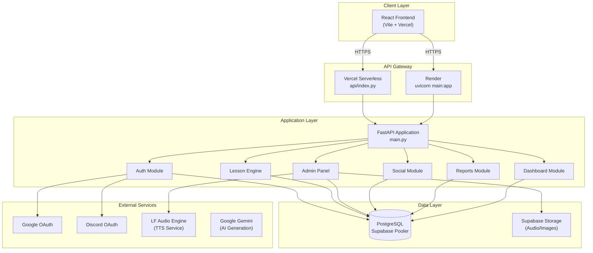

### Key Design Decisions

| Decision | Rationale |
|---|---|
| **FastAPI** | Async support, auto-generated OpenAPI docs, Pydantic validation |
| **SQLAlchemy 2.0** | Mature ORM with relationship support, migration-friendly |
| **Supabase PostgreSQL** | Managed database with pooled connections for serverless |
| **UUID public IDs** | Internal integer PKs for joins; UUIDs exposed to clients for security |
| **Flat i18n content** | `content_es`/`content_en` JSON columns instead of separate translation tables |
| **Modular routers** | Each feature domain is an independent FastAPI router with its own directory |

---

## 2. Project Structure

```
backend/
├── main.py                      # Application entry point & middleware stack
├── config.py                    # Pydantic Settings (env-based configuration)
├── database.py                  # SQLAlchemy engine, session factory, Base
├── models.py                    # All ORM models (single source of truth)
├── schemas.py                   # Shared Pydantic response/request schemas
├── requirements.txt             # Python dependencies
├── Procfile                     # Render deployment command
├── .env                         # Environment variables (DO NOT COMMIT)
│
├── auth/                        # Authentication & authorization
│   ├── endpoints.py             # Auth routes (register, login, OAuth, profile)
│   ├── schemas.py               # Auth-specific request/response schemas
│   ├── utils.py                 # JWT creation/verification, password hashing
│   └── permissions.py           # Family-based access control helpers
│
├── admin/                       # Admin panel (content management)
│   ├── endpoints.py             # Admin CRUD for lessons, characters, audio
│   ├── schemas.py               # Admin-specific Pydantic schemas
│   ├── permissions.py           # require_admin dependency
│   ├── services.py              # Edit history recording & rollback logic
│   ├── validators.py            # Exercise JSON structure validation (40+ types)
│   └── error_messages.py        # Bilingual error formatting (ES/EN)
│
├── dashboard/                   # User dashboard statistics
│   └── endpoints.py             # Stats, recent activity, pending tasks
│
├── lesson_engine/               # Lesson delivery system (v2 flat i18n)
│   └── endpoints.py             # Adventures, sagas, lesson playback, completion
│
├── reports/                     # Platform feedback & bug reports
│   ├── endpoints.py             # Report CRUD with rate limiting
│   └── schemas.py               # Report request/response schemas
│
├── social/                      # Social features (follow system)
│   ├── endpoints.py             # Search, profile, follow/unfollow, requests
│   └── schemas.py               # Social response schemas
│
├── utils/                       # Shared utilities
│   ├── limiter.py               # slowapi rate limiter instance
│   └── gesture_mapper.py        # Character gesture normalization
│
├── scripts/                     # Database & utility scripts
│   ├── import_lessons.py        # Bulk lesson import from JSON
│   ├── generate_audio.py        # Bulk TTS audio generation
│   ├── verify_all_lessons.py    # Lesson data integrity validation
│   ├── clear_all_lessons.py     # Database cleanup utility
│   ├── restructure_db.py        # Schema migration helper
│   └── lf_audio_client.py       # LF Audio Engine API client
│
└── api/                         # (root-level) Vercel serverless wrapper
    └── index.py                 # Imports main.py for Vercel deployment
```

---

## 3. Getting Started

### Prerequisites

- Python 3.11+
- PostgreSQL (or a Supabase project)
- Git

### Local Setup

```bash
# 1. Clone and navigate
git clone <repository-url>
cd LITTLEFOUNDERS-AI/backend

# 2. Create virtual environment
python -m venv venv
source venv/bin/activate  # macOS/Linux
# venv\Scripts\activate   # Windows

# 3. Install dependencies
pip install -r requirements.txt

# 4. Configure environment
cp .env.example .env
# Edit .env with your database credentials and API keys (see Section 4)

# 5. Run the server
uvicorn main:app --reload --port 8000
```

The API will be available at `http://localhost:8000` with interactive docs at `http://localhost:8000/docs`.

### Health Check

```bash
# Verify the API is running
curl http://localhost:8000/

# Verify database connectivity
curl http://localhost:8000/health
```

---

## 4. Configuration & Environment

All configuration is managed through **Pydantic Settings** in `config.py`, which reads from environment variables (`.env` file or system env).

### Required Environment Variables

| Variable | Description | Example |
|---|---|---|
| `DATABASE_HOSTNAME` | PostgreSQL host | `aws-0-us-west-2.pooler.supabase.com` |
| `DATABASE_PORT` | PostgreSQL port | `6543` |
| `DATABASE_USERNAME` | Database user | `postgres.xxxx` |
| `DATABASE_PASSWORD` | Database password | *(secret)* |
| `DATABASE_NAME` | Database name | `postgres` |
| `SECRET_KEY` | JWT signing secret | *(random 256-bit key)* |

### Optional Environment Variables

| Variable | Default | Description |
|---|---|---|
| `ALGORITHM` | `HS256` | JWT algorithm |
| `ACCESS_TOKEN_EXPIRE_MINUTES` | `30` | Token TTL |
| `DISCORD_CLIENT_ID` | `""` | Discord OAuth client ID |
| `DISCORD_CLIENT_SECRET` | `""` | Discord OAuth secret |
| `DISCORD_REDIRECT_URI` | `""` | Discord callback URL |
| `MAIL_USERNAME` | `""` | SMTP username |
| `MAIL_PASSWORD` | `""` | SMTP password |
| `MAIL_FROM` | `""` | Sender email address |
| `MAIL_SERVER` | `smtp.gmail.com` | SMTP server |
| `MAIL_PORT` | `587` | SMTP port |
| `CORS_ORIGINS` | *(default list)* | Comma-separated allowed origins |
| `SUPABASE_URL` | — | Supabase project URL |
| `SUPABASE_KEY` | — | Supabase anon key |
| `SUPABASE_SERVICE_KEY` | — | Supabase service role key |
| `LF_AUDIO_API_URL` | — | LF Audio Engine base URL |
| `LF_AUDIO_API_KEY` | — | LF Audio Engine API key |
| `GEMINI_API_KEY` | — | Google Gemini API key |

### CORS Configuration

Default allowed origins are defined in `config.py`. Override them in production by setting the `CORS_ORIGINS` environment variable:

```bash
CORS_ORIGINS=https://littlefounders.ai,https://www.littlefounders.ai,https://littlefounders-ai.vercel.app
```

---

## 5. Database Layer

### Connection Setup (`database.py`)

```mermaid
graph LR
    APP["FastAPI App"] -->|Depends(get_db)| SF["SessionLocal()"]
    SF -->|Connection| ENGINE["SQLAlchemy Engine"]
    ENGINE -->|pool_pre_ping=True<br/>pool_recycle=300| PG[("PostgreSQL<br/>Supabase Pooler<br/>port 6543")]
```

Key configuration:
- **`pool_pre_ping=True`** — Validates connections before use (handles stale connections)
- **`pool_recycle=300`** — Recycles connections every 5 minutes
- **`connect_timeout=10`** — 10-second connection timeout
- **Timezone** — Forced to UTC via `options: -c timezone=utc`

### Session Management

Every endpoint receives a database session via FastAPI's dependency injection:

```python
from database import get_db

@router.get("/example")
async def example(db: Session = Depends(get_db)):
    # db is automatically closed after the request
    ...
```

The `get_db()` generator ensures sessions are always closed, even on errors.

### Table Creation

Tables are **not** auto-created at startup (disabled for serverless). Tables must pre-exist in Supabase. Use `scripts/restructure_db.py` or Supabase SQL editor for schema changes.

---

## 6. Data Models (ORM)

All models are defined in `models.py` using SQLAlchemy's declarative base.

### Entity Relationship Diagram

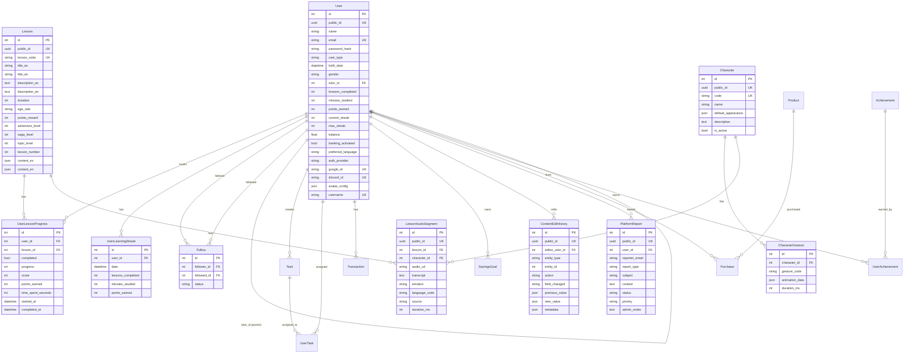

### User Types

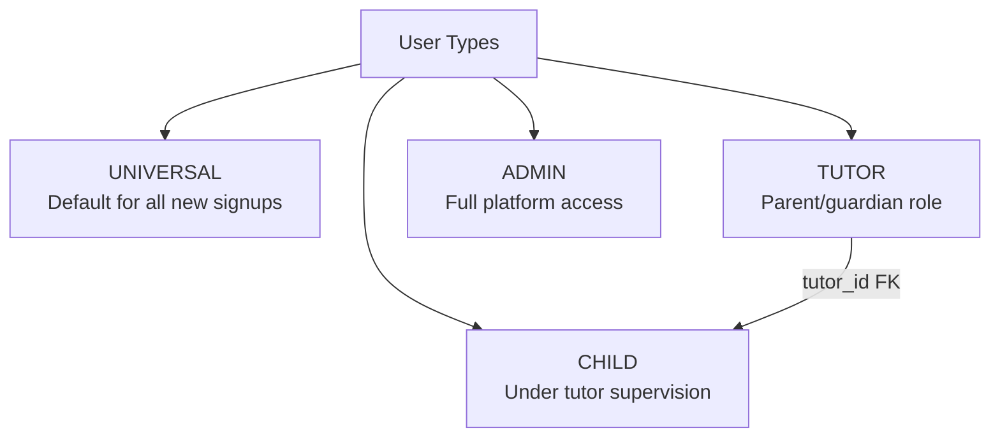

| Type | Description | Access Level |
|---|---|---|
| `universal` | Default signup type, full self-service | Own data + social features |
| `tutor` | Parent/guardian | Own data + children's data |
| `child` | Under tutor supervision | Own data only (restricted) |
| `admin` | Platform administrator | All data + admin panel |

### Lesson Code Convention

Lessons use a hierarchical 4-part code: `{adventure}-{saga}-{topic}-{lesson}`

```
Example: "1-2-1-3"
         │ │ │ └── Lesson #3
         │ │ └──── Topic #1
         │ └────── Saga #2
         └──────── Adventure #1 (Archipelago)
```

### Enum Reference

| Enum | Values |
|---|---|
| `UserType` | `tutor`, `child`, `universal`, `admin` |
| `Gender` | `masculino`, `femenino`, `otro` |
| `TaskCategory` | `chores`, `education`, `social`, `bonus` |
| `TaskDifficulty` | `easy`, `medium`, `hard` |
| `TransactionType` | `income`, `expense`, `deposit`, `withdrawal`, `reward`, `purchase` |
| `FollowStatus` | `pending`, `accepted`, `rejected` |
| `ReportType` | `bug`, `abuse`, `suggestion`, `content`, `other` |
| `ReportStatus` | `pending`, `in_review`, `resolved`, `closed` |
| `ReportPriority` | `low`, `medium`, `high`, `critical` |

---

## 7. Authentication System

### Authentication Flow

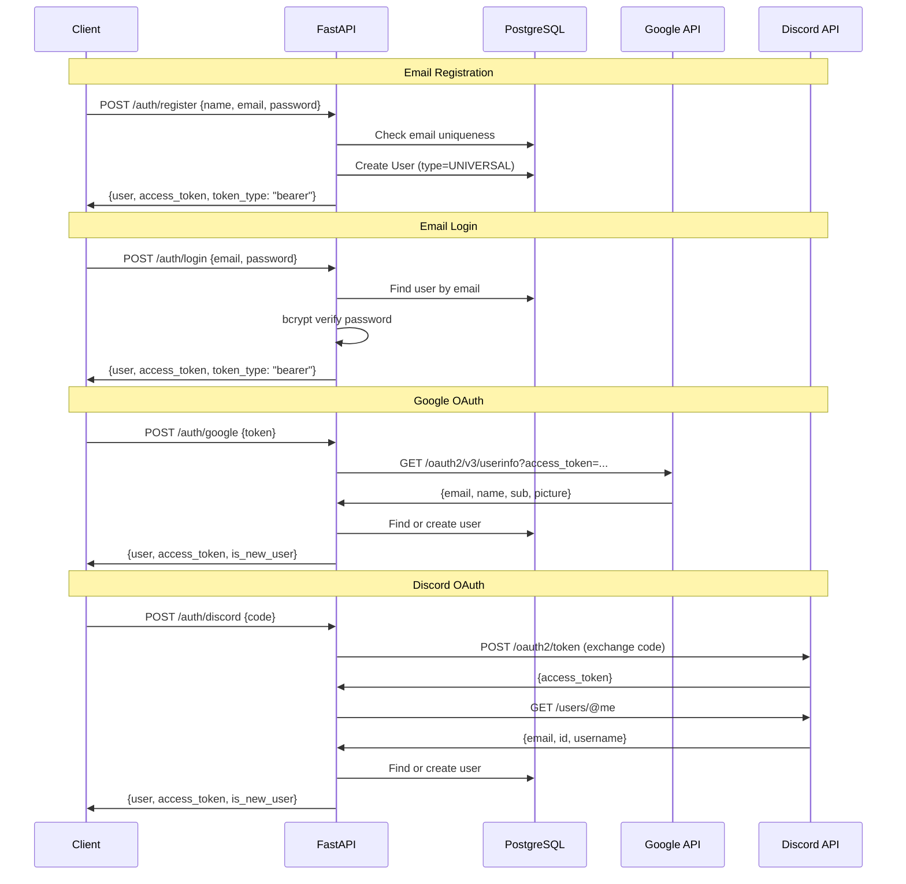

### JWT Token Structure

| Field | Value |
|---|---|
| Algorithm | HS256 |
| Expiration | 30 minutes (configurable) |
| Payload (`sub`) | User's email address |

### Password Security

- **Hashing**: bcrypt via `passlib`
- **Minimum length**: 8 characters (validated in schema)
- **OAuth users**: Stored with placeholder hash (`GOOGLE_AUTH_NO_PASSWORD` / `DISCORD_AUTH_NO_PASSWORD`) — password login is disabled for these accounts

### Authentication Dependencies

Use these FastAPI dependencies to protect endpoints:

```python
from auth.endpoints import get_current_user_from_token, get_current_user_optional

# Required authentication — returns User or raises 401
@router.get("/protected")
async def protected(user: User = Depends(get_current_user_from_token)):
    ...

# Optional authentication — returns User or None
@router.get("/public")
async def public(user: Optional[User] = Depends(get_current_user_optional)):
    ...
```

### Family Access Control (`auth/permissions.py`)

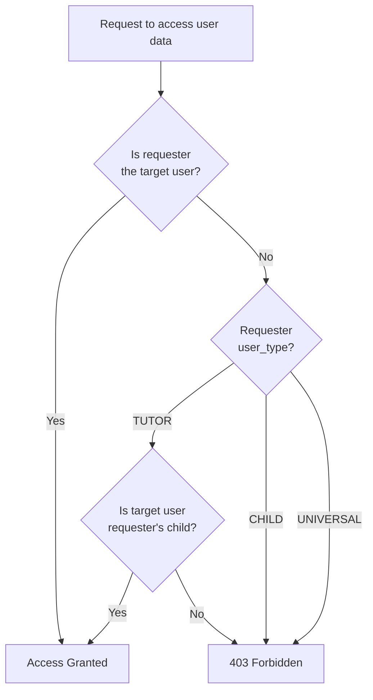

| Function | Purpose |
|---|---|
| `verify_family_access(db, requester_id, target_id)` | Checks if requester can access target's data |
| `get_authorized_children(db, user_id)` | Returns list of child IDs for a tutor |
| `get_authorized_parents(db, child_id)` | Returns list of tutor IDs for a child |
| `verify_ownership(db, user_id, resource_user_id)` | Confirms resource ownership |
| `get_family_member_ids(db, user_id)` | Returns all family member IDs (self + tutor/children) |

---

## 8. API Endpoints Reference

Base URL: `https://your-domain.com` (Render) or via Vercel serverless.

### Router Registration Order (`main.py`)

```python
app.include_router(auth_router)          # /auth/*
app.include_router(dashboard_router)     # /dashboard/*
app.include_router(lesson_engine_router) # /lesson-engine/*
app.include_router(admin_router)         # /admin/*
app.include_router(reports_router)       # /reports/*
app.include_router(social_router)        # /social/*
```

### Complete Endpoint Map

#### Root Endpoints

| Method | Path | Auth | Description |
|---|---|---|---|
| `GET` | `/` | None | API info & version |
| `GET` | `/health` | None | Database connectivity check |

#### Authentication (`/auth`)

| Method | Path | Auth | Description |
|---|---|---|---|
| `POST` | `/auth/register` | None | Register new user (email/password) |
| `POST` | `/auth/login` | None | Login with email/password |
| `POST` | `/auth/google` | None | Login/register with Google OAuth |
| `POST` | `/auth/discord` | None | Login/register with Discord OAuth |
| `GET` | `/auth/me` | Bearer | Get current user profile |
| `PATCH` | `/auth/me` | Bearer | Update profile (name, username, avatar, language) |
| `POST` | `/auth/change-password` | Bearer | Change password (email auth only) |
| `GET` | `/auth/family/{public_id}` | None | Get user's family tree (tutor/children) |
| `GET` | `/auth/preferences/language` | Bearer | Get language preference |
| `PUT` | `/auth/preferences/language` | Bearer | Update language preference (`es`/`en`) |

#### Dashboard (`/dashboard`)

| Method | Path | Auth | Description |
|---|---|---|---|
| `GET` | `/dashboard/stats/{public_id}?requester_public_id=` | None* | User statistics (family-gated) |
| `GET` | `/dashboard/recent-activity/{public_id}?requester_public_id=` | None* | Transaction history |
| `GET` | `/dashboard/pending-tasks/{public_id}?requester_public_id=` | None* | Pending tasks list |

*\*Uses `requester_public_id` query param for family access control instead of Bearer token.*

#### Lesson Engine (`/lesson-engine`)

| Method | Path | Auth | Description |
|---|---|---|---|
| `GET` | `/lesson-engine/adventures?user_public_id=&lang=` | None | List all 6 adventures with progress |
| `GET` | `/lesson-engine/adventures/{code}/sagas?user_public_id=` | None | List sagas for an adventure |
| `GET` | `/lesson-engine/lessons/{code}/play?lang=` | None | Get full lesson content for playback |
| `GET` | `/lesson-engine/lessons/{code}/next` | None | Get next lesson code in sequence |
| `POST` | `/lesson-engine/lessons/{code}/complete?user_public_id=` | None | Mark lesson as completed |
| `GET` | `/lesson-engine/lessons/by-adventure/{id}?saga_id=&topic_id=&lang=` | None | List lessons filtered by hierarchy |
| `GET` | `/lesson-engine/characters` | None | List all active characters |
| `GET` | `/lesson-engine/characters/{code}` | None | Get character details + gestures |
| `GET` | `/lesson-engine/users/{public_id}/stats?lang=` | None | User's adventure progress stats |
| `GET` | `/lesson-engine/users/{public_id}/streak` | None | User's streak info (7-day calendar) |
| `GET` | `/lesson-engine/users/{public_id}/next-lesson` | None | User's global next lesson |

#### Admin Panel (`/admin`)

All admin endpoints require **Bearer token with `admin` user type**.

| Method | Path | Description |
|---|---|---|
| `GET` | `/admin/stats` | Dashboard statistics (lessons, exercises, characters, recent edits) |
| `GET` | `/admin/lessons?page=&limit=&search=&adventure=&saga=` | List lessons (paginated, filterable) |
| `GET` | `/admin/lessons/{lesson_code}` | Get full lesson detail |
| `POST` | `/admin/lessons` | Create new lesson |
| `PATCH` | `/admin/lessons/{lesson_code}` | Update lesson metadata or content |
| `DELETE` | `/admin/lessons/{lesson_code}` | Delete lesson (and related progress) |
| `POST` | `/admin/lessons/{lesson_code}/exercises` | Add exercise to lesson |
| `PATCH` | `/admin/lessons/{lesson_code}/exercises/{index}` | Update specific exercise |
| `POST` | `/admin/lessons/{lesson_code}/exercises/reorder` | Reorder exercises |
| `GET` | `/admin/characters` | List all characters |
| `POST` | `/admin/characters` | Create character |
| `PATCH` | `/admin/characters/{code}` | Update character |
| `DELETE` | `/admin/characters/{code}` | Delete character |
| `POST` | `/admin/characters/{code}/gestures` | Add gesture to character |
| `PATCH` | `/admin/characters/{code}/gestures/{gesture_code}` | Update gesture |
| `DELETE` | `/admin/characters/{code}/gestures/{gesture_code}` | Delete gesture |
| `POST` | `/admin/audio/generate` | Generate TTS audio segment |
| `GET` | `/admin/audio/lesson/{lesson_code}` | List audio segments for a lesson |
| `DELETE` | `/admin/audio/{audio_id}` | Delete audio segment |
| `GET` | `/admin/history?entity_type=&limit=` | View edit history |
| `POST` | `/admin/history/{entry_id}/rollback` | Rollback a change |
| `GET` | `/admin/users?search=&user_type=` | List/search users |

#### Reports (`/reports`)

| Method | Path | Auth | Description |
|---|---|---|---|
| `POST` | `/reports/` | None (optional) | Create report (rate-limited: 5/min per IP) |
| `GET` | `/reports/` | Admin | List reports (filterable by status/type) |
| `GET` | `/reports/stats` | Admin | Report statistics by status/type |
| `GET` | `/reports/{report_id}` | Admin | Get report detail |
| `PATCH` | `/reports/{report_id}` | Admin | Update report status/priority/notes |

#### Social (`/social`)

| Method | Path | Auth | Description |
|---|---|---|---|
| `GET` | `/social/search?q=` | Bearer | Search users by username (min 3 chars) |
| `GET` | `/social/profile/{username}` | Optional | Get public profile |
| `POST` | `/social/follow/{username}` | Bearer | Send follow request |
| `POST` | `/social/unfollow/{username}` | Bearer | Unfollow user |
| `GET` | `/social/followers` | Bearer | List current user's followers |
| `GET` | `/social/following` | Bearer | List who current user follows |
| `GET` | `/social/requests/pending` | Bearer | List pending follow requests |
| `POST` | `/social/requests/accept/{username}` | Bearer | Accept follow request |
| `POST` | `/social/requests/reject/{username}` | Bearer | Reject follow request |

---

## 9. Lesson Engine

The lesson engine is the core content delivery system. It uses a **hierarchical structure** with hardcoded adventure/saga metadata and database-stored lesson content.

### Content Hierarchy

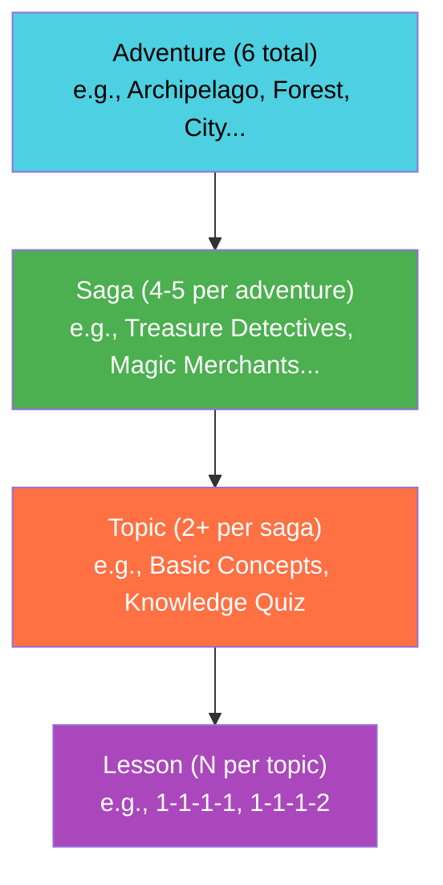

### Adventures

| ID | Code | Title (EN) | Age Range | Theme Color |
|---|---|---|---|---|
| 1 | `archipelago` | The Barter Archipelago | 5-7 | `#4dd0e1` |
| 2 | `forest` | The Forest of Abundance | 8-9 | `#4caf50` |
| 3 | `city` | The Digital City | 10-12 | `#ff7043` |
| 4 | `valley` | The Valley of Inventors | 13-14 | `#ab47bc` |
| 5 | `kingdom` | The Realm of Titans | 15-17 | `#ffd54f` |
| 6 | `cosmos` | Financial Cosmos | 18+ | `#7e57c2` |

### Characters (Narrators)

| Code | Name | Default Gesture | Available Gestures |
|---|---|---|---|
| `liruf` | Liruf | `happy` | happy, sad, excited, thinking, shocked |
| `dina` | Dina | `happy` | neutral, happy, surprised, wink |
| `dr_rho` | Dr. Rho | `wise` | neutral, wise, mysterious, explaining, surprised |
| `zara_vex` | Zara Vex | `happy` | neutral, happy, flirty, curious, excited |

### Lesson Playback Flow

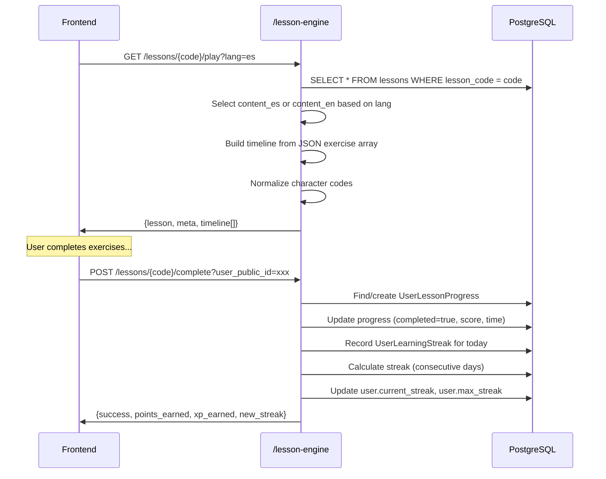

### Exercise Types (40+)

Exercises are stored as JSON arrays in `content_es`/`content_en`. Each exercise has a `type` field and a `content` object with type-specific fields.

#### Foundation (11 types)

| Type | Required Content Fields |
|---|---|
| `intro_narrative` | `transcript` |
| `multiple_choice` | `question`, `options` |
| `true_false` | `statement` |
| `fill_blank` | `segments`, `options` |
| `classification` | `items`, `categories` |
| `matching_pairs` | `pairs` |
| `sequencing` | `items` |
| `tap_action` | `items` |
| `story_mode` | `pages` |
| `math_challenge` | `question` |
| `word_scramble` | `word` |

#### Interactive (5 types)

| Type | Required Content Fields |
|---|---|
| `roleplay_chat` | `dialogue`, `choices` |
| `estimation_slider` | `min`, `max` |
| `risk_reward` | `question`, `risk_options` |
| `concept_builder` | `question`, `concepts` |
| `quiz_battle` | `questions` |

#### Economy & Budget (7 types)

| Type | Required Content Fields |
|---|---|
| `shop_sim` | `budget`, `products` |
| `coin_counter` | `targetAmount`, `coins_available` |
| `price_detective` | `products` |
| `bill_splitter` | `people`, `items` |
| `budget_builder` | `budget`, `items` |
| `expense_timeline` | `expenses` |
| `subscription_tracker` | *(none required)* |

#### Savings & Investment (9 types)

| Type | Required Content Fields |
|---|---|
| `savings_race` | `goal`, `strategies` |
| `emergency_fund` | `initialFund`, `events` |
| `goal_roadmap` | `goals` |
| `interest_calculator` | *(none required)* |
| `portfolio_builder` | `assets` |
| `mystery_investment` | `totalCoins`, `boxes` |
| `passive_income` | `streams`, `targetIncome` |
| `opportunity_cost` | `options` |
| `market_reaction` | `options` |

#### Advanced (8 types)

| Type | Required Content Fields |
|---|---|
| `inflation_simulator` | `product` |
| `credit_score` | `initialScore`, `scenarios` |
| `debt_strategy` | `debts`, `monthlyPayment` |
| `tax_puzzle` | `pieces` |
| `salary_comparison` | `offers` |
| `spot_trap` | `messages` |
| `impact_meter` | `budget`, `causes` |
| `mindset_comparison` | `scenario` |

### Streak Calculation

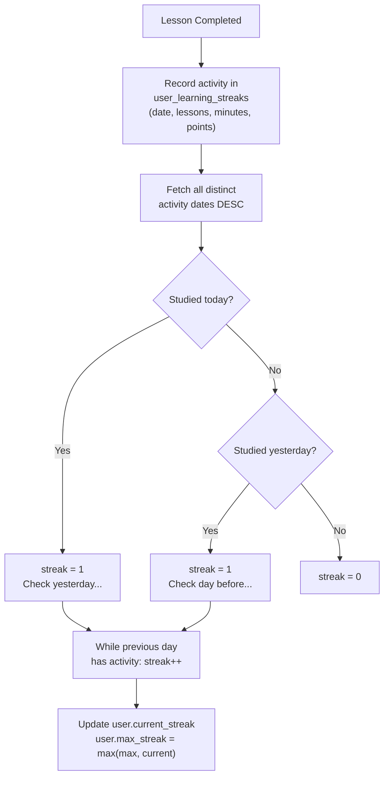

---

## 10. Admin Panel

The admin panel provides full content management with audit trails.

### Access Control

All `/admin/*` endpoints are protected by `require_admin`:

```python
async def require_admin(current_user: User = Depends(get_current_user_from_token)) -> User:
    if current_user.user_type != UserType.ADMIN.value:
        raise HTTPException(status_code=403, detail="Admin role required")
    return current_user
```

### Edit History & Rollback

Every content change (create, update, delete) is recorded in the `content_edit_history` table:

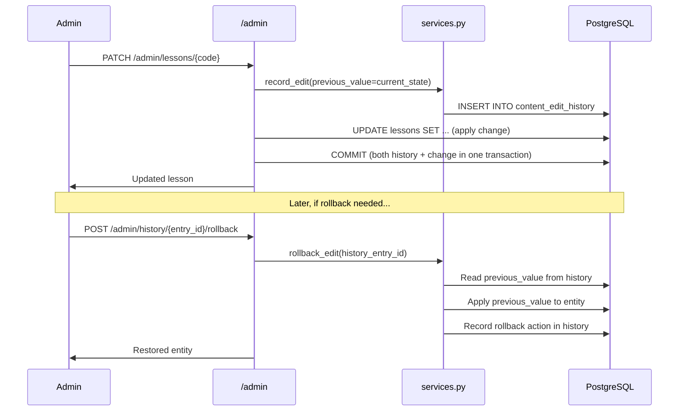

### Exercise Validation

The `admin/validators.py` module validates exercise JSON structures before saving:

1. Checks that `type` is one of the 40 valid exercise types
2. Validates required content fields for each type
3. Checks `correct_answer` presence for types that require it
4. Validates structural integrity (options arrays, category lists, etc.)

Validation errors are returned in bilingual format (ES/EN) via `admin/error_messages.py`.

---

## 11. Social System

### Follow System Flow

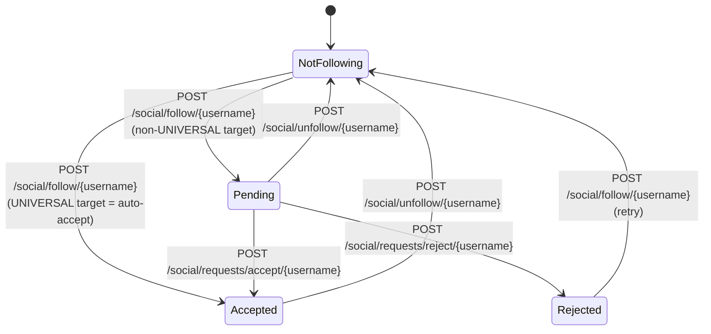

**Key behavior**: Following a `UNIVERSAL` user is auto-accepted. Other user types require manual approval.

### Profile Data

Public profiles include:
- `public_id`, `username`, `name`, `avatar_config`
- `lessons_completed`, `points_earned`, `current_streak`
- `followers_count`, `following_count`
- `is_following` (relative to requesting user)
- `follow_status` (`pending`/`accepted`/`null`)

---

## 12. Reports System

### Report Lifecycle

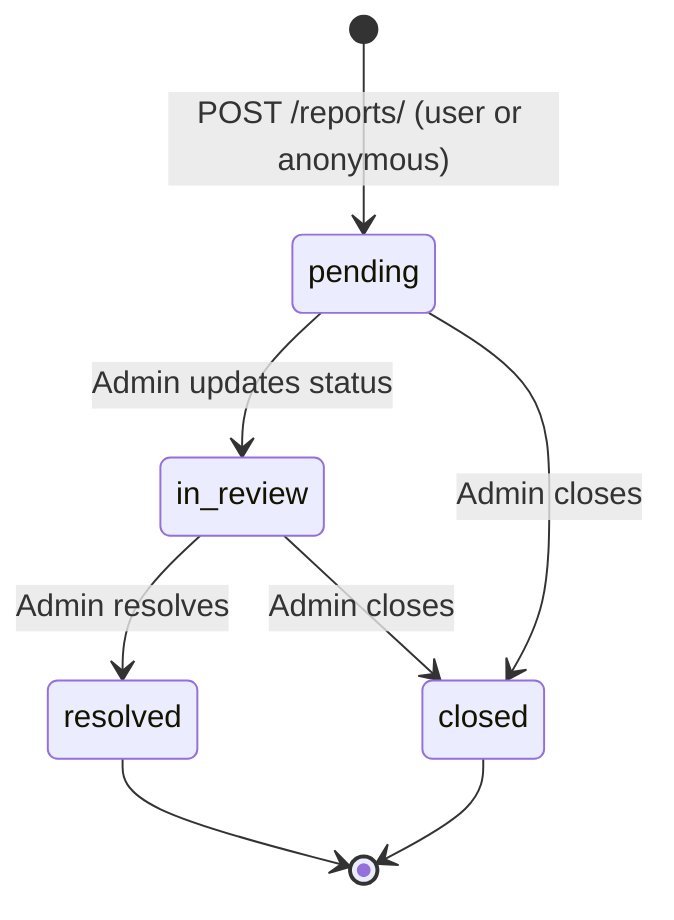

### Rate Limiting

Reports use an **in-memory sliding-window rate limiter** (not the global slowapi limiter):

| Scope | Limit | Window |
|---|---|---|
| Per IP | 5 requests | 60 seconds |
| Per authenticated user | 3 requests | 60 seconds |

### Security

- **Evidence URL validation**: Only URLs from the project's Supabase domain are accepted
- **Optional auth**: Reports can be submitted anonymously; if a Bearer token is present, the user is associated
- **Metadata capture**: User agent and IP are stored in `report_metadata`

---

## 13. Dashboard Module

The dashboard provides aggregated statistics for users, gated by **family-based access control**.

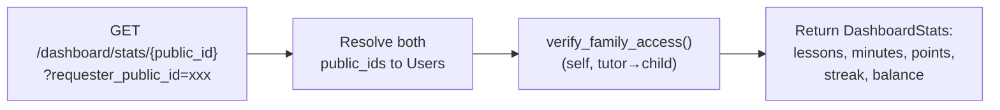

| Endpoint | Returns |
|---|---|
| `/dashboard/stats/{id}` | Lessons completed, minutes studied, points, streak, balance |
| `/dashboard/recent-activity/{id}` | List of recent transactions |
| `/dashboard/pending-tasks/{id}` | Incomplete tasks from authorized creators |

---

## 14. Middleware & Security

### Middleware Stack

Middleware executes **in reverse order of registration** (last registered = first executed):

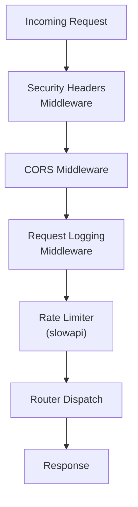

### CORS Configuration

```python
# Default allowed origins (config.py)
allowed_origins = [
    "https://littlefounders.ai",
    "https://www.littlefounders.ai",
    "https://littlefounders-ai.vercel.app",
    "http://localhost:5173",     # Vite dev server
    "http://localhost:3000",
    "http://localhost:8000",
    "http://localhost:8080",
]
```

Override via `CORS_ORIGINS` env var (comma-separated).

### Security Headers

- **`Cross-Origin-Opener-Policy: unsafe-none`** — Required for OAuth popup flows (Google/Discord)
- **`Cross-Origin-Embedder-Policy`** — Currently disabled to avoid breaking OAuth

### Rate Limiting

Global rate limit via `slowapi`:

```python
# utils/limiter.py
limiter = Limiter(key_func=get_remote_address, default_limits=["60/minute"])
```

Additional endpoint-specific limits can be applied with `@limiter.limit()` decorators.

### Request Logging

Every request/response is logged to stdout:

```
[REQUEST] GET /lesson-engine/adventures
[RESPONSE] 200
```

### Validation Error Handler

Custom handler for Pydantic validation errors returns structured 422 responses:

```json
{
    "detail": [
        {
            "loc": ["body", "email"],
            "msg": "value is not a valid email address",
            "type": "value_error.email"
        }
    ]
}
```

---

## 15. Utilities

### Rate Limiter (`utils/limiter.py`)

Global slowapi limiter instance, imported by `main.py` and available for per-route limits:

```python
from utils.limiter import limiter

@router.get("/endpoint")
@limiter.limit("10/minute")
async def endpoint(request: Request):
    ...
```

### Gesture Mapper (`utils/gesture_mapper.py`)

Normalizes character gesture codes across languages and naming conventions:

```python
from utils.gesture_mapper import normalize_gesture, get_available_gestures

normalize_gesture('liruf', 'feliz')      # → 'happy'
normalize_gesture('dina', 'sorprendida') # → 'surprised'
normalize_gesture('dr_rho', None)        # → 'wise' (default)
get_available_gestures('zara_vex')       # → ['curious', 'excited', 'flirty', 'happy', 'neutral']
```

### Scripts (`scripts/`)

| Script | Purpose |
|---|---|
| `import_lessons.py` | Bulk import lessons from JSON files |
| `generate_audio.py` | Generate TTS audio for lessons via LF Audio Engine |
| `verify_all_lessons.py` | Validate all lessons in database for data integrity |
| `verify_api_data.py` | Test API endpoints with specific exercise types |
| `clear_all_lessons.py` | Delete all lesson data (use with caution) |
| `restructure_db.py` | Database schema migration helper |
| `create_verification_lessons.py` | Create test lessons for QA |
| `lf_audio_client.py` | LF Audio Engine API client library |
| `image_generator.py` | Image generation utility |
| `list_models.py` | SQLAlchemy model introspection |

---

## 16. Error Handling

### HTTP Status Codes

| Code | Usage |
|---|---|
| `200` | Successful operation |
| `201` | Resource created (reports) |
| `400` | Bad request (validation, duplicate email, etc.) |
| `401` | Unauthorized (invalid/missing token) |
| `403` | Forbidden (insufficient permissions, not admin, family access denied) |
| `404` | Resource not found |
| `422` | Validation error (Pydantic schema or exercise validator) |
| `429` | Rate limit exceeded |
| `500` | Internal server error |

### Standard Error Format

```json
{
    "detail": "Human-readable error message"
}
```

### Validation Error Format (422)

```json
{
    "detail": [
        {
            "loc": ["body", "field_name"],
            "msg": "error description",
            "type": "error_type"
        }
    ]
}
```

### Admin Bilingual Validation Errors

```json
{
    "status": 422,
    "message": "Validation errors found",
    "errors": {
        "es": ["El campo 'question' es requerido para multiple_choice"],
        "en": ["Field 'question' is required for multiple_choice"]
    }
}
```

### Error Handling Patterns

```python
# Pattern 1: Raise HTTPException directly
if not user:
    raise HTTPException(status_code=404, detail="User not found")

# Pattern 2: Try/catch with rollback
try:
    db.add(entity)
    db.commit()
except HTTPException:
    raise  # Re-raise HTTP exceptions as-is
except Exception as e:
    db.rollback()
    raise HTTPException(status_code=500, detail="Operation failed")
```

---

## 17. Deployment

### Architecture

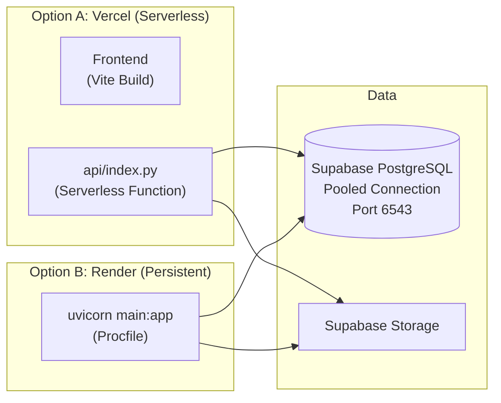

### Vercel Deployment

The `api/index.py` file wraps the FastAPI app for Vercel's serverless runtime:

```python
# api/index.py
sys.path.insert(0, backend_dir)
from main import app as application
app = application
```

- Serverless functions are stateless — no persistent connections
- Table auto-creation is disabled (`models.Base.metadata.create_all` commented out)
- Each cold start re-initializes the application

### Render Deployment

The `Procfile` configures the Render web service:

```
web: cd backend && uvicorn main:app --host 0.0.0.0 --port $PORT
```

- Persistent process with connection pooling
- Automatic restarts on crash
- Uses `$PORT` environment variable from Render

### Database Considerations

- Use **port 6543** (Supabase pooler) for serverless/multiple-connection scenarios
- Use **port 5432** (direct connection) only for migrations or scripts
- `pool_pre_ping=True` handles connection staleness
- `pool_recycle=300` prevents long-lived idle connections

---

## 18. Conventions & Patterns

### ID Strategy

| Context | ID Type | Example |
|---|---|---|
| Database PKs & FKs | Auto-increment `Integer` | `1`, `42`, `1337` |
| API responses | UUID (`public_id`) | `"a1b2c3d4-e5f6-..."` |
| Lesson identification | String code | `"1-2-1-3"` |
| Character identification | String code | `"liruf"`, `"dr_rho"` |

**Rule**: Never expose internal integer IDs to the client. Always use `public_id` (UUID) or semantic codes.

### Naming Conventions

| Element | Convention | Example |
|---|---|---|
| Files | `snake_case.py` | `gesture_mapper.py` |
| Classes | `PascalCase` | `UserLessonProgress` |
| Functions | `snake_case` | `get_current_user_from_token` |
| Endpoints | `kebab-case` | `/lesson-engine/adventures` |
| Database tables | `snake_case` | `user_lesson_progress` |
| Enum values | `lowercase` | `"universal"`, `"pending"` |

### Adding a New Module

1. Create a directory under `backend/` (e.g., `backend/my_module/`)
2. Add `endpoints.py` with a FastAPI `APIRouter`:
   ```python
   router = APIRouter(prefix="/my-module", tags=["My Module"])
   ```
3. Add `schemas.py` for Pydantic models (if needed)
4. Register the router in `main.py`:
   ```python
   from my_module.endpoints import router as my_module_router
   app.include_router(my_module_router)
   ```

### Adding a New Model

1. Define the model in `models.py`
2. Add relationships to existing models as needed
3. Create the table in Supabase (SQL editor or migration script)
4. Add Pydantic schemas in the appropriate `schemas.py`

### Dependency Injection Pattern

```python
# Standard protected endpoint
@router.get("/resource")
async def get_resource(
    db: Session = Depends(get_db),                          # Database session
    current_user: User = Depends(get_current_user_from_token)  # Auth required
):
    ...

# Admin-only endpoint
@router.get("/admin-resource")
async def get_admin_resource(
    db: Session = Depends(get_db),
    admin: User = Depends(require_admin)  # Auth + admin check
):
    ...
```

### i18n Pattern

Content is stored with dual-language columns:

```python
# Model
title_es = Column(String(200), nullable=False)
title_en = Column(String(200), nullable=False)
content_es = Column(JSON, nullable=False)  # Full exercise array in Spanish
content_en = Column(JSON, nullable=False)  # Full exercise array in English

# Endpoint
@router.get("/resource")
async def get_resource(lang: str = "es"):
    title = resource.title_en if lang == "en" else resource.title_es
    content = resource.content_en if lang == "en" else resource.content_es
```

### Soft Delete Pattern

Entities use `is_active` boolean instead of hard deletes:

```python
# Model
is_active = Column(Boolean, default=True)

# Query (exclude inactive)
characters = db.query(Character).filter(Character.is_active == True).all()
```

---

> **Need help?** Open an issue at the project repository or reach out to the team lead.
