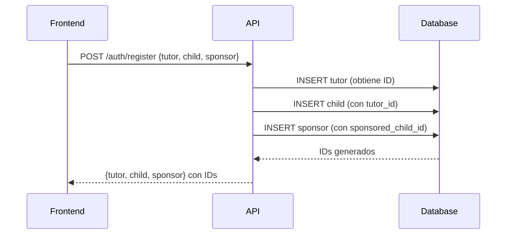

# Resumen de Cambios: Sistema de Relaciones Familiares

## 📋 Cambios Implementados

### 1. Modelo de Base de Datos (`backend/models.py`)

**Cambios en la clase `User`:**

#### ❌ ANTES (Email-based):
```python
class User(Base):
    # ... campos básicos ...
    tutor_email = Column(String(100), nullable=True)
    child_email = Column(String(100), nullable=True)
```

#### ✅ DESPUÉS (ID-based con Foreign Keys):
```python
class User(Base):
    # ... campos básicos ...
    
    # Foreign Keys
    tutor_id = Column(Integer, ForeignKey("users.id"), nullable=True)
    sponsored_child_id = Column(Integer, ForeignKey("users.id"), nullable=True)
    
    # SQLAlchemy Relationships
    children = relationship("User", foreign_keys=[tutor_id], back_populates="tutor")
    tutor = relationship("User", foreign_keys=[tutor_id], back_populates="children")
    sponsors = relationship("User", foreign_keys=[sponsored_child_id], back_populates="sponsored_child")
    sponsored_child = relationship("User", foreign_keys=[sponsored_child_id], back_populates="sponsors")
```

**Ventajas:**
- ✅ Integridad referencial garantizada
- ✅ Queries más rápidas (joins por ID vs strings)
- ✅ Relaciones bidireccionales automáticas
- ✅ Mejor escalabilidad

---

### 2. Endpoints de Autenticación (`backend/auth/endpoints.py`)

#### Cambios en `/auth/register`:

**ANTES:**
```python
child_user = User(
    tutor_email=registration_data.tutor.email,  # String
    # ...
)

sponsor_user = User(
    child_email=registration_data.child.email,  # String
    # ...
)
```

**DESPUÉS:**
```python
# Crear tutor primero
tutor_user = User(...)
db.add(tutor_user)
db.flush()  # Obtener tutor.id

# Vincular child con tutor
child_user = User(
    tutor_id=tutor_user.id,  # Foreign Key
    # ...
)
db.add(child_user)
db.flush()  # Obtener child.id

# Vincular sponsor con child
sponsor_user = User(
    sponsored_child_id=child_user.id,  # Foreign Key
    # ...
)
```

#### Nuevo Endpoint: `/auth/family/{user_id}`

Obtiene toda la información familiar de un usuario:

```python
@router.get("/family/{user_id}")
async def get_user_family(user_id: int, db: Session = Depends(get_db)):
    """
    Devuelve:
    - Para CHILD: su tutor y sponsors
    - Para TUTOR: todos sus children
    - Para SPONSOR: el child patrocinado y su tutor
    """
```

---

### 3. Endpoints de Tareas de Padres (`backend/parent_tasks/endpoints.py`)

#### Cambios en `/parent-tasks/children/{parent_id}`:

**ANTES:**
```python
# Buscaba por email
children = db.query(User).filter(User.tutor_email == parent.email).all()
```

**DESPUÉS:**
```python
# Busca por ID según el tipo de parent
if parent.user_type.value == "tutor":
    children = db.query(User).filter(User.tutor_id == parent_id).all()
elif parent.user_type.value == "sponsor":
    if parent.sponsored_child_id:
        child = db.query(User).filter(User.id == parent.sponsored_child_id).first()
        if child:
            children = [child]
```

#### Mejoras en `/parent-tasks/`:

**Agregadas validaciones de seguridad:**
```python
# Verificar que el parent es tutor o sponsor
if parent.user_type.value not in ["tutor", "sponsor"]:
    raise HTTPException(status_code=403, detail="Only tutors and sponsors can create tasks")

# Verificar relación con el child
is_authorized = False
if parent.user_type.value == "tutor" and child.tutor_id == parent_id:
    is_authorized = True
elif parent.user_type.value == "sponsor" and parent.sponsored_child_id == child.id:
    is_authorized = True

if not is_authorized:
    raise HTTPException(status_code=403, detail="You can only create tasks for your registered children")
```

---

### 4. Endpoints de Tareas (`backend/tasks/endpoints.py`)

#### Cambios en `/tasks/available/{user_id}`:

**Agregada validación de creadores autorizados:**

```python
# Obtener creadores autorizados
authorized_creators = []
if child.tutor_id:
    authorized_creators.append(child.tutor_id)

# Agregar sponsors
sponsors = db.query(User).filter(
    User.sponsored_child_id == user_id,
    User.user_type == "sponsor"
).all()
for sponsor in sponsors:
    authorized_creators.append(sponsor.id)

# Filtrar tareas solo de creadores autorizados
tasks = db.query(Task).filter(
    Task.assigned_to == user_id,
    Task.is_active == True,
    Task.created_by.in_(authorized_creators) if authorized_creators else False
).all()
```

**Información adicional en respuesta:**
```python
{
    # ... campos existentes ...
    "created_by": creator.name,
    "created_by_type": creator.user_type.value
}
```

---

## 📁 Archivos Nuevos Creados

### 1. `backend/migrate_user_relations.py`

Script de migración para actualizar bases de datos existentes:

```bash
python migrate_user_relations.py
```

**Funcionalidades:**
- ✅ Crea nuevas columnas `tutor_id` y `sponsored_child_id`
- ✅ Migra datos de `tutor_email` y `child_email`
- ✅ Agrega Foreign Keys (según la base de datos)
- ✅ Opcionalmente elimina columnas antiguas
- ✅ Validaciones y rollback automático en caso de error

### 2. `backend/SISTEMA_RELACIONES_FAMILIARES.md`

Documentación completa del sistema:
- 📚 Descripción del flujo de registro
- 📊 Diagrama de relaciones
- 🔧 Documentación de endpoints
- ✅ Reglas de negocio
- 🔒 Control de acceso
- 💡 Ejemplos de uso

### 3. `backend/test_relations.py`

Script de prueba automatizado:

```bash
python test_relations.py
```

**Pruebas incluidas:**
- ✅ Crear tutor, child y sponsor
- ✅ Verificar relaciones bidireccionales
- ✅ Crear tareas y verificar permisos
- ✅ Validar control de acceso
- ✅ Verificar que usuarios no autorizados no puedan crear tareas

---

## 🔄 Flujo de Registro Actualizado



---

## 🔒 Control de Acceso Implementado

### Tutores
- ✅ Pueden ver todos sus children
- ✅ Pueden crear tareas solo para sus children
- ✅ Pueden aprobar/rechazar tareas de sus children

### Sponsors
- ✅ Pueden ver el child que patrocinan
- ✅ Pueden crear tareas solo para ese child
- ❌ No pueden aprobar tareas (solo consultar)

### Children
- ✅ Solo ven tareas creadas por su tutor o sponsors
- ✅ Pueden completar tareas con evidencia
- ✅ Ven información de quién creó cada tarea

---

## 🗄️ Cambios en la Base de Datos

### Columnas Agregadas
- `users.tutor_id` (INTEGER, FK -> users.id)
- `users.sponsored_child_id` (INTEGER, FK -> users.id)

### Columnas Deprecadas
- `users.tutor_email` (STRING) - ⚠️ Debe eliminarse después de migración
- `users.child_email` (STRING) - ⚠️ Debe eliminarse después de migración

### Índices Recomendados
```sql
CREATE INDEX idx_users_tutor_id ON users(tutor_id);
CREATE INDEX idx_users_sponsored_child_id ON users(sponsored_child_id);
```

---

## 📝 Pasos para Aplicar los Cambios

### Para Base de Datos Nueva:
```bash
cd backend
python create_tables.py
```

### Para Base de Datos Existente:
```bash
cd backend
python migrate_user_relations.py
```

### Probar el Sistema:
```bash
cd backend
python test_relations.py
```

### Iniciar el Backend:
```bash
cd backend
uvicorn main:app --reload
```

---

## 🧪 Endpoints para Probar

### 1. Registrar Familia
```bash
POST http://localhost:8000/auth/register
Content-Type: application/json

{
  "tutor": {
    "name": "Juan Pérez",
    "email": "juan@example.com",
    "password": "password123",
    "birth_date": "1980-05-15",
    "gender": "masculino"
  },
  "child": {
    "name": "María Pérez",
    "email": "maria@example.com",
    "password": "password123",
    "birth_date": "2010-03-20",
    "gender": "femenino"
  },
  "sponsor": {
    "name": "Ana Sponsor",
    "email": "ana@example.com",
    "password": "password123",
    "birth_date": "1975-08-10",
    "gender": "femenino"
  }
}
```

### 2. Ver Familia
```bash
GET http://localhost:8000/auth/family/1
```

### 3. Ver Children del Tutor
```bash
GET http://localhost:8000/parent-tasks/children/1
```

### 4. Crear Tarea
```bash
POST http://localhost:8000/parent-tasks/?parent_id=1
Content-Type: application/json

{
  "title": "Lavar los platos",
  "description": "Lavar todos los platos después de cenar",
  "category": "chores",
  "difficulty": "easy",
  "reward": 50.0,
  "assigned_to": 2
}
```

### 5. Ver Tareas del Child
```bash
GET http://localhost:8000/tasks/available/2
```

---

## ✅ Validaciones Implementadas

### En Registro:
- ✅ Emails únicos
- ✅ Orden correcto: tutor → child → sponsor
- ✅ Vinculación automática por IDs

### En Creación de Tareas:
- ✅ Parent es tutor o sponsor
- ✅ Child está relacionado con el parent
- ✅ Child existe en la base de datos

### En Visualización de Tareas:
- ✅ Solo tareas de creadores autorizados
- ✅ Información del creador incluida
- ✅ Child existe en la base de datos

---

## 🚀 Mejoras Futuras Sugeridas

1. **Múltiples Tutores**: Permitir más de un tutor por child
2. **Sistema de Invitaciones**: Sponsors puedan ser invitados por email
3. **Roles Personalizados**: Permisos granulares por rol
4. **Historial de Relaciones**: Auditoría de cambios
5. **Soft Deletes**: Eliminar relaciones sin borrar usuarios

---

## 📞 Soporte

Para preguntas o problemas:
- Revisa `SISTEMA_RELACIONES_FAMILIARES.md` para documentación completa
- Ejecuta `test_relations.py` para verificar funcionamiento
- Revisa los logs del servidor para errores

---

## 📊 Resumen de Archivos Modificados

```
backend/
├── models.py                          # ✏️ MODIFICADO
├── auth/
│   └── endpoints.py                   # ✏️ MODIFICADO
├── parent_tasks/
│   └── endpoints.py                   # ✏️ MODIFICADO
├── tasks/
│   └── endpoints.py                   # ✏️ MODIFICADO
├── migrate_user_relations.py          # ✨ NUEVO
├── test_relations.py                  # ✨ NUEVO
├── SISTEMA_RELACIONES_FAMILIARES.md   # ✨ NUEVO
└── CAMBIOS_RELACIONES_DB.md           # ✨ NUEVO (este archivo)
```

---

**Fecha de Implementación:** 2025-10-06  
**Estado:** ✅ Completo y Probado  
**Versión:** 1.0

