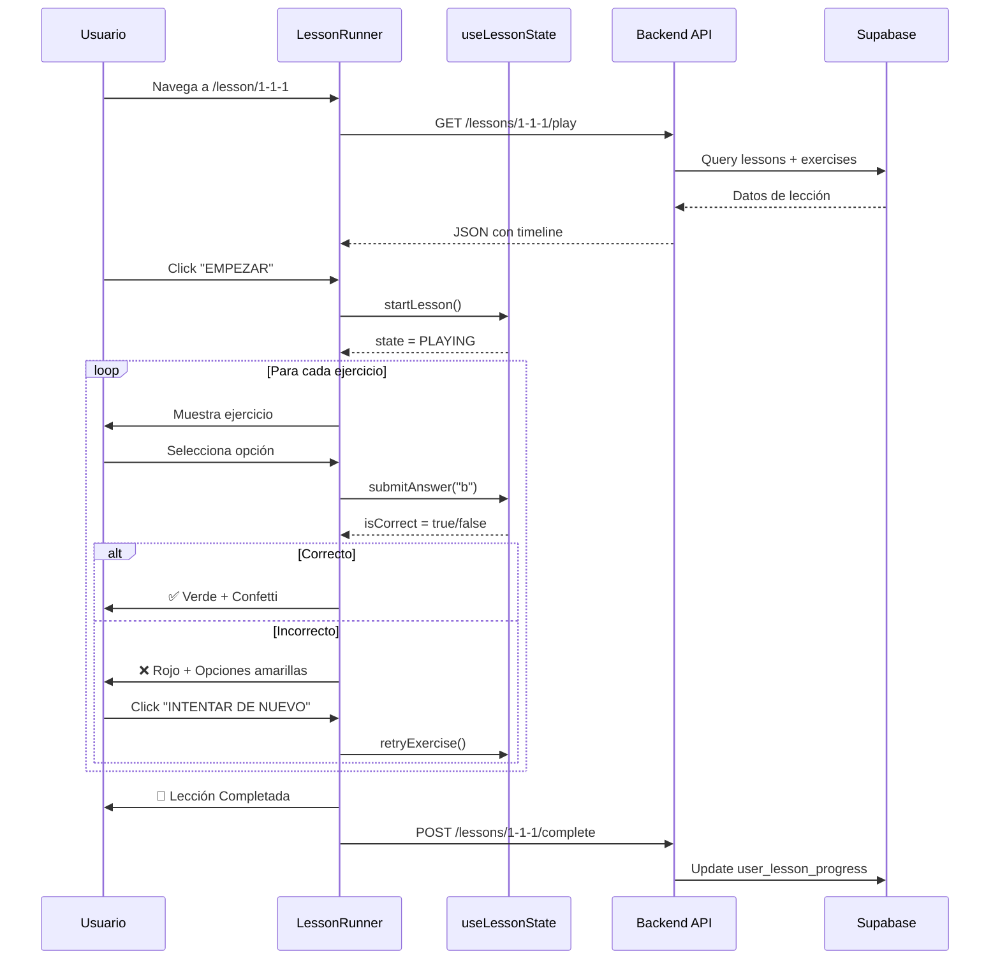

# 📚 LittleFounders Lesson Engine - Documentación Técnica

## Índice
1. [Introducción](#introducción)
2. [Arquitectura General](#arquitectura-general)
3. [Base de Datos](#base-de-datos)
4. [Backend API](#backend-api)
5. [Frontend Components](#frontend-components)
6. [Flujo de Datos](#flujo-de-datos)
7. [Agregar Nuevas Lecciones](#agregar-nuevas-lecciones)
8. [Personajes](#personajes)
9. [Audio Pipeline](#audio-pipeline)
10. [Troubleshooting](#troubleshooting)

---

## Introducción

El **Lesson Engine** es el sistema central que permite crear y reproducir lecciones interactivas de educación financiera para niños. Está inspirado en Duolingo y soporta:

- Narrativas con personajes animados (Liruf 🦖 verde, Dina 🦕 naranja, Dr. Rho 👨‍🔬 explorador)
- Ejercicios de opción múltiple con retroalimentación visual
- Sistema de vidas y puntos
- Audio generado por IA (ElevenLabs)
- Modo claro/oscuro
- Diseño responsive mobile-first

---

## Arquitectura General

```
┌─────────────────────────────────────────────────────────────────┐
│                         FRONTEND                                 │
│  ┌─────────────────────────────────────────────────────────┐    │
│  │                   LessonRunner.tsx                       │    │
│  │  ┌─────────────┐  ┌─────────────┐  ┌─────────────┐     │    │
│  │  │useLessonData│  │useLessonState│ │DinoCharacter│     │    │
│  │  └─────────────┘  └─────────────┘  │DinaCharacter│     │    │
│  │                                     └─────────────┘     │    │
│  └─────────────────────────────────────────────────────────┘    │
└────────────────────────────┬────────────────────────────────────┘
                             │ HTTP (fetch)
                             ▼
┌─────────────────────────────────────────────────────────────────┐
│                         BACKEND                                  │
│  ┌─────────────────────────────────────────────────────────┐    │
│  │            lesson_engine/endpoints.py                    │    │
│  │  GET /lesson-engine/lessons/{code}/play                 │    │
│  │  POST /lesson-engine/lessons/{code}/complete            │    │
│  └─────────────────────────────────────────────────────────┘    │
│                             │                                    │
│                             ▼                                    │
│  ┌─────────────────────────────────────────────────────────┐    │
│  │                    models.py                             │    │
│  │  Adventure, Saga, Lesson, Exercise, Character...        │    │
│  └─────────────────────────────────────────────────────────┘    │
└────────────────────────────┬────────────────────────────────────┘
                             │ SQLAlchemy
                             ▼
┌─────────────────────────────────────────────────────────────────┐
│                      SUPABASE (PostgreSQL)                       │
│  adventures, sagas, lessons, exercises, characters, etc.        │
└─────────────────────────────────────────────────────────────────┘
```

---

## Base de Datos

### Tablas Principales

#### `adventures` - Aventuras (Nivel superior)
```sql
id              INTEGER PRIMARY KEY
code            VARCHAR UNIQUE      -- Ej: "1" (Detectives del Tesoro)
title           VARCHAR             -- Título visible
description     TEXT
age_range       VARCHAR             -- "3-5", "6-8", etc.
order_index     INTEGER             -- Orden de aparición
theme_color     VARCHAR             -- Color hex para UI
background_scene VARCHAR            -- Código de escena visual
is_active       BOOLEAN
```

#### `sagas` - Sagas (Dentro de aventuras)
```sql
id              INTEGER PRIMARY KEY
adventure_id    INTEGER FK → adventures.id
code            VARCHAR UNIQUE      -- Ej: "1-1" (Saga 1 de Aventura 1)
title           VARCHAR             -- "¿Qué es el Dinero?"
order_index     INTEGER
icon            VARCHAR
```

#### `lessons` - Lecciones
```sql
id                  INTEGER PRIMARY KEY
lesson_id           VARCHAR UNIQUE      -- Ej: "1-1-1" (identificador único)
title               VARCHAR             -- "¡Hola Dinero!"
description         TEXT
saga_id             INTEGER FK → sagas.id
difficulty          VARCHAR             -- "Fácil", "Medio", "Difícil"
points_reward       INTEGER DEFAULT 10
xp_reward           INTEGER DEFAULT 25
estimated_duration_seconds INTEGER
order_index         INTEGER
```

#### `exercises` - Ejercicios
```sql
id              INTEGER PRIMARY KEY
lesson_id       INTEGER FK → lessons.id
exercise_type   VARCHAR             -- "intro_narrative", "multiple_choice"
character_code  VARCHAR DEFAULT 'liruf'  -- "liruf", "dina", o "dr_rho"
order_index     INTEGER
start_time_ms   INTEGER DEFAULT 0
pause_at_ms     INTEGER             -- Para pausar audio
content         JSONB               -- Contenido del ejercicio
correct_answer  JSONB               -- Respuesta correcta
feedback        JSONB               -- Mensajes de éxito/error
points          INTEGER DEFAULT 5
```

#### `characters` - Personajes
```sql
id                  INTEGER PRIMARY KEY
code                VARCHAR UNIQUE      -- "liruf", "dina", o "dr_rho"
name                VARCHAR             -- "Liruf" o "Dina"
elevenlabs_voice_id VARCHAR             -- ID de voz en ElevenLabs
description         TEXT
```

### Formato de Campos JSONB

#### `exercises.content` para `intro_narrative`:
```json
{
  "transcript": "¡Hola! Soy Liruf y hoy vamos a aprender sobre el dinero."
}
```

#### `exercises.content` para `multiple_choice`:
```json
{
  "question": "¿Qué usamos para comprar cosas?",
  "options": [
    {"id": "a", "text": "Piedras"},
    {"id": "b", "text": "Dinero"},
    {"id": "c", "text": "Hojas"}
  ]
}
```

#### `exercises.correct_answer`:
```json
{
  "correctOptionId": "b"
}
```

#### `exercises.feedback`:
```json
{
  "success": "¡Exacto! El dinero es lo que usamos para comprar.",
  "error": "Hmm, piensa otra vez. ¿Qué le das a la cajera?"
}
```

---

## Backend API

### Archivo: `backend/lesson_engine/endpoints.py`

#### GET `/lesson-engine/lessons/{code}/play`

Obtiene una lección completa para reproducción.

**Parámetros:**
- `code` (path): Código de lección, ej: "1-1-1"

**Respuesta exitosa (200):**
```json
{
  "lesson": {
    "id": 1,
    "code": "1-1-1",
    "title": "¡Hola Dinero!",
    "description": "...",
    "saga": "¿Qué es el Dinero?",
    "adventure": "Detectives del Tesoro"
  },
  "meta": {
    "estimated_duration_seconds": 180,
    "points_reward": 10,
    "xp_reward": 25
  },
  "timeline": [
    {
      "id": 1,
      "type": "intro_narrative",
      "order_index": 1,
      "character_code": "liruf",
      "content": {"transcript": "¡Hola exploradores!..."},
      "feedback": {"success": "¡Genial!"},
      "points": 5,
      "audio": {
        "url": "https://...supabase.../audio.mp3",
        "duration_ms": 5000
      }
    },
    {
      "id": 2,
      "type": "multiple_choice",
      "order_index": 2,
      "character_code": "liruf",
      "content": {
        "question": "¿Qué usamos para comprar?",
        "options": [...]
      },
      "correct_answer": {"correctOptionId": "b"},
      "feedback": {"success": "...", "error": "..."},
      "points": 10
    }
  ]
}
```

#### POST `/lesson-engine/lessons/{code}/complete`

Marca lección como completada.

**Body:**
```json
{
  "time_spent_seconds": 120,
  "exercises_results": [
    {"exercise_id": 1, "status": "correct", "attempts": 1}
  ]
}
```

### Modelos SQLAlchemy: `backend/models.py`

```python
class Exercise(Base):
    __tablename__ = "exercises"
    
    id = Column(Integer, primary_key=True)
    lesson_id = Column(Integer, ForeignKey("lessons.id"))
    exercise_type = Column(String(50))
    character_code = Column(String(50), default='liruf')  # 'liruf', 'dina', o 'dr_rho'
    order_index = Column(Integer, default=0)
    content = Column(JSON)
    correct_answer = Column(JSON)
    feedback = Column(JSON)
    points = Column(Integer, default=5)
```

---

## Frontend Components

### Estructura de archivos

```
frontend/src/components/lessons/engine/
├── LessonRunner.tsx        # Componente principal
├── index.ts                # Exports
├── hooks/
│   ├── useLessonData.ts    # Fetch datos del backend
│   ├── useLessonState.ts   # Máquina de estados
│   └── index.ts
└── stages/
    ├── IntroNarrativeStage.tsx
    ├── MultipleChoiceStage.tsx
    └── index.ts
```

### `LessonRunner.tsx` - Componente Principal

**Props:**
```typescript
interface LessonRunnerProps {
  lessonCode?: string;  // Si no se provee, usa params de URL
}
```

**Estados internos:**
- `lives`: Sistema de vidas (5 iniciales, -1 por error)
- `selectedOption`: Opción seleccionada por usuario
- `isChecked`: Si ya verificó respuesta
- `localFeedback`: 'none' | 'success' | 'error'

**Flujo visual:**
1. **IDLE**: Pantalla de inicio con personaje y botón "EMPEZAR"
2. **PLAYING**: Mostrando ejercicio actual
3. **COMPLETED**: Diálogo de éxito con puntos/XP

### `useLessonData.ts` - Hook de Datos

```typescript
interface ExerciseData {
  id: number;
  type: 'intro_narrative' | 'multiple_choice' | ...;
  order_index: number;
  character_code?: string;  // 'liruf', 'dina', o 'dr_rho'
  content: {...};
  correct_answer?: {...};
  feedback?: {...};
  audio?: { url: string; duration_ms?: number };
}

function useLessonData(lessonCode: string): {
  data: LessonData | null;
  loading: boolean;
  error: string | null;
  refetch: () => void;
}
```

### `useLessonState.ts` - Máquina de Estados

```typescript
type LessonState = 
  | 'IDLE'           // Esperando iniciar
  | 'PLAYING'        // Reproduciendo
  | 'WAITING_INPUT'  // Esperando respuesta
  | 'CHECKING'       // Verificando
  | 'FEEDBACK_SUCCESS'
  | 'FEEDBACK_ERROR'
  | 'COMPLETED';

interface Actions {
  startLesson: () => void;
  submitAnswer: (answerId: string) => boolean;
  nextExercise: () => void;
  retryExercise: () => void;  // Después de error
}
```

---

## Flujo de Datos



---

## Agregar Nuevas Lecciones

### Método 1: SQL Directo

```sql
-- 1. Insertar lección
INSERT INTO lessons (lesson_id, title, description, difficulty, points_reward)
VALUES ('1-1-3', 'Nueva Lección', 'Descripción...', 'Fácil', 20);

-- 2. Insertar ejercicios
INSERT INTO exercises (lesson_id, exercise_type, order_index, character_code, content, correct_answer, feedback, points)
VALUES 
(
  (SELECT id FROM lessons WHERE lesson_id = '1-1-3'),
  'intro_narrative',
  1,
  'liruf',
  '{"transcript": "¡Bienvenido a la nueva lección!"}'::jsonb,
  NULL,
  '{"success": "¡Genial!"}'::jsonb,
  5
),
(
  (SELECT id FROM lessons WHERE lesson_id = '1-1-3'),
  'multiple_choice',
  2,
  'dina',  -- Usar Dina en esta pregunta
  '{"question": "¿Pregunta?", "options": [{"id": "a", "text": "Op1"}, {"id": "b", "text": "Op2"}]}'::jsonb,
  '{"correctOptionId": "b"}'::jsonb,
  '{"success": "¡Correcto!", "error": "Intenta de nuevo..."}'::jsonb,
  10
);
```

### Método 2: Archivo SQL (Recomendado)

1. Crear archivo en `backend/migrations/mi_leccion.sql`
2. Ejecutar en Supabase SQL Editor
3. Probar en `http://localhost:8080/lesson/<codigo>`

---

## Personajes

### Liruf 🦖 (Verde)
- **Código**: `liruf`
- **Componente**: `DinoCharacter.tsx`
- **Moods**: `happy`, `excited`, `thinking`, `sad`
- **Uso**: Personaje principal, amigable

### Dina 🦕 (Naranja)
- **Código**: `dina`
- **Componente**: `DinaCharacter.tsx`
- **Expressions**: `neutral`, `happy`, `surprised`, `wink`
- **Uso**: Personaje secundario, curiosa

### Dr. Rho 👨‍🔬 (Explorador)
- **Código**: `dr_rho`
- **Componente**: `DrRhoCharacter.tsx`
- **Moods**: `neutral`, `wise`, `mysterious`, `explaining`, `surprised`
- **Uso**: Explorador temporal, sabio y misterioso

### Cambiar personaje en ejercicio:

```sql
UPDATE exercises 
SET character_code = 'dr_rho' 
WHERE id = 123;
```

El `LessonRunner` automáticamente renderiza el personaje correcto:

```tsx
{getCharacterCode() === 'dina' ? (
  <DinaCharacter expression={getDinaExpression()} />
) : getCharacterCode() === 'dr_rho' ? (
  <DrRhoCharacter mood={getRhoMood()} />
) : (
  <DinoCharacter mood={getMood()} />
)}
```

---

## Audio Pipeline

### Generar Audio con ElevenLabs

```bash
cd backend
python scripts/generate_audio.py --lesson 1-1-1
```

El script:
1. Lee ejercicios de tipo `intro_narrative` de la BD
2. Genera audio con ElevenLabs API
3. Sube a Supabase Storage (`littlefounders-audio`)
4. Guarda URL en `lesson_audio_segments`

### Configuración requerida en `.env`:
```
ELEVENLABS_API_KEY=sk-...
SUPABASE_URL=https://xxx.supabase.co
SUPABASE_KEY=eyJ...
SUPABASE_SERVICE_KEY=eyJ... (para storage)
```

### Bucket de Storage:
- Nombre: `littlefounders-audio`
- Acceso: **Público** (para que frontend pueda reproducir)

---

## Troubleshooting

### Error: "Lección no encontrada"
- Verificar que `lesson_id` existe en tabla `lessons`
- Verificar que hay ejercicios asociados

### Error: Personaje no cambia
- Verificar columna `character_code` en ejercicios
- Valores válidos: `'liruf'`, `'dina'`, o `'dr_rho'`

### Error: No puede reintentar después de error
- Verificar que `retryExercise()` está siendo llamado
- Hook debe cambiar state a `WAITING_INPUT`

### Error: Audio no reproduce
- Verificar URL en `lesson_audio_segments.audio_url`
- Verificar que bucket es público en Supabase

### Desarrollo local:
```bash
# Backend
cd backend
python -m uvicorn main:app --reload --port 8000

# Frontend
cd frontend
npm run dev
```

---

## Recursos Adicionales

- **Swagger UI**: http://localhost:8000/docs
- **Supabase Dashboard**: https://app.supabase.com
- **ElevenLabs**: https://elevenlabs.io

---

*Documentación creada: Enero 2026*
*LittleFounders - Educación Financiera para Niños*
