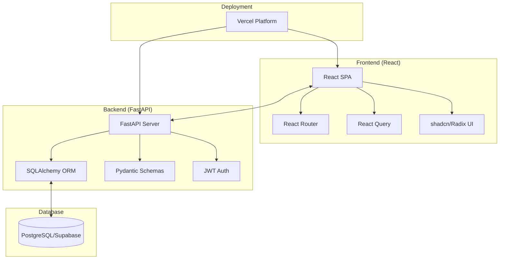
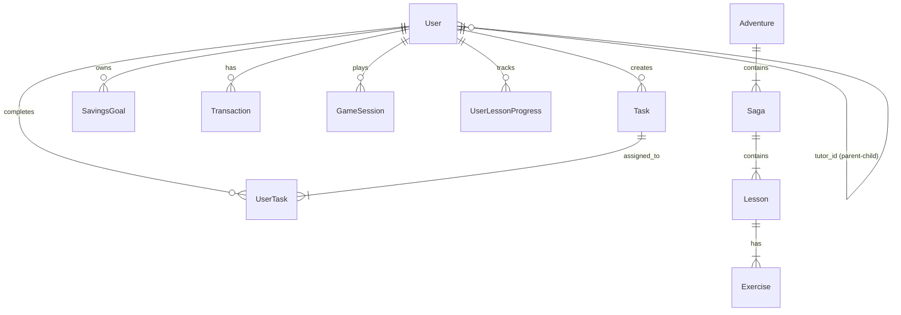
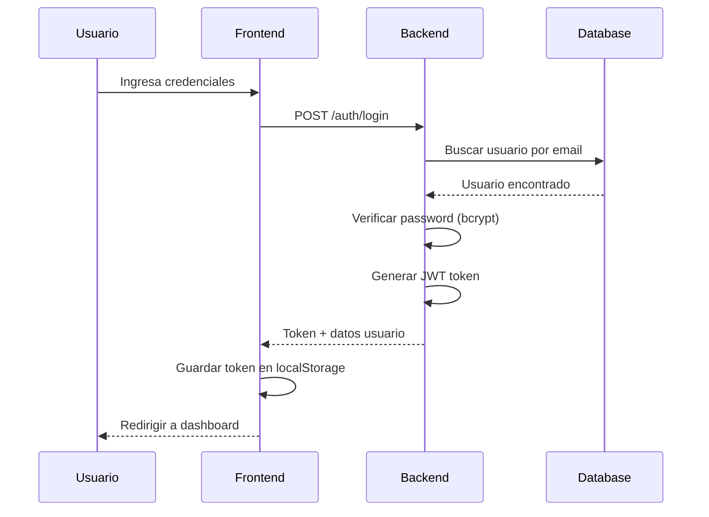

# 📚 Reporte Completo del Tech Stack - LittleFounders

> **Versión:** 1.0.0  
> **Fecha:** Enero 2026  
> **Propósito:** Documentación técnica detallada para onboarding de desarrolladores

---

## 📋 Tabla de Contenidos

1. [Visión General de la Arquitectura](#visión-general-de-la-arquitectura)
2. [Backend - Tecnologías](#backend---tecnologías)
3. [Frontend - Tecnologías](#frontend---tecnologías)
4. [Base de Datos](#base-de-datos)
5. [Infraestructura y Despliegue](#infraestructura-y-despliegue)
6. [Autenticación y Seguridad](#autenticación-y-seguridad)
7. [Estructura del Proyecto](#estructura-del-proyecto)

---

## 🏗️ Visión General de la Arquitectura

LittleFounders es una **plataforma educativa de finanzas para niños** construida con una arquitectura **monorepo full-stack**. La aplicación sigue el patrón de **separación clara entre frontend y backend**, comunicándose a través de una REST API.



### Arquitectura General

| Capa | Tecnología | Propósito |
|------|------------|-----------|
| Frontend | React + TypeScript + Vite | Interfaz de usuario SPA |
| Backend | FastAPI + Python | REST API y lógica de negocio |
| Base de Datos | PostgreSQL (Supabase) | Persistencia de datos |
| Hosting | Vercel | Despliegue serverless |

---

## 🐍 Backend - Tecnologías

El backend está construido con **Python 3.11+** y utiliza un stack moderno y performante.

### Framework Principal: FastAPI

**Archivo:** `backend/main.py`

```python
from fastapi import FastAPI
from fastapi.middleware.cors import CORSMiddleware

app = FastAPI(
    title="LittleFounders API",
    version="1.0.0",
    description="API para la plataforma educativa financiera LittleFounders"
)
```

**¿Por qué FastAPI?**
- ⚡ **Alto rendimiento**: Basado en Starlette y Pydantic
- 📚 **Documentación automática**: Swagger UI disponible en `/docs`
- 🔒 **Validación automática**: Schemas con Pydantic
- 🔄 **Async nativo**: Soporte para operaciones asíncronas

### Dependencias del Backend

| Paquete | Versión | Propósito |
|---------|---------|-----------|
| `fastapi` | 0.104.1 | Framework web principal |
| `uvicorn[standard]` | 0.24.0 | Servidor ASGI |
| `sqlalchemy` | 2.0.23 | ORM para base de datos |
| `psycopg2-binary` | 2.9.9 | Driver PostgreSQL |
| `pydantic` | 2.11.7 | Validación de datos |
| `pydantic-settings` | 2.9.1 | Configuración tipo-segura |
| `python-jose[cryptography]` | 3.3.0 | Manejo de JWT |
| `passlib[bcrypt]` | 1.7.4 | Hashing de contraseñas |
| `bcrypt` | 4.0.1 | Algoritmo de encriptación |
| `email-validator` | 2.2.0 | Validación de emails |
| `alembic` | 1.13.1 | Migraciones de BD |
| `supabase` | ≥2.0.0 | SDK de Supabase |
| `python-dotenv` | ≥1.0.0 | Variables de entorno |

### Estructura de Módulos del Backend

```
backend/
├── main.py                    # Punto de entrada de la API
├── config.py                  # Configuración con Pydantic Settings
├── database.py                # Conexión a PostgreSQL
├── models.py                  # Modelos SQLAlchemy (ORM)
├── schemas.py                 # Schemas Pydantic (validación)
├── auth/                      # Módulo de autenticación
│   ├── endpoints.py           # Rutas: /auth/login, /auth/register
│   ├── permissions.py         # Control de permisos por rol
│   ├── schemas.py             # Schemas de auth
│   └── utils.py               # Funciones de hash y JWT
├── dashboard/                 # Dashboard del usuario
├── tasks/                     # Sistema de tareas
├── parent_tasks/              # Tareas asignadas por padres
├── savings/                   # Metas de ahorro
├── store/                     # Tienda virtual
├── lecciones/                 # Sistema de lecciones
├── investment_games/          # Juegos de inversión (Lemonade Stand)
├── virtual_cards/             # Tarjetas virtuales
└── lesson_engine/             # Motor de lecciones interactivas
```

### Configuración del Backend

**Archivo:** `backend/config.py`

```python
from pydantic_settings import BaseSettings, SettingsConfigDict

class Settings(BaseSettings):
    model_config = SettingsConfigDict(
        env_file=".env",
        env_file_encoding="utf-8",
        extra="ignore",
        case_sensitive=False
    )
    
    # Database
    database_hostname: str
    database_port: str
    database_password: str
    database_name: str
    database_username: str
    
    # Security
    secret_key: str
    algorithm: str
    access_token_expire_minutes: int
    
    # ... más configuración
```

### Conexión a Base de Datos

**Archivo:** `backend/database.py`

```python
from sqlalchemy import create_engine
from sqlalchemy.orm import sessionmaker

DATABASE_URL = f"postgresql://{settings.database_username}:{settings.database_password}@{settings.database_hostname}:{settings.database_port}/{settings.database_name}"

engine = create_engine(
    DATABASE_URL,
    pool_pre_ping=True,      # Verificar conexiones
    pool_recycle=300,        # Reciclar cada 5 minutos
    connect_args={
        "connect_timeout": 10,
        "options": "-c timezone=utc"
    }
)

SessionLocal = sessionmaker(autocommit=False, autoflush=False, bind=engine)
```

---

## ⚛️ Frontend - Tecnologías

El frontend está construido con **React 18** y **TypeScript**, utilizando un stack moderno de herramientas.

### Framework y Build Tool

| Tecnología | Versión | Propósito |
|------------|---------|-----------|
| **React** | 18.3.1 | Biblioteca UI |
| **TypeScript** | 5.5.3 | Tipado estático |
| **Vite** | 5.4.1 | Build tool y dev server |
| **@vitejs/plugin-react-swc** | 3.5.0 | Compilación SWC rápida |

### Configuración Vite

**Archivo:** `frontend/vite.config.ts`

```typescript
import { defineConfig } from "vite";
import react from "@vitejs/plugin-react-swc";
import path from "path";

export default defineConfig(({ mode }) => ({
  server: {
    host: "::",
    port: 8080,
  },
  plugins: [react()],
  resolve: {
    alias: {
      "@": path.resolve(__dirname, "./src"),
    },
  },
}));
```

### Estilización: TailwindCSS + Design System

**Versión TailwindCSS:** 3.4.11

El proyecto implementa un **design system personalizado** basado en variables CSS con soporte para **dark mode**.

**Archivo:** `frontend/tailwind.config.ts`

```typescript
export default {
  darkMode: ["class"],
  content: [
    "./pages/**/*.{ts,tsx}",
    "./components/**/*.{ts,tsx}",
    "./src/**/*.{ts,tsx}",
  ],
  theme: {
    extend: {
      colors: {
        border: 'hsl(var(--border))',
        background: 'hsl(var(--background))',
        foreground: 'hsl(var(--foreground))',
        primary: {
          DEFAULT: 'hsl(var(--primary))',
          foreground: 'hsl(var(--primary-foreground))'
        },
        // Colores D-S
        success: {
          DEFAULT: 'hsl(var(--success))',
          light: 'hsl(var(--success-light))'
        },
        warning: { ... },
        info: { ... },
        // Colores semánticos del juego
        revenue: { ... },
        customers: { ... },
        product: { ... },
      },
      boxShadow: {
        'soft': 'var(--shadow-soft)',
        'medium': 'var(--shadow-medium)',
        'button': 'var(--shadow-button)',
      }
    }
  },
  plugins: [require("tailwindcss-animate")],
}
```

### Bibliotecas de UI: shadcn/ui + Radix

El proyecto utiliza **shadcn/ui**, un sistema de componentes construido sobre **Radix UI**.

**Componentes Radix utilizados:**

| Componente | Uso en LittleFounders |
|------------|----------------------|
| `@radix-ui/react-dialog` | Modales y diálogos |
| `@radix-ui/react-dropdown-menu` | Menús desplegables |
| `@radix-ui/react-tabs` | Navegación por pestañas |
| `@radix-ui/react-progress` | Barras de progreso |
| `@radix-ui/react-avatar` | Avatares de usuario |
| `@radix-ui/react-accordion` | Secciones colapsables |
| `@radix-ui/react-toast` | Notificaciones |
| `@radix-ui/react-checkbox` | Checkboxes estilizados |
| `@radix-ui/react-select` | Selectores personalizados |
| `@radix-ui/react-slider` | Sliders de valores |
| `@radix-ui/react-switch` | Toggles |
| `@radix-ui/react-tooltip` | Tooltips informativos |
| `@radix-ui/react-popover` | Popovers |

### Iconos: Lucide React

**Versión:** 0.462.0

```typescript
import { Home, Settings, User, Star, Award } from "lucide-react";
```

### Enrutamiento: React Router DOM

**Versión:** 6.26.2

**Archivo:** `frontend/src/App.tsx`

```typescript
import { BrowserRouter, Routes, Route } from "react-router-dom";

<Routes>
  <Route path="/" element={<LandingPage />} />
  <Route path="/login" element={<Login />} />
  <Route path="/register" element={<Register />} />
  <Route path="/welcome" element={<Welcome />} />
  <Route path="/dashboard" element={<Dashboard />} />
  <Route path="/lecciones" element={<Lecciones />} />
  <Route path="/savings" element={<Savings />} />
  <Route path="/store" element={<Store />} />
  {/* ... más rutas */}
</Routes>
```

### State Management: React Query

**Versión:** @tanstack/react-query 5.56.2

Se utiliza para:
- Fetching de datos del API
- Caching automático
- Sincronización de estado servidor/cliente
- Invalidación de queries

### Formularios: React Hook Form + Zod

| Paquete | Versión | Propósito |
|---------|---------|-----------|
| `react-hook-form` | 7.53.0 | Manejo de formularios |
| `@hookform/resolvers` | 3.9.0 | Integración con Zod |
| `zod` | 3.23.8 | Validación de schemas |

### Visualización 3D: Three.js + React Three Fiber

| Paquete | Versión | Propósito |
|---------|---------|-----------|
| `three` | 0.181.2 | Motor 3D WebGL |
| `@react-three/fiber` | 8.18.0 | Wrapper React para Three.js |
| `@react-three/drei` | 9.122.0 | Helpers y utilidades |

**Uso:** Elementos visuales interactivos en lecciones y juegos educativos.

### Gráficos: Recharts

**Versión:** 2.12.7

Utilizado para:
- Dashboard de progreso del niño
- Estadísticas del juego Lemonade Stand
- Gráficos de ahorro

### Otras Bibliotecas Importantes

| Paquete | Versión | Propósito |
|---------|---------|-----------|
| `canvas-confetti` | 1.9.4 | Efectos de celebración |
| `date-fns` | 3.6.0 | Manipulación de fechas |
| `sonner` | 1.5.0 | Sistema de toasts |
| `embla-carousel-react` | 8.3.0 | Carruseles |
| `next-themes` | 0.3.0 | Manejo de dark/light mode |
| `clsx` + `tailwind-merge` | - | Utilidades de clases CSS |

### Estructura del Frontend

```
frontend/src/
├── main.tsx                   # Punto de entrada React
├── App.tsx                    # Router principal
├── index.css                  # Variables CSS globales
├── components/
│   ├── ui/                    # Componentes shadcn/ui (54 archivos)
│   ├── auth/                  # Login, Register, AuthGuard
│   ├── dashboard/             # Dashboard del niño y tutor
│   ├── demo/                  # Lecciones demo
│   ├── games/                 # Juegos (Lemonade Stand)
│   ├── lessons/               # Componentes de lecciones
│   ├── banking/               # Banca virtual
│   └── profile/               # Perfil de usuario
├── pages/
│   ├── LandingPage.tsx        # Página de inicio
│   ├── Login.tsx              # Inicio de sesión
│   ├── Register.tsx           # Registro
│   ├── Welcome.tsx            # Bienvenida post-registro
│   ├── Profile.tsx            # Perfil de usuario
│   ├── Lecciones.tsx          # Lista de lecciones
│   ├── Savings.tsx            # Metas de ahorro
│   ├── Store.tsx              # Tienda virtual
│   └── demo/                  # Lecciones demo (14 archivos)
├── hooks/                     # Custom hooks
├── lib/                       # Utilidades (cn, etc.)
├── config/                    # Configuración API
└── utils/                     # Funciones auxiliares
```

---

## 🗄️ Base de Datos

### PostgreSQL vía Supabase

La base de datos está alojada en **Supabase**, un BaaS que proporciona PostgreSQL administrado.

### Modelos de Datos Principales

**Archivo:** `backend/models.py`

#### 1. Modelo de Usuario (`User`)

```python
class User(Base):
    __tablename__ = "users"
    
    id = Column(Integer, primary_key=True)
    name = Column(String(100), nullable=False)
    email = Column(String(100), unique=True, index=True)
    password_hash = Column(String(255), nullable=False)
    user_type = Column(String)  # 'tutor', 'child', 'universal'
    birth_date = Column(DateTime)
    gender = Column(String)
    
    # Relaciones familiares
    tutor_id = Column(Integer, ForeignKey("users.id"))
    children = relationship("User", back_populates="tutor")
    tutor = relationship("User", back_populates="children")
    
    # Métricas del niño
    lessons_completed = Column(Integer, default=0)
    minutes_studied = Column(Integer, default=0)
    points_earned = Column(Integer, default=0)
    current_streak = Column(Integer, default=0)
    balance = Column(Float, default=0.0)
```

#### 2. Sistema de Lecciones

```python
class Adventure(Base):
    """Aventuras principales del currículum"""
    __tablename__ = "adventures"
    
    code = Column(String(50), unique=True)  # "archipielago"
    title = Column(String(200))
    age_range = Column(String(20))  # "5-7"
    theme_color = Column(String(50))
    background_scene = Column(String(50))

class Saga(Base):
    """Sagas dentro de una aventura"""
    __tablename__ = "sagas"
    
    adventure_id = Column(Integer, ForeignKey("adventures.id"))
    code = Column(String(50))  # "detectives-tesoro"
    title = Column(String(200))
    icon = Column(String(50))  # "🔍"

class Lesson(Base):
    """Lecciones individuales"""
    __tablename__ = "lessons"
    
    lesson_id = Column(String(50))  # "1-1-1"
    title = Column(String(200))
    saga_id = Column(Integer, ForeignKey("sagas.id"))
    difficulty = Column(String(50))
    xp_reward = Column(Integer, default=25)
    estimated_duration_seconds = Column(Integer)

class Exercise(Base):
    """Ejercicios dentro de una lección"""
    __tablename__ = "exercises"
    
    lesson_id = Column(Integer, ForeignKey("lessons.id"))
    exercise_type = Column(String(50))  # 'multiple_choice', 'drag_drop', etc.
    character_code = Column(String(50))  # 'liruf', 'dina'
    content = Column(JSON)
    correct_answer = Column(JSON)
```

#### 3. Sistema de Tareas y Recompensas

```python
class Task(Base):
    __tablename__ = "tasks"
    
    title = Column(String(200))
    category = Column(Enum(TaskCategory))  # 'chores', 'education', 'social'
    difficulty = Column(Enum(TaskDifficulty))  # 'easy', 'medium', 'hard'
    reward = Column(Float)  # Dinero virtual
    created_by = Column(Integer, ForeignKey("users.id"))
    assigned_to = Column(Integer, ForeignKey("users.id"))

class UserTask(Base):
    __tablename__ = "user_tasks"
    
    is_completed = Column(Boolean, default=False)
    is_approved = Column(Boolean)  # Aprobación del tutor
    photo_evidence = Column(String(500))  # Evidencia fotográfica
```

#### 4. Sistema de Ahorro

```python
class SavingsGoal(Base):
    __tablename__ = "savings_goals"
    
    title = Column(String(200))
    target_amount = Column(Float)
    current_amount = Column(Float, default=0.0)
    category = Column(String(50))  # 'toy', 'education', 'experience'
    parent_match_percentage = Column(Integer, default=0)  # Match del tutor
    round_up_enabled = Column(Boolean, default=False)
```

#### 5. Juegos de Inversión (Lemonade Stand)

```python
class GameSession(Base):
    __tablename__ = "game_sessions"
    
    game_type = Column(String(50))  # "lemonade_stand"
    day_number = Column(Integer, default=1)
    cash = Column(Float, default=50.0)
    inventory = Column(JSON)  # {lemons, sugar, cups, ice}
    recipe = Column(JSON)  # Configuración de receta
    weather = Column(String(20))  # 'sunny', 'cloudy', 'rainy'
    location = Column(String(50))  # 'park', 'school', 'mall'
    reputation = Column(Integer, default=50)  # 0-100
    level = Column(Integer, default=1)
```

### Diagrama ER Simplificado



---

## 🚀 Infraestructura y Despliegue

### Vercel (Plataforma Principal)

LittleFounders está desplegado en **Vercel** con una configuración monorepo.

**Archivo:** `vercel.json`

```json
{
    "builds": [
        {
            "src": "package.json",
            "use": "@vercel/static-build",
            "config": {
                "distDir": "frontend/dist"
            }
        },
        {
            "src": "backend/index.py",
            "use": "@vercel/python"
        }
    ],
    "routes": [
        {
            "src": "/api/(.*)",
            "dest": "backend/index.py"
        },
        {
            "src": "/(.*)",
            "dest": "frontend/dist/$1"
        }
    ]
}
```

### Arquitectura de Despliegue

```
┌─────────────────────────────────────────┐
│              Vercel Platform            │
├─────────────────────────────────────────┤
│                                         │
│   ┌──────────────┐  ┌──────────────┐   │
│   │   Frontend   │  │   Backend    │   │
│   │  (Static)    │  │ (Serverless) │   │
│   │              │  │              │   │
│   │  /dist/*     │  │  /api/*      │   │
│   └──────────────┘  └──────────────┘   │
│                                         │
└─────────────────────────────────────────┘
              │                │
              ▼                ▼
┌─────────────────────────────────────────┐
│           Supabase (Database)           │
│              PostgreSQL                 │
└─────────────────────────────────────────┘
```

### Variables de Entorno Requeridas

| Variable | Descripción |
|----------|-------------|
| `DATABASE_HOSTNAME` | Host de Supabase PostgreSQL |
| `DATABASE_PORT` | Puerto |
| `DATABASE_NAME` | Nombre de la BD |
| `DATABASE_USERNAME` | Usuario |
| `DATABASE_PASSWORD` | Contraseña |
| `SECRET_KEY` | Clave para JWT |
| `ALGORITHM` | Algoritmo JWT |
| `ACCESS_TOKEN_EXPIRE_MINUTES` | Expiración del token |

---

## 🔐 Autenticación y Seguridad

### Sistema de Autenticación JWT

**Archivos principales:**
- `backend/auth/endpoints.py` - Rutas de autenticación
- `backend/auth/utils.py` - Funciones de hashing y JWT
- `backend/auth/permissions.py` - Control de permisos

### Flujo de Autenticación



### Endpoints de Autenticación

| Endpoint | Método | Descripción |
|----------|--------|-------------|
| `/auth/register` | POST | Registro de nuevo usuario |
| `/auth/login` | POST | Inicio de sesión |
| `/auth/me` | GET | Obtener usuario actual |
| `/auth/me` | PUT | Actualizar perfil |
| `/auth/family/{user_id}` | GET | Obtener familia del usuario |

### Tipos de Usuario

```python
class UserType(str, enum.Enum):
    TUTOR = "tutor"      # Padres/Tutores
    CHILD = "child"      # Niños
    UNIVERSAL = "universal"  # Usuario simplificado
```

### Hashing de Contraseñas

```python
from passlib.context import CryptContext

pwd_context = CryptContext(schemes=["bcrypt"], deprecated="auto")

def get_password_hash(password: str) -> str:
    return pwd_context.hash(password)

def verify_password(plain_password: str, hashed_password: str) -> bool:
    return pwd_context.verify(plain_password, hashed_password)
```

---

## 📁 Estructura del Proyecto

```
LITTLEFOUNDERS-AI/
├── 📁 backend/                    # Servidor FastAPI
│   ├── main.py                    # Entry point
│   ├── config.py                  # Configuración
│   ├── database.py               # Conexión PostgreSQL
│   ├── models.py                 # Modelos SQLAlchemy
│   ├── schemas.py                # Schemas Pydantic
│   ├── requirements.txt          # Dependencias Python
│   ├── 📁 auth/                   # Autenticación
│   ├── 📁 dashboard/              # Dashboard API
│   ├── 📁 tasks/                  # Sistema de tareas
│   ├── 📁 savings/                # Metas de ahorro
│   ├── 📁 lecciones/              # API de lecciones
│   ├── 📁 investment_games/       # Juegos
│   └── 📁 docs/                   # Documentación
│
├── 📁 frontend/                   # Aplicación React
│   ├── package.json              # Dependencias npm
│   ├── vite.config.ts            # Configuración Vite
│   ├── tailwind.config.ts        # Configuración Tailwind
│   ├── index.html                # HTML base
│   ├── 📁 src/
│   │   ├── App.tsx               # Router principal
│   │   ├── index.css             # Variables CSS
│   │   ├── 📁 components/         # Componentes React
│   │   ├── 📁 pages/              # Páginas
│   │   ├── 📁 hooks/              # Custom hooks
│   │   └── 📁 lib/                # Utilidades
│   └── 📁 public/                 # Assets estáticos
│
├── vercel.json                    # Configuración Vercel
├── package.json                   # Root package.json
├── database.sql                   # Schema SQL
└── 📄 INSTRUCCIONES_LOCAL.md      # Guía de desarrollo
```

---

## 🏷️ Resumen de Versiones

| Tecnología | Versión | Categoría |
|------------|---------|-----------|
| Python | 3.11+ | Runtime |
| FastAPI | 0.104.1 | Backend Framework |
| SQLAlchemy | 2.0.23 | ORM |
| React | 18.3.1 | Frontend Framework |
| TypeScript | 5.5.3 | Language |
| Vite | 5.4.1 | Build Tool |
| TailwindCSS | 3.4.11 | CSS Framework |
| React Router | 6.26.2 | Routing |
| React Query | 5.56.2 | State Management |
| Radix UI | 1.x | Component Library |
| Three.js | 0.181.2 | 3D Graphics |
| Recharts | 2.12.7 | Charts |
| PostgreSQL | Latest | Database |
| Supabase | 2.0+ | BaaS |
| Vercel | - | Hosting |

---

> **Nota para nuevos desarrolladores:** Este documento proporciona una visión completa del tech stack. Para tareas específicas, consulta la documentación adicional en los archivos README de cada módulo.

**Última actualización:** Enero 2026
