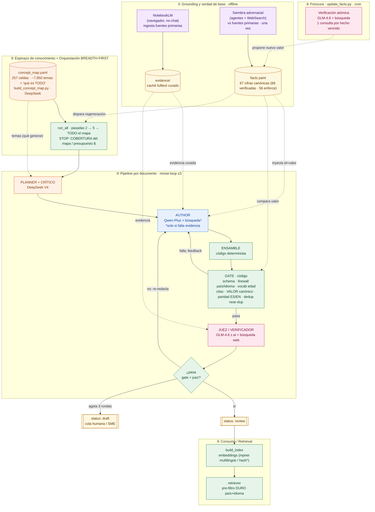

# ARCHITECTURE_V3.md — Cerebro de conocimiento, pipeline v3 (fact-anchored · Qwen+GLM · breadth-first)

> **⚠️ v4 — SUPERSEDED (2026-06-22):** la autoridad de diseño de principio a fin es ahora
> [`ARCHITECTURE_V4.md`](ARCHITECTURE_V4.md) y la guía canónica para la **corrida masiva** es
> [`RUNBOOK_V4.md`](RUNBOOK_V4.md). Este documento es el **diseño histórico v3/v3.1**: sigue siendo válido
> donde v4 no lo contradice, pero **donde difiera mandan los docs v4**. Cambios clave de v4 a tener en
> mente al leer abajo: (1) el autor redacta desde **evidencia recuperada POR TEMA** (`tools/evidence_rag.py`,
> TF-IDF léxico + firewall de jurisdicción sobre el insumo), **no desde memoria ni desde un blob por dominio**;
> (2) **verificación atómica** (`tools/atomic_verify.py`): cada afirmación de la prosa se verifica vía NLI
> contra la evidencia (3 vías: soportada/contradicha/no-verificable), con barra de calidad
> (`min_factscore 0.80`, `max_unverifiable_rate 0.50`) — el juez GLM **ya no es el único garante factual**;
> (3) el gate aplica **disciplina de ids** (un `@fact` fuera de tabla que duplica una cantidad canónica =
> HARD-FAIL; `--strict-facts` endurece los volátiles fuera de tabla) y reporta el *anchored ratio*;
> (4) **proyección de costo** (`tools/cost_projection.py`) cableada al preflight (no da GO si los caps no
> alcanzan para terminar la corrida completa); (5) la **cobertura cuenta solo docs VERIFICADOS** (no drafts)
> e índice semántico real (mpnet, no hash); el andamio "## For future Claude" desapareció (el autor escribe
> "## Resumen"). Planner = **DeepSeek V4**, autor = **Qwen-Plus**, juez **y** verificación atómica = **GLM/z.ai**.

> **⚠️ v3.1 — HARDENING (2026-06-21):** la referencia CANÓNICA de principio a fin (con mermaid) es ahora
> [`PIPELINE.md`](PIPELINE.md). Tras una evaluación crítica adversarial: el **STOP por cobertura ahora es
> REAL** (antes solo etiqueta); **review→draft FUNCIONA** (antes no-op); **"100% real" → alcance honesto**
> (solo las ~67 cifras de `facts.yaml` son verificadas determinísticamente; el resto es LLM-revisado con
> `grounding_tier`); `facts.yaml` 48→**~67**; embedder de prod **fastembed multilingüe**; **frescura
> wall-clock**; **dedup semántico** + **decontaminación** añadidos. Este doc es el diseño histórico.

> **Estado:** diseñado, implementado y auditado (GO) el **2026-06-21**. Listo para ejecución; **aún no
> ejecutado** (la corrida completa la dispara un humano). Ver el plan de ejecución en
> [`PLAN_V3_EXECUTION.md`](PLAN_V3_EXECUTION.md). Esta es la decisión arquitectónica autoritativa que
> sucede a [`BRAIN_STRATEGY.md`](BRAIN_STRATEGY.md) (estrategia base) en los puntos donde difiera.

---

## 0. Filosofía: AMPLITUD antes que profundidad

El cerebro vale por **cuánto del espectro de conocimiento cubre**, no por cuán hondo profundiza en un
tema. Un RAG que sabe "un poco de todo" sobre finanzas/emprendimiento/economía/administración/fiscal —
MX y US, 5→18+ — alimenta mejor la generación de lecciones y un futuro chatbot que uno que sabe "todo de
impuestos y nada de lo demás".

Tres principios, en orden:

1. **Breadth-first.** Cubrir TODAS las celdas `país × dominio × subdominio` con un *baseline* antes de
   profundizar ninguna. La profundidad llega en pasadas posteriores y solo si queda presupuesto/tamaño.
2. **Fact-anchored.** Las cifras volátiles tienen UNA verdad de base estructurada (`facts.yaml`) que el
   código —no el consenso de dos LLMs— hace cumplir. La corrección de números es **determinista**.
3. **Uso sabio de la API.** Caché de respuestas, búsqueda solo cuando hace falta, y nunca preguntarle a
   un LLM lo que ya está verificado en la tabla canónica.

Esto corrige el hallazgo central del benchmark vs. la industria (Phi/Cosmopedia, BloombergGPT/FinPile,
SAFE/FActScore, Constitutional AI): *el cuello de botella no es el retrieval, es la verificación factual.*

---

## Diagrama del pipeline completo (modelos por rol)

**Qué modelo hace qué** (configurable en `_meta/build_policy.yaml → models`):

| Etapa | Modelo | Proveedor | Búsqueda web | Dónde |
|------|--------|-----------|--------------|-------|
| Grounding (ingesta de fuentes primarias) | **NotebookLM** (navegador, no-chat) | Google | sí (propia) | `build_evidence.py` |
| Siembra de `facts.yaml` (una vez) | **verificación adversarial** (agentes + WebSearch) | — | sí | workflow (fuera del runtime) |
| Planner **y** Crítico de completitud (diseña el currículo → AMPLITUD) | **deepseek-v4-flash** | **DeepSeek** | no | `q_planner`, `q_critic` |
| **Autor** | **qwen-plus-latest** | Qwen | **sí** (condicional: solo si falta evidencia) | `q_author` |
| Ensamble + **Gate** | — (**código determinista**) | — | no | `assemble_doc`, `gate_kb.py` |
| **Juez / Verificador** | **glm-4.6** | **GLM (z.ai)** | **sí** (`web_search`) | `q_judge` |
| Frescura (re-verificación atómica) | **glm-4.6** (= `MODELS['judge']`) | GLM (z.ai) | sí | `update_facts.py` |
| Índice (embeddings) | mpnet multilingüe (768d)/fastembed o `hash`* (no-LLM) | local | no | `build_index.py` |

> **Tres proveedores independientes** — planner **DeepSeek** · autor **Qwen** · juez **GLM** — = errores
> no correlacionados **y** 3 pools de cuota separados (más velocidad). Las cifras no las decide ningún LLM:
> las ancla `facts.yaml` y las compara el gate por código.



\* El embedder por defecto es `hash` (placeholder sin semántica); para servir el RAG en producción usar
`--embedder fastembed` (mpnet multilingüe 768d, ver §8).

---

## 1. Ancla de verdad — `_meta/facts.yaml`

La pieza nueva más importante. Una tabla canónica de **67 hechos** (66 verificados, 56 con `enforce`)
—"números de oro" MX/US (impuestos, salarios/UMA,
banca central, inversión, bolsa, metales, cripto, crédito), **verificada el
2026-06-21 contra fuentes PRIMARIAS** (DOF/SAT/LISR/LIVA, INEGI, CONASAMI, Banxico; IRS Rev.Proc/IRB,
SSA, Federal Reserve) con **verificación adversarial** (un agente busca, otro independiente refuta).

Cada hecho: `value, unit, jurisdiction, label_es, effective_from, effective_to, volatility, enforce,
source_url, source_publisher, last_verified, verified, notes`.

Dos flags de control gobiernan el comportamiento:

| flag | efecto |
|------|--------|
| `verified: true` | se **inyecta al autor** (para que copie id+valor) y, si además `enforce`, lo **exige el gate**. `false` = placeholder a confirmar (no se usa ni se exige). |
| `enforce: true` (default) | el **gate compara** el `@fact` del doc contra este valor; difiere ⇒ HARD-FAIL. `false` = valor compuesto/descriptivo (rangos, condiciones) que se inyecta pero no se compara carácter-a-carácter. |

Flujo de la verdad:

```
facts.yaml ──(inyección)──► AUTOR copia id+valor exactos
     │
     └──(comparación determinista)──► GATE: @fact value == canónico ?  no ⇒ RECHAZO
```

Resultado: un número equivocado **no puede** entrar al corpus aunque autor y juez se equivoquen de
acuerdo. Es el estándar "knowledge graph / tabla canónica" de los sistemas regulados (Bloomberg, Thomson
Reuters), no "LLM juzga a LLM".

Loader/normalizador: [`tools/facts_table.py`](knowledge/tools/facts_table.py) (`load_facts`,
`values_match`, `canonical_block`). `values_match` normaliza moneda/comas/espacios y compara como número
cuando aplica (`3500000` == `3,500,000 MXN`).

---

## 2. Proveedores y roles — Qwen autor + GLM juez

| Rol | Modelo | Proveedor | Búsqueda web | Por qué |
|-----|--------|-----------|--------------|---------|
| Planner / Crítico | `deepseek-v4-flash` | **DeepSeek** | no | diseña el currículo (clave para la AMPLITUD); 3er pool de cuota |
| **Autor** | `qwen-plus-latest` | Qwen | **sí** (`enable_search`) | redacta y funda en evidencia/web |
| **Juez / Verificador** | `glm-4.6` | **z.ai (GLM)** | **sí** (tool `web_search`) | **proveedor INDEPENDIENTE** del autor → errores no correlacionados, y **sí** busca |

**DeepSeek fue retirado del rol JUEZ** (pero se reincorpora como **PLANNER** —rol sin búsqueda, pool de
cuota propio—): su API nativa no tiene búsqueda web (`search_ok=False`), así que
verificaba cifras 2026 a ciegas. GLM (z.ai) da las dos cosas que importan a la vez: independencia de
proveedor (lo que DeepSeek aportaba) **y** búsqueda (lo que le faltaba). Autor Qwen + juez GLM > todo-Qwen
porque dos entrenamientos distintos no comparten los mismos puntos ciegos.

Cliente único multi-proveedor: [`tools/llm_qwen.py`](knowledge/tools/llm_qwen.py) — `provider_for(model)`
deduce `qwen|glm|deepseek`; Qwen usa `enable_search`, GLM usa el tool `web_search` (formato z.ai),
DeepSeek no busca. **Caché content-addressed** (sha256 de provider+model+messages+params) → resume y
re-ejecuciones no re-pagan.

---

## 3. El pipeline por documento (revise-loop)

```
                 ┌─────────────────────── revise-loop (≤3) ───────────────────────┐
PLANNER(Qwen) → AUTOR(Qwen+canon+evidencia+search?) → ENSAMBLE → GATE(código) → JUEZ(GLM+search) → review
                 └── feedback de gate/juez re-alimenta al autor ──┘            └→ agotado ⇒ draft (cola humana)
```

1. **PLANNER** (`q_planner`, DeepSeek V4): propone documentos por subdominio con ángulos distintos. Para
   `shared` fuerza neutralidad (sin IVA/SAT/IRS).
2. **AUTOR** (`q_author`, Qwen-Plus): recibe **(a)** el bloque de **CIFRAS CANÓNICAS** de la jurisdicción
   (debe copiar id+valor exactos), **(b)** la **evidencia curada** (NotebookLM) si existe. Búsqueda web
   **condicional** (`wise_use.author_search_when_evidence`): si hay evidencia, no busca (ahorra); si
   falta, busca. Redacta ES (canónico) + EN (fiel), secciones por tier de edad, mini-ejemplo numérico,
   marca `[[fact:id]]` y declara `facts` con fuente.
   > **v4:** el autor redacta desde **evidencia recuperada POR TEMA** (`tools/evidence_rag.py`, TF-IDF léxico
   > + firewall de jurisdicción sobre el insumo), no desde memoria ni desde un blob por dominio. Escribe
   > "## Resumen" (el andamio "## For future Claude" se eliminó; el indexer excluye el andamio).
3. **ENSAMBLE** (`assemble_doc`, código): frontmatter de esquema + registra fuentes + sustituye sentinels
   `[[fact:]]` por `<!-- @fact id=… value="…" … -->` (valor **citado** para que rangos/multi-token
   round-trippeen el parser).
4. **GATE** (`tools/gate_kb.py`, código determinista) — hace cumplir:
   - schema de frontmatter + enums (taxonomy/schema.json)
   - **firewall anti-fuga** país/idioma (un `@fact` no cita fuente de otra jurisdicción)
   - techo de **vocabulario por edad** (Piaget) en secciones tempranas
   - **citas** existen; volatility≥medium exige ≥1 fuente `tier:primary`
   - **NUEVO v3 — valor canónico:** cada `@fact` cuyo id esté en `facts.yaml` (verified+enforce) debe
     tener **exactamente** ese valor (`FACT MISMATCH` = HARD-FAIL)
   - **NUEVO v3 — paridad ES/EN:** un `@fact` no puede divergir de valor entre idiomas
   - fallo ⇒ los errores se re-alimentan al autor (revise-loop)
5. **JUEZ** (`q_judge`, GLM + búsqueda): recibe la **evidencia** (para NLI cite-and-verify) y la nota de
   que **las cifras canónicas ya las valida el gate** (no las re-checa → uso sabio). Puntúa 5 dimensiones
   y devuelve `wrong_facts` solo de cifras NO canónicas realmente incorrectas. `_real_wrong` filtra
   falsos positivos. Bajo la barra / hechos erróneos ⇒ revise.
   > **v4:** el juez GLM **ya no es el único garante factual**. Se añade **verificación atómica**
   > (`tools/atomic_verify.py`, GLM/z.ai): cada afirmación de la prosa se verifica vía NLI contra la
   > evidencia (3 vías: soportada/contradicha/no-verificable), con barra de calidad
   > (`quality_bar.atomic_verify`: `min_factscore 0.80`, `max_unverifiable_rate 0.50`). Además el gate
   > aplica **disciplina de ids** (un `@fact` fuera de tabla que duplique una cantidad canónica = HARD-FAIL;
   > `--strict-facts` endurece los volátiles fuera de tabla) y reporta el *anchored ratio*.
6. **Resolución:** pasa gate+juez ⇒ `status: review`. Agota 3 rondas ⇒ `status: draft` (conservado para
   revisión humana; los drafts son la cola del SME). **Nada se auto-publica.**

---

## 4. Orquestación BREADTH-FIRST

El espacio de "qué generar" lo define el **concept map** (§4.5). `run_all` ejecuta **varias pasadas** con
cap creciente de docs/subdominio (`breadth.passes: [2, 5, 0]`, que se expande a `[2, 5, 13, 21, 29, 37]`):

- **Pasada 1 (cap 2):** cubre las **257 celdas** `país×dominio×subdominio` con 2 docs core cada una →
  amplitud total primero.
- **Pasada 2 (cap 5):** profundiza tras cubrir todo.
- **Pasada 3 (cap 0 = sin tope):** genera **TODOS los temas del concept map** de cada celda → cobertura
  ENCICLOPÉDICA. Todo SOLO mientras quede presupuesto.

El cap es **total por celda** (existentes + nuevos), así que cada pasada crece de forma incremental y el
resume nunca duplica. Las celdas se **intercalan** `mx→us→shared` (jurisdiccional primero).

**STOP por COBERTURA (no por MB):** con `targets.stop_on: coverage`, la corrida NO frena al alcanzar un
tamaño en MB — corre hasta **cubrir todo el concept map** (todas las celdas, todos sus temas). "Capturar
todo el conocimiento posible" lo DEFINE el concept map. El MB pasa a **tope de seguridad** opcional
(`size_safety_cap_mb`). El **presupuesto en $** sí puede cortar en cualquier punto: **primero ancho, luego hondo**.
> **v4:** la cobertura cuenta **solo docs VERIFICADOS** (no drafts), sobre un índice semántico real (mpnet).

---

## 4.5. Concept map — el ESPINAZO de conocimiento (cobertura enciclopédica)

La pieza que convierte "capturar absolutamente TODO" en algo **concreto y MEDIBLE**. `build_concept_map.py`
deriva, por celda, el espacio **EXHAUSTIVO** de temas que una enciclopedia tendría (DeepSeek V4 con un
prompt de enumeración exhaustiva + crítico de completitud loop-until-dry), y lo persiste en
`_meta/concept_map.yaml` como artefacto **versionado y reviewable** — no efímero como el planner en runtime.

- **Es la definición de "TODO":** ~31 temas GENUINOS por celda × 257 celdas ≈ **~7,950 temas únicos**
  (cifra LEAN tras la evaluación crítica: el mapa salía inflado ~2-3× y se regeneró por SATURACIÓN, no por
  llenar un cap). Es contenido REAL, no relleno — el mapa lo demuestra. Ejemplo: `mx/taxes/income_tax`
  (residencia fiscal, tipos de ingreso, RESICO, deducciones, medios de defensa, cripto…).
- **Hace la cobertura MEDIBLE:** `--status` reporta `docs generados / temas del mapa (%)`. El stop = 100% del mapa.
- **El orquestador genera CONTRA el mapa** (`_cell_topics`): determinista, completo, resumible. Si una celda
  no está en el mapa, cae al planner en vivo (compat).
- **Robustez:** parser con **salvamento** (extrae cada tema completo aunque DeepSeek trunque el JSON por
  razonamiento), concurrente, escritura atómica, resumible (salta celdas ya mapeadas).
- **Anti-relleno:** un **gate de dedup near-dup** (`dedup.py`, shingle-Jaccard, sin deps) evita que dos
  temas produzcan docs casi-idénticos → "tamaño = conocimiento único". (Dedup semántica con embeddings = upgrade futuro.)

---

## 5. Robustez: resume, errores, presupuesto

| Mecanismo | Implementación |
|-----------|----------------|
| **Resume idempotente** | un doc ya en disco se salta (`exists`). Re-ejecutar `--run` continúa donde quedó. |
| **Caché LLM** | respuestas cacheadas (sha256): el resume no re-paga las llamadas ya hechas. |
| **Escritura atómica** | `write_atomic` (`.tmp`+rename): un corte a mitad NO deja un doc corrupto. |
| **Manifiesto de estado** | `index/build_state.json` (atómico+lock) registra status por doc; `--status` lo resume. |
| **Retry de drafts** | `--retry-drafts` regenera los docs en `draft` en el resume (en vez de saltarlos). |
| **Tolerancia a fallos** | un subdominio que lance excepción NO tumba la corrida (`continue_on_subdomain_error`). |
| **Backoff de red** | el cliente reintenta 429/5xx con backoff; degrada búsqueda GLM a sin-búsqueda si el tool falla. |
| **Presupuesto $** | `wise_use.budget_usd` corta la corrida al alcanzar ese gasto estimado (tokens×precio de los 3 proveedores); `alert_usd_remaining` imprime una ALERTA cuando el saldo estimado baja del umbral (recargar APIs). `budget_output_tokens` es el tope alterno por tokens del autor. |
| **Preflight** | `tools/preflight.py` audita GO/NO-GO antes de arrancar (credenciales, pings, gate, facts). *v4:* cablea `tools/cost_projection.py` y rechaza GO si los caps de presupuesto no alcanzan para terminar la corrida completa (proyección ~$964 USD: GLM ~$703, Qwen ~$261; el cap de GLM debe subir de $9 a ~$800). |

---

## 6. Frescura: validity windows + agente de actualización atómica

`facts.yaml` modela **point-in-time**: cada cifra tiene `effective_from/effective_to` y `volatility`.
`review_due = last_verified + cadencia(volatility)` (cadencias en `volatility_policy.yaml`:
high=3m, medium=1a, low=2a, static=nunca).

[`tools/update_facts.py`](knowledge/tools/update_facts.py) es el **agente de actualización atómica**
(diseñado para cron, p.ej. semanal):

```
--due       lista hechos vencidos (sin red)
--verify    UNA consulta atómica por hecho vencido → fuente primaria → propone cambios (no auto-aplica)
--affected  lista los docs que citan un @fact (para regenerarlos cuando su valor cambia)
```

Reporta a `index/facts_update_report.json`. **No edita `facts.yaml` solo**: un humano/SME aprueba el
cambio, actualiza `value`+`last_verified`, y regenera los docs afectados (`--retry-drafts`). Caso testigo:
el estímulo IVA 8% frontera expira `2026-12-31`; su `effective_to` lo marcará vencido y el agente lo
levantará en la primera corrida de 2027 sin tocar el resto del cerebro.

---

## 7. Mapa de componentes (v3)

```
_meta/
  facts.yaml          ← NUEVO: tabla canónica (verdad de base) · 67 hechos (66 verificados, 56 enforce)
  build_policy.yaml   ← v3: models(qwen+glm), breadth(passes), wise_use, run(resume)
  taxonomy.yaml · sources.yaml · volatility_policy.yaml · schema.json
tools/
  llm_qwen.py         ← multi-proveedor (qwen/glm/deepseek) + caché + provider_for()
  facts_table.py      ← NUEVO: loader/normalizador de facts.yaml
  build_dataset.py    ← pipeline: canon→autor, juez GLM+evidencia, breadth-first, resume, atómico
  gate_kb.py          ← + comparación de valor canónico + paridad @fact ES/EN
  preflight.py        ← NUEVO: auditoría GO/NO-GO (+ v4: cablea cost_projection)
  update_facts.py     ← NUEVO: agente de actualización atómica (cron-ready)
  build_evidence.py · build_index.py · retriever.py · kb_common.py
  evidence_rag.py     ← v4: recuperación de evidencia POR TEMA (TF-IDF léxico + firewall jurisdicción)
  atomic_verify.py    ← v4: verificación atómica NLI (FActScore) de la prosa vs evidencia
  cost_projection.py  ← v4: proyección de costo (preflight rechaza GO si los caps no terminan la corrida)
```

---

## 8. Lo que NO cambió (y por qué)

- **Retrieval** (markdown→SQLite FTS5/BM25 + embeddings, pre-filtro DURO país/idioma): el benchmark
  concluyó que a 10 MB el retrieval **no es el cuello de botella** (el firewall es pre-filtro de metadata,
  independiente del embedding; el conjunto ya filtrado es pequeño). Migrar a `sqlite-vec`+reranker
  es mejora de fase **100 MB**, no bloqueante ahora. *Pendiente conocido:* el embedder por defecto
  (`build_index.py`) es `hash` (placeholder sin semántica); usar `--embedder fastembed` (mpnet multilingüe
  768d; fallback MiniLM-L12-v2 384d) antes de servir el RAG en producción. *(v4: el índice de producción
  ya usa mpnet real, no hash. Nota: `bge-m3` NO está soportado por fastembed 0.8.0.)*
- **NotebookLM** sigue como grounding curado opcional (657 archivos en `evidence/`); a futuro conviene
  bajarlo de dependencia de runtime a herramienta de *descubrimiento* de fuentes.

## 9. Futuro (fase 100 MB y consumo)

1. Subir `targets.total_size_mb` a 100 y re-correr (mismos gates/juez/facts).
2. Embedder real (mpnet multilingüe 768d; en v4 ya es el índice de prod) + `sqlite-vec` + reranker para el retrieval de producción.
3. `update_facts.py` en cron + cola de drafts con UI mínima para el SME.
4. Métricas estilo FActScore (fracción de `@fact` confirmados) en el reporte de calidad.
