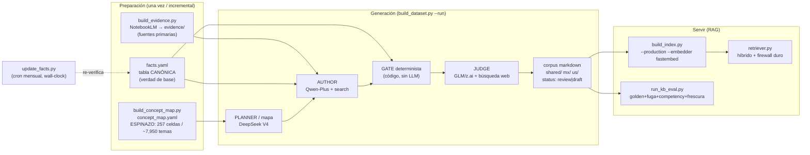
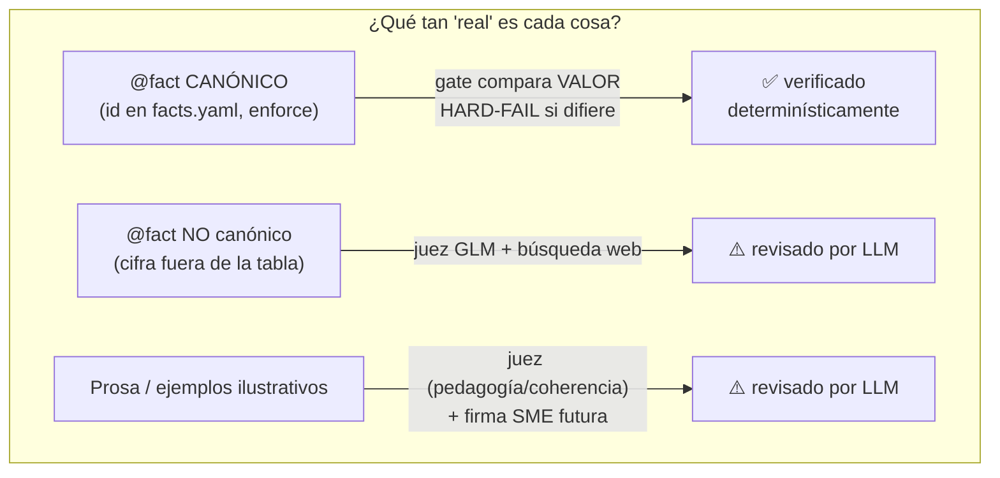
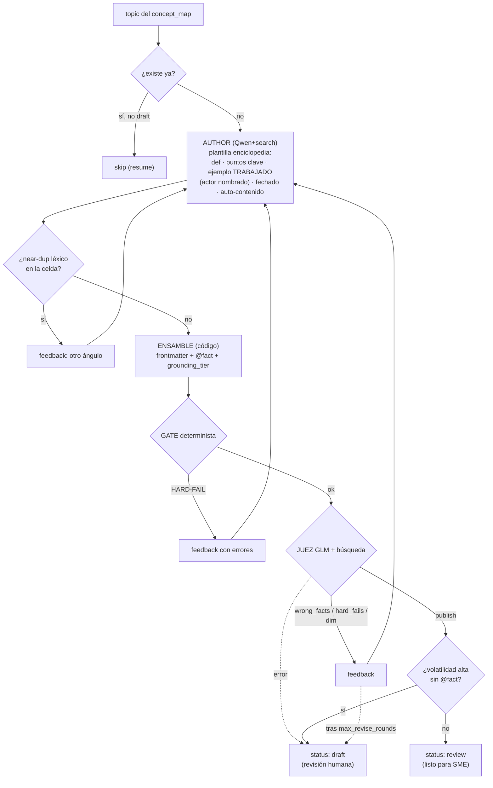
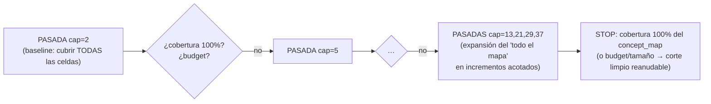
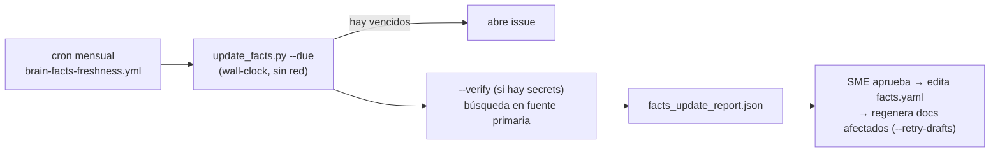

# PIPELINE.md — El pipeline del cerebro RAG, de principio a fin (canónico)

> **Autoridad:** este documento es la referencia CANÓNICA del pipeline `rag-llm-brain` tras el
> *hardening v3.1* (2026-06-21). Si otro doc contradice a éste sobre el comportamiento del pipeline,
> gana éste. Diseño histórico: [`ARCHITECTURE_V3.md`](ARCHITECTURE_V3.md) · ejecución/resume:
> [`PLAN_V3_EXECUTION.md`](PLAN_V3_EXECUTION.md) · cobertura: [`ENCYCLOPEDIA_STRATEGY.md`](ENCYCLOPEDIA_STRATEGY.md).
>
> **Propósito del artefacto:** un **corpus sintético, ANCLADO EN HECHOS**, bilingüe (ES/EN), para
> **México y EE.UU.** (diferenciados, sin fuga de jurisdicción), edades 5-18+, sobre finanzas, impuestos,
> negocios, economía, administración y contaduría. Se construye SIN consumir tokens de Claude, alimenta la
> generación de lecciones y un futuro chatbot RAG, y sirve como **base de conocimiento durable**.
>
> **Qué NO es** (claim honesto): NO es un corpus de *pretraining* tipo Cosmopedia ni "datos 100% reales".
> Es una **base de conocimiento curada** donde las **cifras canónicas están verificadas
> determinísticamente** (tabla `facts.yaml`) y **el resto es prosa autorada por LLM + revisada por un juez
> LLM con búsqueda**, etiquetada por su nivel de grounding y pendiente de firma SME humana antes de
> `published`. Compite con Investopedia / publicaciones IRS-SAT / un currículo hand-authored — no con
> corpus de pretraining.

---

## 1. Visión de 30 segundos



**3 proveedores INDEPENDIENTES** (errores no correlacionados + pools de cuota separados):
**DeepSeek V4** planea, **Qwen-Plus** redacta, **GLM (z.ai)** juzga con búsqueda web.

---

## 2. Roles, modelos y presupuesto

| Rol | Modelo | Proveedor | Búsqueda | Por qué |
|-----|--------|-----------|----------|---------|
| Planner / crítico / **concept map** | `deepseek-v4-flash` | DeepSeek | no | 10× más barato y 3× más rápido que GLM (confirmado por bake-off); diseña la AMPLITUD |
| **Autor** (redacta ES+EN) | `qwen-plus-latest` | Alibaba | sí (`enable_search`) | redactor fuerte; funda en evidencia + web |
| **Juez / verificador** | `glm-4.6` | z.ai (Zhipu) | sí (`web_search`) | proveedor INDEPENDIENTE del autor → no se autoaprueba; verifica cifras NO canónicas |

**Presupuesto = RAÍL DE SEGURIDAD, no condición de STOP.** Topes en USD por proveedor
(`wise_use.budget_usd`); la corrida se detiene LIMPIA y reanudable cuando cualquiera toca su tope.
- El **autor (Qwen) es pay-as-you-go** (factura a tarjeta): `--run` **REHÚSA arrancar** si Qwen no tiene
  tope, salvo `--i-accept-unbounded-author`. Default `qwen: 60`.
- Alerta cuando `(tope − gasto estimado) < alert_usd_remaining` ($3).
- El costo incluye **surcharge de búsqueda web** por llamada (`search_usd_per_call`).
- Contadores de uso bajo lock entre workers (`usage_snapshot()`) → el costo no se corrompe.

> **Costo de un corpus COMPLETO:** del orden de varios cientos de USD (GLM es el cuello de botella).
> Con los saldos prepago actuales una sola corrida cubre bajas-centenas de docs; el corpus completo se
> alcanza en **varios ciclos recarga-y-resume** (el resume es gratis: caché de respuestas LLM en
> `index/llm_cache/`). Sube los `budget_usd` a la proyección del corpus completo antes de un `--run` total.

---

## 3. Las tres anclas de verdad



1. **`facts.yaml`** — tabla canónica (**~67 cifras** verificadas con fuente primaria). El gate compara cada
   `@fact` canónico contra ella; cualquier divergencia = **HARD-FAIL**. Esto es lo único "100% real".
2. **`evidence/`** — fulltext curado de fuentes primarias (NotebookLM). El autor funda en ella; el juez
   contrasta por NLI. (gitignored: insumo con copyright, no producto.)
3. **`concept_map.yaml`** — el ESPINAZO: el espacio EXHAUSTIVO de temas (257 celdas, ~7,950 temas) =
   la definición operativa de "TODO el conocimiento". La cobertura es MEDIBLE contra él.

**Etiqueta de grounding por-doc** (frontmatter, honesta): `grounding_tier` ∈
`anchored` (≥1 cifra canónica) | `llm_reviewed` (sin ancla; juez + fuentes) | `conceptual` (estático sin
cifras) + `canonical_facts` / `cited_facts` / `evidence_grounded`. Un consumidor (lección/chatbot) sabe
qué tan verificado está cada doc.

---

## 4. El loop por documento (build_topic)



**Reglas duras del loop** (todas implementadas y testeadas):
- **GATE determinista** (`gate_kb.py`, sin LLM): frontmatter+enums, `doc_id==path`, coherencia
  país/jurisdicción/currency, dominio/subdominio en vocabulario cerrado, fuentes existen, **volatilidad
  ≥medium exige fuente `primary` VIVA**, fechas no futuras, `@fact` bien formados, **anti-fuga** (la
  fuente de cada `@fact` coincide en jurisdicción), **valor canónico** (HARD-FAIL si difiere de
  `facts.yaml`), **paridad ES/EN** de cada `@fact`, vocabulario prohibido por tier (techo Piaget).
- **Juez = GLM con búsqueda**, NO re-checa cifras canónicas (eso ya lo hace el gate); el filtro
  `_real_wrong` NO se traga errores reales (solo suprime confirmación dura doc==correcto).
- **Degradación a draft funciona de verdad** (bug histórico arreglado): un doc que agota rondas, o cuyo
  juez falla, o de alta volatilidad sin `@fact`, queda en `status: "draft"` y `--retry-drafts` lo reencuentra.
- **Nada se publica solo:** el pipeline escribe `review`/`draft`; un humano/SME aprueba → `published`.

---

## 5. Orquestación: BREADTH-FIRST + STOP por COBERTURA



- **Amplitud antes que profundidad:** primero un baseline en CADA celda, luego se profundiza.
- **STOP por COBERTURA real** (bug histórico arreglado): `coverage_complete()` mide docs/temas contra el
  `concept_map`; el cap "todo el mapa" (`0`) se **expande en incrementos acotados** (`full_step`) para
  checkpointear cobertura y budget entre pasadas. La corrida PARA al cubrir el 100% del mapa, reporta `%`,
  y respeta `require_full_breadth`. Un corte por budget recomputa cobertura desde disco al reanudar.
- **Resume:** checkpoint por existencia de archivo + `index/build_state.json` (atómico). Re-ejecutar salta
  lo hecho; `--retry-drafts` regenera los draft. La caché LLM hace el resume **gratis**.

---

## 6. Anti-redundancia (dos niveles) y anti-contaminación

| Nivel | Herramienta | Qué atrapa | Cuándo |
|-------|-------------|-----------|--------|
| Inline (barato) | `dedup.py` (shingle-Jaccard) | casi-verbatim DENTRO de una celda | en cada doc, durante el `--run` |
| Curación (semántico) | `semdedup.py` (embeddings + coseno) | **paráfrasis** y **gemelos CROSS-CELL** | pasada offline ANTES de servir |
| Anti eval-circular | `decontaminate.py` | preguntas de eval que aparezcan verbatim en el corpus | CI + antes de servir |

- `semdedup.py` compara SOLO dentro de `(país, idioma)` (firewall); reporta y, con `--demote`, degrada el
  redundante a draft conservando el mejor representante. Requiere `fastembed`.
- **Decisión de diseño (RAG ≠ pretraining):** **un solo doc canónico por (país, idioma, tema)** con
  secciones por edad; la adaptación por edad se hace en INFERENCIA, NO almacenando copias por audiencia
  /formato (eso fragmenta el embedding e infla el índice — lo contrario de Cosmopedia, que es pretraining).

---

## 7. Servir RAG + evaluación

- **Índice servible:** `build_index.py --production --embedder fastembed` (modelo MULTILINGÜE
  `BAAI/bge-m3`, configurable en `build_policy.embedding`). `--production` **RECHAZA** el embedder `hash`
  (placeholder léxico, no servible). Chunking por encabezados + secciones de edad; metadata prependida.
- **Retriever híbrido:** PRE-FILTRO DURO `language == target AND country IN (target,'shared')` (firewall
  anti-fuga, NO depende del embedding) → vector (coseno) + léxico (BM25) → RRF → boost por tier.
- **Eval (`run_kb_eval.py`):** A) golden Q&A (exactitud+grounding) · B) **FUGA de jurisdicción
  (bloqueante)** · D) **competency recall** (cobertura funcional por celda; `--strict-recall` lo hace
  bloqueante tras `--run`) · C) frescura (wall-clock). CI corre tests + gate + decontaminación + eval.

---

## 8. Frescura (sin reloj congelado)



`review_due = last_verified + cadencia(volatilidad)`. La staleness se compara contra **TIEMPO REAL**
(antes usaba el `date_anchor` congelado → nada vencía). `update_facts.py` **NO auto-edita** `facts.yaml`:
propone, el SME aprueba. El `date_anchor` queda solo como sello "as of" del contenido.

---

## 9. Cómo correr (de cero a servir)

```bash
cd littlefounders_brain/rag-llm-brain
python3.11 -m venv .venv && ./.venv/bin/pip install -r requirements.txt   # incluye fastembed+numpy

# 0) credenciales en .env (gitignored): QWEN_API_KEY/QWEN_BASE_URL · DEEPSEEK_API_KEY · ZAI_API_KEY/ZAI_BASE_URL
# 1) ESPINAZO (una vez; ya generado): qué es "TODO"
./.venv/bin/python knowledge/tools/build_concept_map.py --status
# 2) PREFLIGHT GO/NO-GO (env, pings, gate, facts)
./.venv/bin/python knowledge/tools/preflight.py
# 3) TESTS de invariantes (deben pasar)
./.venv/bin/python knowledge/tools/test_pipeline.py
# 4) SLICE de prueba barato ANTES del run masivo
./.venv/bin/python knowledge/tools/build_dataset.py --only mx/taxes/income_tax --max-docs 2
# 5) RUN (breadth-first, STOP por cobertura, presupuesto como raíl):
nohup ./.venv/bin/python knowledge/tools/build_dataset.py --run --workers 8 > knowledge/build_v3.log 2>&1 &
./.venv/bin/python knowledge/tools/build_dataset.py --status            # progreso + grounding + drafts
# 6) Resume tras corte por budget (recargar APIs, subir budget_usd, re-lanzar = continúa gratis):
./.venv/bin/python knowledge/tools/build_dataset.py --run --workers 8 --retry-drafts
# 7) CURACIÓN antes de servir: dedup semántico + decontaminación
./.venv/bin/python knowledge/tools/semdedup.py --embedder fastembed --demote
./.venv/bin/python knowledge/tools/decontaminate.py --strict
# 8) ÍNDICE de PRODUCCIÓN + EVAL con recall bloqueante
./.venv/bin/python knowledge/tools/build_index.py --production --embedder fastembed
./.venv/bin/python knowledge/eval/run_kb_eval.py --strict-recall
```

**Antes de un `--run` masivo:** corre el preflight + tests, valida un slice, sube los `budget_usd` a la
proyección del corpus completo y recarga las APIs. El `--run` NO arranca con el autor sin tope.

---

## 10. Qué esperar, usos y límites

- **Resultado:** un corpus markdown bilingüe, jurisdiction-safe, con cifras canónicas ANCLADAS y el resto
  revisado por LLM, etiquetado por grounding, en `status: review/draft` (humano aprueba → `published`).
  Calidad ALTA donde hay anclaje (impuestos); fuera de ahí, `llm_reviewed` (revisar SME).
- **Usos** (por riesgo creciente): (1) retrieval gateado para la lesson factory con humano-en-el-loop;
  (2) base de conocimiento durable / catástrofe; (3) grounding de contenido fiscal MX/US; (4) chatbot
  (solo tras índice fastembed + recall + answer-correctness + monitor de juez + frescura real).
- **Límites:** anclaje determinista solo para las cifras de `facts.yaml`; el resto es LLM-revisado
  (pendiente SME); magnitud órdenes menor que un corpus de pretraining (irrelevante: objetivos distintos —
  aquí la fidelidad por-doc ES el producto).

---

## 11. Mapa de archivos (qué toca qué)

```
_meta/   facts.yaml(canónica) · concept_map.yaml(espinazo) · taxonomy.yaml · build_policy.yaml · sources.yaml · schema.json · volatility_policy.yaml
tools/   build_dataset.py(orquestador) · gate_kb.py(gate) · facts_table.py · build_concept_map.py · normalize_concept_map.py
         dedup.py · semdedup.py · decontaminate.py · coverage_report.py · build_index.py · retriever.py · kb_common.py
         llm_qwen.py(cliente multi-prov) · preflight.py · update_facts.py · build_evidence.py · test_pipeline.py
eval/    run_kb_eval.py · golden_qa.json · leakage_tests.json · competency_questions.json · PILOT_QUALITY_REPORT.md
.github/workflows/  brain-ci.yml(tests+gate+decontam+eval) · brain-facts-freshness.yml(cron frescura)
```

**Invariantes que NO se negocian:** país+idioma = filtro DURO; cifras volátiles en `facts.yaml` (no
inventar); nada se publica solo; no comitear `.env`/`evidence/`/`index/`/`.venv/`; ES canónico + paridad
ES/EN de `@fact`.
