# PIPELINE_EXPLICADO.md — El cerebro RAG explicado para humanos

> **Qué es este documento.** Una explicación **paso a paso, en lenguaje humano**, de **cada
> proceso** que ocurre en el cerebro de conocimiento (`rag-llm-brain`). Cada proceso trae: una
> explicación llana, una **analogía**, un **esquema Mermaid**, qué consume y qué produce, las reglas
> que nunca se rompen, los números reales y los "ojo con esto".
>
> **Para quién.** Para una persona — fundador, SME, alguien nuevo en el proyecto — que quiere
> **entender la máquina sin leer el código**. Lo técnico está, pero subordinado a la narrativa.
>
> **Relación con los otros docs.** Este es el **manual humano**. La referencia técnica corta y
> canónica es [`PIPELINE.md`](PIPELINE.md); el diseño profundo de ingeniería es
> [`ARCHITECTURE_V4.md`](ARCHITECTURE_V4.md); la guía de la corrida masiva es
> [`RUNBOOK_V4.md`](RUNBOOK_V4.md); y "dónde estamos / qué sigue" vive en
> [`walkthrough.md`](walkthrough.md). Si algo aquí contradice a `ARCHITECTURE_V4.md`, gana ése.
>
> **⚠️ Documento VIVO.** Si cambias cualquier proceso del pipeline (`knowledge/tools/*.py` o
> `knowledge/_meta/*.yaml`), **actualiza este archivo en el MISMO commit** — el esquema y el paso
> afectados. Ver [§21 Cómo mantener este documento](#21-cómo-mantener-este-documento-vivo).
>
> **Última actualización:** 2026-06-22 · auditoría de código completa (36 procesos) · branch
> `feat/lesson-factory-v2`. **Alcance:** SOLO `littlefounders_brain/rag-llm-brain/`.

---

## Tabla de contenido

**Parte I — Panorama**
1. [Qué hace este sistema (en una idea)](#1-qué-hace-este-sistema-en-una-idea)
2. [La analogía maestra: una redacción que fabrica una enciclopedia](#2-la-analogía-maestra)
3. [Mapa de pájaro: todo el pipeline en un esquema](#3-mapa-de-pájaro)
4. [Los tres actores (los modelos de IA y sus roles)](#4-los-tres-actores)
5. [Los contratos: los archivos que mandan](#5-los-contratos)

**Parte II — Preparación (se hace una vez / incremental)**
6. [El espinazo: definir "qué es TODO el conocimiento"](#6-el-espinazo)
7. [La evidencia: traer las fuentes oficiales a casa](#7-la-evidencia)
8. [Las cifras canónicas: la única verdad de los números](#8-las-cifras-canónicas)

**Parte III — La corrida (escribir el corpus)**
9. [El bucle de un documento (`build_topic`)](#9-el-bucle-de-un-documento)
10. [Las cuatro inspecciones de calidad](#10-las-cuatro-inspecciones)
11. [La orquestación: amplitud, parada y presupuesto](#11-la-orquestación)
12. [El ciclo de vida de un documento](#12-el-ciclo-de-vida-de-un-documento)

**Parte IV — Curar, servir y evaluar**
13. [Anti-repetición: los dos dedups + descontaminación](#13-anti-repetición)
14. [Construir el índice buscable](#14-construir-el-índice-buscable)
15. [Recuperar (el buscador con cortafuegos)](#15-recuperar)
16. [Medir cobertura y evaluar](#16-medir-cobertura-y-evaluar)

**Parte V — Guardas operativas**
17. [Preflight, proyección de costo y tests](#17-guardas-operativas)

**Parte VI — Referencia**
18. [Los invariantes que NUNCA se negocian](#18-los-invariantes-que-nunca-se-negocian)
19. [Glosario humano](#19-glosario-humano)
20. [Mapa de archivos ↔ procesos](#20-mapa-de-archivos--procesos)
21. [Cómo mantener este documento vivo](#21-cómo-mantener-este-documento-vivo)

---

# Parte I — Panorama

## 1. Qué hace este sistema (en una idea)

El cerebro RAG es una **fábrica que construye, sola, una base de conocimiento de finanzas, impuestos
y negocios para México y Estados Unidos** (diferenciados, sin mezclar países), bilingüe (español e
inglés), para edades de 5 a 18+. Esa base alimentará la generación de lecciones y, a futuro, un
chatbot.

Lo importante, y lo que lo hace distinto de "pídele a una IA que escriba textos", son **tres
disciplinas**:

1. **Los números no se inventan.** Toda cifra que cambia con el tiempo (un IVA, un tramo de ISR, una
   deducción estándar) vive en una **tabla maestra revisada por humanos** (`facts.yaml`). La IA la
   **copia**, no la recuerda. Si un texto pone otro número, el sistema se detiene.
2. **La prosa se escribe DESDE evidencia real, no de memoria.** El autor recibe párrafos de fuentes
   oficiales (SAT, IRS, leyes) y redacta a partir de ellos; luego un verificador revisa **frase por
   frase** que lo escrito se sostenga en esa evidencia.
3. **Nada se publica solo.** El pipeline solo deja documentos "en revisión" o "borrador". El salto a
   "publicado" lo da **siempre un humano** (un experto, el SME).

No consume tokens de Claude: lo construyen tres modelos de IA externos y baratos, coordinados por
código.

> **Claim honesto (no marketing).** Esto NO es "datos 100% reales" ni un corpus de pre-entrenamiento.
> Es una **base de conocimiento curada y FUNDAMENTADA**: las cifras canónicas están verificadas
> determinísticamente, y el resto es prosa autorada desde evidencia y verificada afirmación por
> afirmación, etiquetada por su nivel de fundamento y pendiente de firma humana. Compite con
> Investopedia / publicaciones del IRS-SAT / un currículo hecho a mano — no con GPT.

---

## 2. La analogía maestra

Piensa en una **redacción editorial que fabrica una enciclopedia**, con una cadena de producción muy
estricta:

- **El plano de la obra** (la *taxonomía* y el *mapa de conceptos*): antes de escribir nada, alguien
  dibuja el índice completo de la enciclopedia — qué países, qué temas, qué subtemas, y dentro de
  cada casilla, la lista exacta de artículos que deberían existir. Eso convierte "cubrir todo" en una
  meta **medible**.
- **El archivo de recortes** (la *evidencia*): un becario va una vez a las bibliotecas oficiales
  (SAT, IRS), fotocopia los documentos clave y los archiva por país y tema. El escritor ya no vuelve
  a salir: trabaja desde esos recortes.
- **El libro de precios pegado en la caja** (la tabla de *cifras canónicas*): los números oficiales
  están escritos a mano y revisados. El escritor los copia; no los pone "de memoria".
- **El redactor** (el *autor*, Qwen): escribe cada artículo desde los recortes y el libro de precios.
- **Cuatro inspectores en fila** antes de que el artículo salga a imprenta: el de las **cantidades**
  (el *gate*: ¿los números cuadran con el libro de precios?), el de **estilo y pedagogía** (el
  *juez*), el que **prueba bocado a bocado** (el *verificador atómico*: ¿cada frase se sostiene en los
  recortes?), y una **última red** contra números sueltos del año equivocado (la regla *D1*).
- **El editor en jefe humano** (el *SME*): es el único que firma "publicado". El robot nunca tiene la
  llave de la imprenta.

Todo este documento es, básicamente, el recorrido por esa redacción, oficina por oficina.

---

## 3. Mapa de pájaro

Todo el pipeline cabe en tres grandes momentos: **preparar** (una vez), **correr** (escribir el
corpus) y **curar/servir** (dejarlo buscable y evaluado).

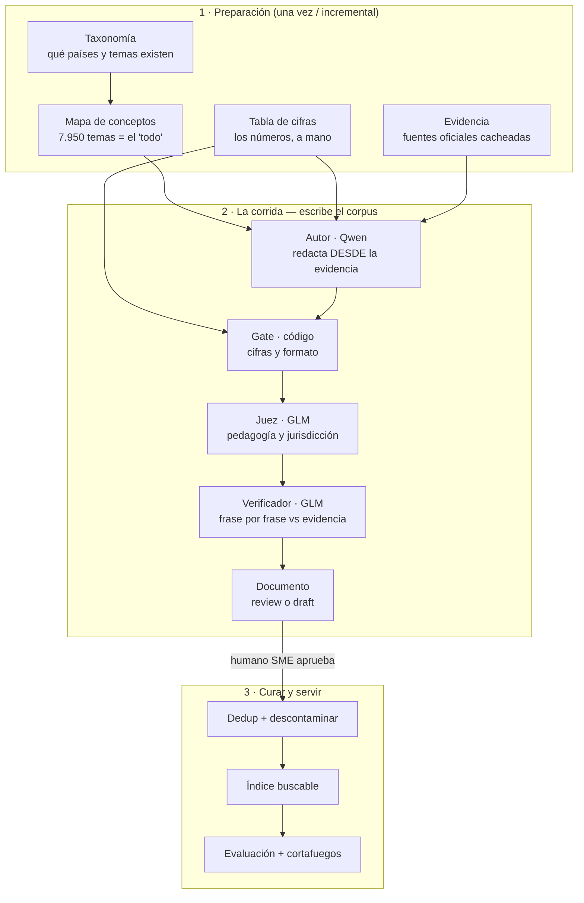
```mermaid
flowchart TD
  subgraph PREP["1 · Preparación (una vez / incremental)"]
    TAX["Taxonomía<br/>qué países y temas existen"]
    MAP["Mapa de conceptos<br/>7.950 temas = el 'todo'"]
    FACTS["Tabla de cifras<br/>los números, a mano"]
    EV["Evidencia<br/>fuentes oficiales cacheadas"]
  end
  subgraph RUN["2 · La corrida — escribe el corpus"]
    AUTHOR["Autor · Qwen<br/>redacta DESDE la evidencia"]
    GATE["Gate · código<br/>cifras y formato"]
    JUDGE["Juez · GLM<br/>pedagogía y jurisdicción"]
    VER["Verificador · GLM<br/>frase por frase vs evidencia"]
    DOC["Documento<br/>review o draft"]
  end
  subgraph SERVE["3 · Curar y servir"]
    CUR["Dedup + descontaminar"]
    IDX["Índice buscable"]
    EVAL["Evaluación + cortafuegos"]
  end
  TAX --> MAP --> AUTHOR
  FACTS --> AUTHOR
  FACTS --> GATE
  EV --> AUTHOR
  AUTHOR --> GATE --> JUDGE --> VER --> DOC
  DOC -->|"humano SME aprueba"| CUR --> IDX --> EVAL
```

**Cómo leer el resto del documento:** las Partes II a V recorren cada caja de este mapa por dentro.
Cada proceso trae su propio esquema más detallado.

---

## 4. Los tres actores

El cerebro lo construyen **tres modelos de IA de tres proveedores distintos**. Que sean
**independientes** es a propósito: nadie se autocalifica, y los errores de uno no se contagian a los
otros (cuotas y fallos separados).

| Actor | Modelo | Proveedor | ¿Busca en web? | Su trabajo |
|-------|--------|-----------|----------------|-----------|
| **Planeador** | `deepseek-v4-flash` | DeepSeek | no | Diseña el mapa de conceptos (la AMPLITUD). Es el rol más barato. |
| **Autor** | `qwen-plus` | Alibaba (Qwen) | sí | Redacta cada documento ES+EN **desde la evidencia recuperada**. |
| **Juez** | `glm-4.6` | z.ai (GLM) | sí | Califica pedagogía, coherencia y jurisdicción. Independiente del autor. |
| **Verificador atómico** | `glm-4.6` | z.ai (GLM) | no | Revisa **cada afirmación** contra la evidencia (NLI estilo FActScore). |

> **Analogía:** una redacción donde el **planeador** arma el índice, el **redactor** escribe, y dos
> **fact-checkers de otra empresa** revisan — uno la calidad general y otro frase por frase. El
> redactor nunca se aprueba a sí mismo.

**Migración en curso (GLM → MiniMax).** El cliente ya tiene cableado un cuarto proveedor, **MiniMax**,
para reemplazar a GLM como juez+verificador (más capacidad, menor costo). Está **escenificado pero
pendiente** de la `MINIMAX_API_KEY` y de un *bake-off* que demuestre que discrimina igual o mejor que
GLM. Regla: **no se cambia el modelo juez por razonamiento, se cambia con datos** (ver [§10.5](#105-bake-off-de-jueces-judge_bakeoffpy) y [§10.6](#106-el-teléfono-compartido-llm_qwenpy)).

---

## 5. Los contratos

Antes de cualquier proceso, hay un puñado de archivos en `knowledge/_meta/` que funcionan como
**contratos**: definen lo que está permitido. Si un documento se sale de ellos, el guardián (el gate)
lo rechaza.

| Contrato | Es… | En una frase |
|----------|-----|--------------|
| `taxonomy.yaml` | el **plano** | Qué países, 12 dominios y subdominios, 5 rangos de edad → **257 celdas**. |
| `concept_map.yaml` | el **índice** | La lista exhaustiva de temas por celda → **7.950 temas** = "todo". |
| `facts.yaml` | el **libro de precios** | 67 cifras volátiles MX/US, verificadas a mano. |
| `sources.yaml` | la **guía telefónica** | 124 fuentes citables, con su tier y su país. |
| `volatility_policy.yaml` | la **tabla de caducidad** | Cada cuánto vence cada tipo de cifra. |
| `schema.json` | el **molde** | Las claves y enums obligatorios de cada documento. |
| `build_policy.yaml` | el **tablero de control** | Modelos por rol, presupuestos, umbrales de calidad, pasadas. |

Los siguientes capítulos explican cómo se **construyen** y cómo se **usan** estos contratos.

---

# Parte II — Preparación

> Estos procesos se corren **una vez** (o de forma incremental) para dejar listos los insumos. No se
> repiten en cada documento.

## 6. El espinazo

El "espinazo" es la respuesta a la pregunta **"¿qué es TODO lo que hay que cubrir?"**. Sin él,
"cubrir todo" sería una promesa vaga; con él, la cobertura es un número: documentos hechos ÷ temas del
mapa.

### 6.1 La taxonomía (`taxonomy.yaml`)

Es la **lista de ingredientes permitidos**. Decide qué países existen (México, EE.UU. y `shared` =
neutro), 12 grandes dominios con sus subdominios, y 5 rangos de edad. Es un **vocabulario cerrado**:
todo lo que un documento declara debe estar aquí, o el gate lo rechaza. Al cruzar los ejes salen las
**257 celdas** que la enciclopedia debe llenar. También fija qué NO se le puede enseñar a un niño
pequeño (un niño de 5-7 no ve "interés" ni "inversión": el *techo Piaget*).

> **Analogía:** el plano de un edificio antes de construirlo — cuántos pisos, cuántos cuartos y para
> qué sirve cada uno. Nadie cuelga un cuadro en un cuarto que no aparece en el plano.

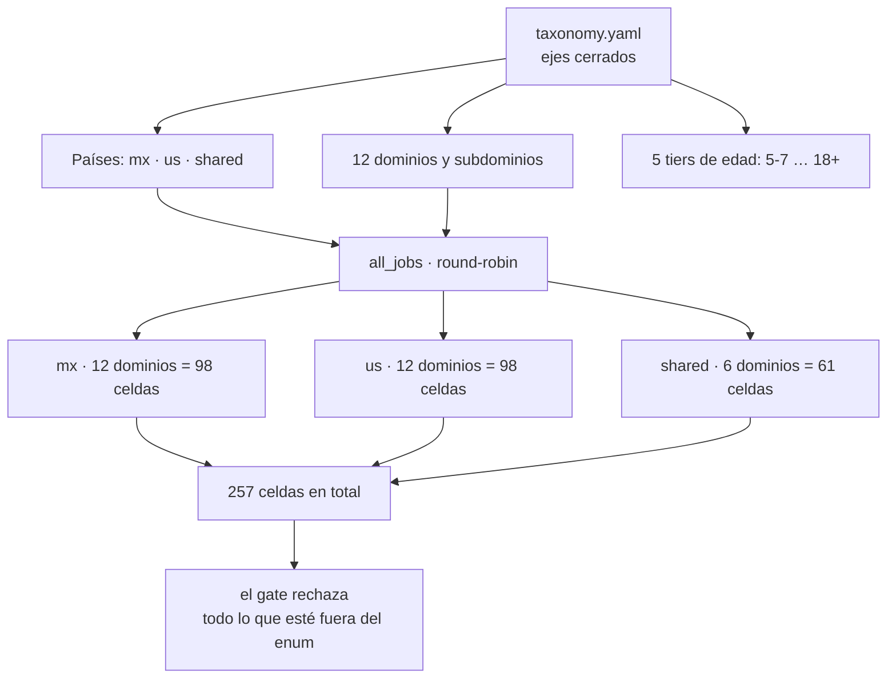
```mermaid
flowchart TD
  TAXO["taxonomy.yaml<br/>ejes cerrados"] --> PAIS["Países: mx · us · shared"]
  TAXO --> DOM["12 dominios y subdominios"]
  TAXO --> EDAD["5 tiers de edad: 5-7 … 18+"]
  PAIS --> JOBS["all_jobs · round-robin"]
  DOM --> JOBS
  JOBS --> MX["mx · 12 dominios = 98 celdas"]
  JOBS --> US["us · 12 dominios = 98 celdas"]
  JOBS --> SH["shared · 6 dominios = 61 celdas"]
  MX --> CELL["257 celdas en total"]
  US --> CELL
  SH --> CELL
  CELL --> GATE["el gate rechaza<br/>todo lo que esté fuera del enum"]
```

- **Entra:** decisiones de diseño humanas + el techo Piaget. · **Sale:** 257 celdas y las listas-enum
  válidas que todo el sistema obedece.
- **Reglas duras:** vocabulario cerrado; `shared` = jurisdicción-neutra (cero instrumentos o cifras de
  un país); el techo Piaget es HARD-FAIL si se excede; español es el idioma canónico.
- **Números:** 12 dominios · 5 edades (tier1 5-7 … tier5 18+) · 3 profundidades · 4 volatilidades ·
  98 (mx) + 98 (us) + 61 (shared) = **257 celdas**.
- **Ojo con esto:** `shared` solo usa 6 de los 12 dominios (por eso aporta 61, no 98). Las 257 celdas
  no están escritas literalmente: **emergen** al cruzar taxonomía × cobertura en `all_jobs()`. Hoy
  solo el dominio `taxes` está cubierto de punta a punta (el piloto).

### 6.2 El generador del mapa (`build_concept_map.py`, DeepSeek)

Toma cada casilla del plano y le pregunta al modelo barato (DeepSeek) **cuáles serían TODOS los temas
enseñables** de esa casilla, como armando el índice de una enciclopedia. Hace una lista grande, luego
un "crítico" revisa qué faltó, y repite **hasta que ya no aparecen temas nuevos** (parada por
saturación). El resultado se guarda en `concept_map.yaml`.

> **Analogía:** un bibliotecario que, por cada estante vacío, escribe la lista exacta de libros que
> deberían estar ahí; otro bibliotecario dice "te faltó este clásico". Cuando nadie encuentra huecos,
> el estante queda "mapeado".

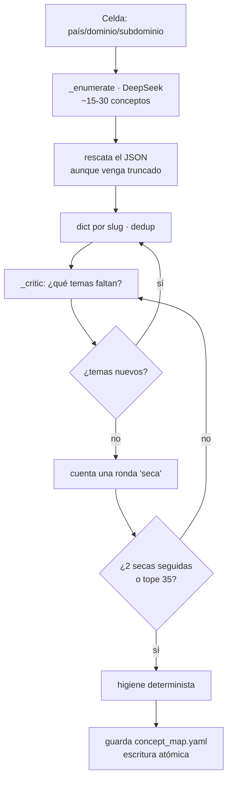
```mermaid
flowchart TD
  CELL["Celda: país/dominio/subdominio"] --> ENUM["_enumerate · DeepSeek<br/>~15-30 conceptos"]
  ENUM --> EXTRACT["rescata el JSON<br/>aunque venga truncado"]
  EXTRACT --> DICT["dict por slug · dedup"]
  DICT --> CRITIC["_critic: ¿qué temas faltan?"]
  CRITIC --> FRESH{"¿temas nuevos?"}
  FRESH -->|"sí"| DICT
  FRESH -->|"no"| DRY["cuenta una ronda 'seca'"]
  DRY --> STOP{"¿2 secas seguidas<br/>o tope 35?"}
  STOP -->|"no"| CRITIC
  STOP -->|"sí"| CLEAN["higiene determinista"]
  CLEAN --> SAVE["guarda concept_map.yaml<br/>escritura atómica"]
```

- **Entra:** las 257 celdas + las edades. · **Sale:** `concept_map.yaml` con **257 celdas / 7.950
  temas** (cada tema con slug, títulos ES/EN, ángulo, edades, profundidad, id).
- **Reglas duras:** cobertura medible (docs ÷ temas del mapa); tope **35 temas/celda** (bajado de 60
  tras una evaluación, porque salía inflado); el crítico para tras 2 rondas secas (máx. 4); en celdas
  `shared` se descarta cualquier tema con sabor a un país; los ids siempre se regeneran a un formato
  uniforme `país.dominio.subdominio.slug`.
- **Números:** `MAX_TOPICS=35` · `MAX_CRITIC_ROUNDS=4` · ~30,9 temas/celda en promedio (el tope rara
  vez se alcanza) · temperaturas 0.5/0.6 · es resumible (guarda tras cada celda).
- **Ojo con esto:** el archivo es enorme (~3 MB) y **no** se inspecciona entero. Si DeepSeek corta la
  salida, el rescate por objeto mitiga la pérdida, pero un tema cortado a la mitad se pierde en
  silencio. **7.950 no es 257×35**: la mayoría de las celdas saturan antes.

### 6.3 El normalizador / de-bloat (`normalize_concept_map.py`)

Cuando una evaluación encontró el mapa "sucio" (etiquetas inventadas, ids opacos, fuga de temas
mexicanos en la zona neutra, listas infladas tipo "Presupuesto para perro, para gato, para coche…"),
este programa lo limpia **sin llamar a ningún modelo**: aplica reglas fijas. Es el **mismo** conjunto
de reglas que el generador ya aplica al vuelo, pero corrible por separado sobre el archivo entero.

> **Analogía:** el corrector de estilo de una editorial. No escribe el libro: unifica formatos, quita
> los capítulos repetidos y borra los que se colaron en la sección equivocada, antes de imprenta.

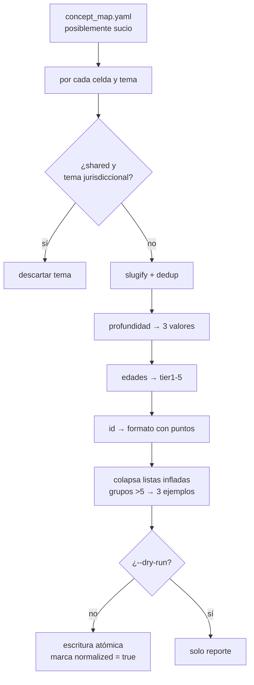
```mermaid
flowchart TD
  MAP["concept_map.yaml<br/>posiblemente sucio"] --> LOOP["por cada celda y tema"]
  LOOP --> SHARED{"¿shared y<br/>tema jurisdiccional?"}
  SHARED -->|"sí"| DROP["descartar tema"]
  SHARED -->|"no"| SLUG["slugify + dedup"]
  SLUG --> DEPTH["profundidad → 3 valores"]
  DEPTH --> AGE["edades → tier1-5"]
  AGE --> CID["id → formato con puntos"]
  CID --> ATOM["colapsa listas infladas<br/>grupos &gt;5 → 3 ejemplos"]
  ATOM --> WRITE{"¿--dry-run?"}
  WRITE -->|"no"| OUT["escritura atómica<br/>marca normalized = true"]
  WRITE -->|"sí"| REP["solo reporte"]
```

- **Entra/Sale:** el mapa → el mismo mapa, limpio (in-place, atómico). · **Reglas:** 100%
  determinista, sin API; profundidad siempre ∈ {intro, intermediate, advanced}; edades siempre un
  subconjunto no vacío de tier1-5; `shared` nunca conserva un tema con token de país.
- **Ojo con esto:** los niveles "professional"/"expert" se absorben en **advanced**, y "adulto" cae en
  **tier5** — **no existe un tier "practitioner" separado**. Por eso el north-star (nivel
  CFA/Series-7) exige primero **regenerar el mapa** con tiers profesionales (ver `walkthrough.md`,
  Fase H). El firewall de la zona neutra es **léxico** (~37 tokens): puede dejar pasar una fuga que no
  use ninguno.

### 6.4 El bake-off del planeador (`mapgen_bakeoff.py`)

Antes de comprometerse con un modelo para construir el mapa, hace una **competencia justa**: les da a
DeepSeek, Qwen y GLM la misma muestra de 8 celdas y el mismo prompt, y mide objetivamente cuántos
temas saca cada uno, cuánta "suciedad" hubo que limpiar, cuánto costó y cuánto tardó. **No** decide la
calidad subjetiva (eso lo hace un juez ciego aparte): solo guarda candidatos y métricas duras.

> **Analogía:** una cata a ciegas entre tres panaderos con la misma harina y receta — se mide cuánto
> pan, cuánta masa tirada, cuánto cobraron y cuánto tardaron. El sabor lo juzga otro jurado.

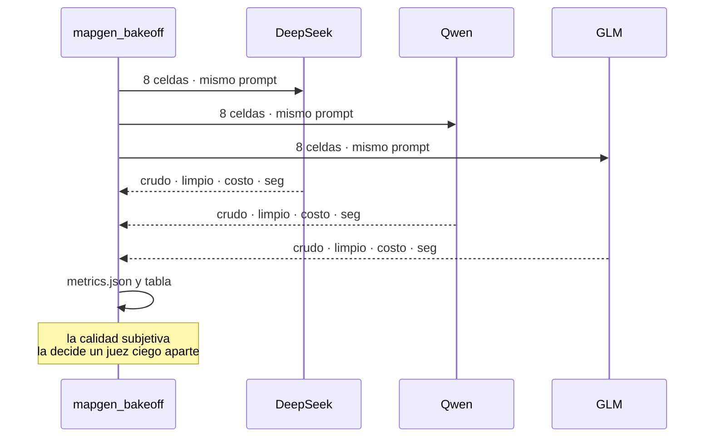
```mermaid
sequenceDiagram
  participant B as mapgen_bakeoff
  participant D as DeepSeek
  participant Q as Qwen
  participant G as GLM
  B->>D: 8 celdas · mismo prompt
  B->>Q: 8 celdas · mismo prompt
  B->>G: 8 celdas · mismo prompt
  D-->>B: crudo · limpio · costo · seg
  Q-->>B: crudo · limpio · costo · seg
  G-->>B: crudo · limpio · costo · seg
  B->>B: metrics.json y tabla
  Note over B: la calidad subjetiva<br/>la decide un juez ciego aparte
```

- **Resultado documentado:** DeepSeek V4 ganó por costo/velocidad → es el planeador definitivo.
- **Ojo con esto:** son **llamadas pagadas reales**; solo 8 celdas (sonda, no el mapa completo); si un
  modelo no está en la tabla de precios, su costo saldría falsamente en $0.

---

## 7. La evidencia

Aquí está la base de la disciplina "escribir desde fuentes, no de memoria". Se hace **una vez** por
(país, dominio): se traen los textos oficiales y se guardan localmente para que el autor trabaje sin
volver a internet.

### 7.1 Ingesta de evidencia (`build_evidence.py`)

Por cada (país, dominio) crea un cuaderno en **NotebookLM** (un buscador que lee y resume documentos),
le siembra las fuentes oficiales del país, espera a que las indexe, y **vuelca el texto completo** a un
caché local `evidence/<país>/<dominio>/`. Si NotebookLM falla, no se cae: lo anota y sigue. Si ya hay
evidencia para un tema, no la regenera.

> **Analogía:** un becario que va a la biblioteca oficial (SAT/IRS), fotocopia los documentos
> importantes **una sola vez**, los archiva en carpetas rotuladas por país/tema, y deja todo listo
> para el escritor. Si la fotocopiadora se traba, anota y sigue.

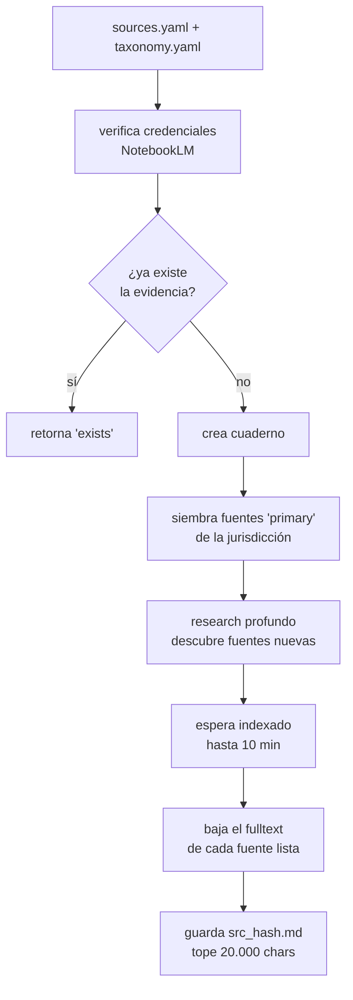
```mermaid
flowchart TD
  A["sources.yaml + taxonomy.yaml"] --> B["verifica credenciales<br/>NotebookLM"]
  B --> C{"¿ya existe<br/>la evidencia?"}
  C -->|"sí"| D["retorna 'exists'"]
  C -->|"no"| E["crea cuaderno"]
  E --> F["siembra fuentes 'primary'<br/>de la jurisdicción"]
  F --> G["research profundo<br/>descubre fuentes nuevas"]
  G --> H["espera indexado<br/>hasta 10 min"]
  H --> I["baja el fulltext<br/>de cada fuente lista"]
  I --> J["guarda src_hash.md<br/>tope 20.000 chars"]
```

- **Sale:** 657 archivos `.md` cacheados (gitignored: es texto con copyright, **insumo no producto**).
- **Reglas duras:** idempotente; solo siembra fuentes tier `primary` de la jurisdicción del país (o
  neutras); NotebookLM **no** está en la ruta crítica por-documento — se usa una vez por dominio.
- **Ojo con esto (importante):** **no valida el contenido** — una página de error 404 se cachea igual
  como "evidencia" (se vio una de bls.gov). El autor podría redactar desde texto basura: *garbage-in,
  garbage-out*. El firewall y el verificador no detectan "esto no es contenido real".

### 7.2 El control manual de NotebookLM (`discover_notebooklm.py`)

Es la **caja de herramientas manual** para hablar con NotebookLM, con cinco botones: `auth` (verifica
credenciales), `seed` (siembra fuentes), `research` (busca fuentes nuevas en profundidad), `extract`
(baja el texto completo) y `ask` (hace una pregunta y devuelve la respuesta **con citas**). Es el primo
manual de `build_evidence`, pensado para que un humano explore paso a paso.

> **Analogía:** un control remoto de cinco botones para una fotocopiadora-bibliotecaria muy lista pero
> frágil. `ask` es preguntarle directo y que conteste señalando el libro y la página.

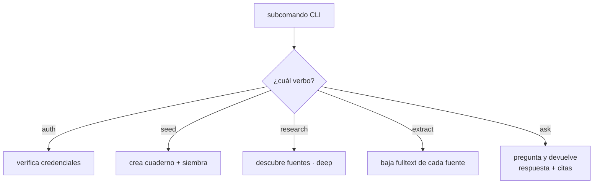
```mermaid
flowchart TD
  A["subcomando CLI"] --> B{"¿cuál verbo?"}
  B -->|"auth"| C["verifica credenciales"]
  B -->|"seed"| D["crea cuaderno + siembra"]
  B -->|"research"| F["descubre fuentes · deep"]
  B -->|"extract"| G["baja fulltext de cada fuente"]
  B -->|"ask"| J["pregunta y devuelve<br/>respuesta + citas"]
```

- **Ojo con esto:** **solapa fuerte** con `build_evidence.py` (misma lógica de seed/extract duplicada
  en dos archivos) → riesgo de divergencia. NotebookLM es una API **no oficial** y frágil: todo el
  wrapper existe para tolerar esa fragilidad.

### 7.3 RAG-to-write: recuperar evidencia por-tema (`evidence_rag.py`)

Esta es la pieza que hace que el autor escriba **desde la fuente**. Cuando va a escribir sobre, por
ejemplo, "el IVA en México", esta herramienta busca dentro del caché local los **párrafos más
relevantes** a ese tema exacto y se los entrega. No usa IA pesada: cuenta cuántas **palabras
importantes** del tema aparecen en cada párrafo, dándole más peso a las palabras raras (TF-IDF). Y
tiene un **cortafuegos**: si escribe para EE.UU. y un párrafo huele claramente a México (menciona SAT,
LISR) y nada de EE.UU., lo descarta.

> **Analogía:** un asistente de investigación que te subraya y te pasa solo los párrafos del
> expediente que hablan de tu tema exacto, ordenados de más a menos relevante. Y tiene una regla de
> oro: si escribes sobre EE.UU. y un párrafo es puro México, lo tira aunque sea bueno.

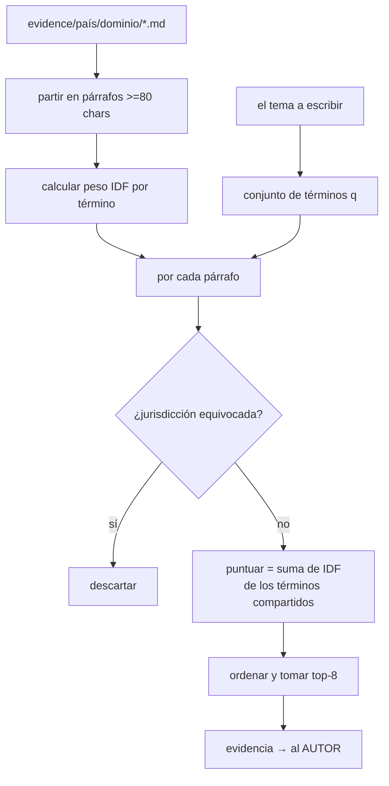
```mermaid
flowchart TD
  A["evidence/país/dominio/*.md"] --> B["partir en párrafos &gt;=80 chars"]
  B --> C["calcular peso IDF por término"]
  D["el tema a escribir"] --> E["conjunto de términos q"]
  C --> F["por cada párrafo"]
  E --> F
  F --> G{"¿jurisdicción equivocada?"}
  G -->|"sí"| H["descartar"]
  G -->|"no"| I["puntuar = suma de IDF<br/>de los términos compartidos"]
  I --> J["ordenar y tomar top-8"]
  J --> L["evidencia → al AUTOR"]
```

- **Reglas duras:** país+idioma = **filtro DURO**; `shared` nunca filtra; ranking 100% léxico y
  determinista (a propósito **no** usa embeddings en el camino caliente, para no cargar un modelo de
  1 GB con 8 trabajadores); si no hay evidencia, devuelve vacío y el autor cae a buscar en web.
- **Números:** top-8 párrafos · máx. 8.000 chars · párrafos de ≥80 chars · términos de ≥3 letras.
- **Ojo con esto:** el cortafuegos es **heurístico** por palabras clave (falsos negativos en ambos
  sentidos posibles); al ser puramente léxico, una paráfrasis del tema que no comparta palabras
  exactas **no se recupera**; si la evidencia cacheada es basura, este RAG la sirve igual.

### 7.4 El catálogo de fuentes (`sources.yaml`)

Es la **guía telefónica oficial**: la lista de todas las fuentes confiables (SAT, IRS, leyes, Banxico,
BLS…) con su dirección, su nivel de confianza (`primary` = gobierno/ley es lo mejor) y su país. Los
documentos citan estas fuentes **por su id**, y el gate exige que toda cita exista aquí. También es de
donde `build_evidence` saca qué páginas bajar por país.

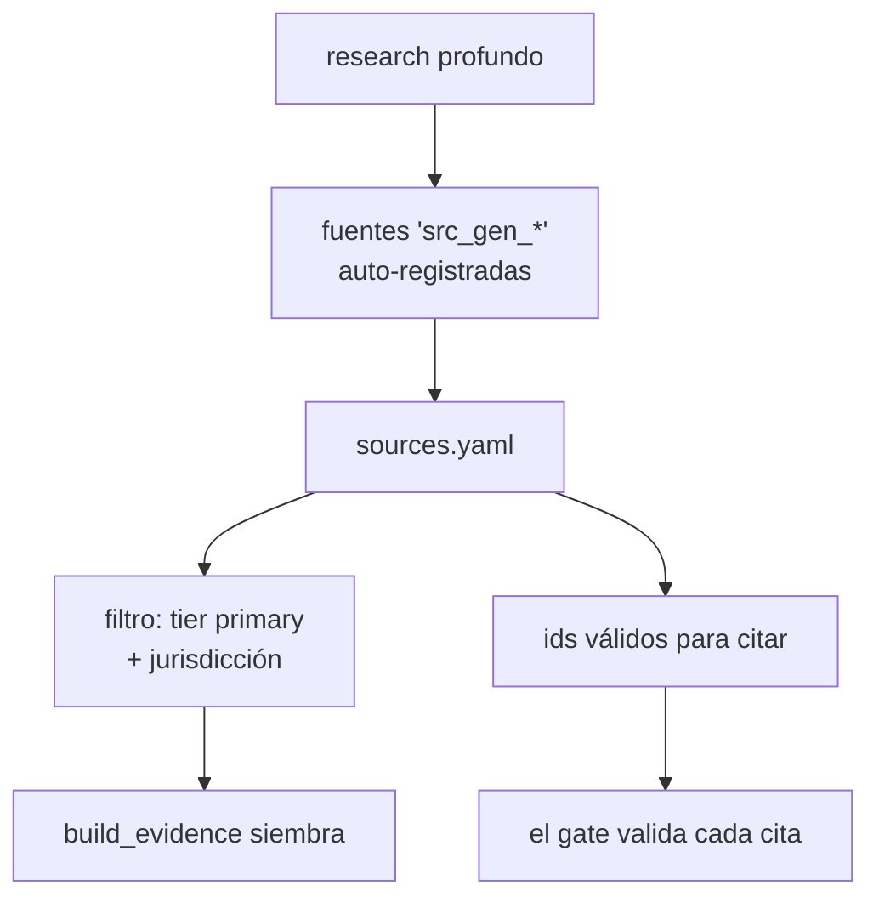
```mermaid
flowchart TD
  A["sources.yaml"] --> B["filtro: tier primary<br/>+ jurisdicción"]
  B --> C["build_evidence siembra"]
  A --> F["ids válidos para citar"]
  F --> G["el gate valida cada cita"]
  H["research profundo"] --> I["fuentes 'src_gen_*'<br/>auto-registradas"] --> A
```

- **Números:** **124 fuentes** (102 `primary`, 24 `tertiary`); ~10 MX + ~13 US curadas a mano, el
  resto descubiertas por research.
- **Ojo con esto:** las fuentes `tertiary` (Cornell LII, Investopedia) **no** se siembran en
  NotebookLM (sirven para validar citas, no para generar evidencia). El id del catálogo
  (`src_sat_*`) **no** coincide con el nombre de archivo de la evidencia (`src_<hash de la url>.md`).

---

## 8. Las cifras canónicas

El corazón de la confianza en los números. Si la prosa puede tener matices, **los números no**: o son
exactos o el sistema se detiene.

### 8.1 La tabla de la verdad (`facts.yaml`)

Imagina una sola hoja maestra donde están escritos, a mano y revisados uno por uno, todos los números
"que cambian con el tiempo" de México y EE.UU.: el IVA es 16%, el salario mínimo 2026 es 315.04 pesos,
la deducción estándar de un soltero en EE.UU. es 16,100 dólares. Cada número tiene su **id** (clave
como `mx.iva.general`), su **valor**, su **país**, la **ley/agencia** de donde salió y la **fecha** en
que se verificó. La regla de oro: la IA que escribe **no inventa cifras**; recibe esta hoja y las
copia. Si un texto pone un número distinto, todo se detiene.

> **Analogía:** el libro de precios pegado en la caja registradora. La cajera (la IA) no decide cuánto
> cuesta el pan: lee el precio del cartel. Si cobra otra cosa, el gerente la frena en seco.

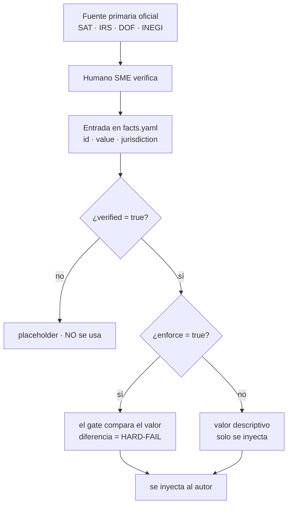
```mermaid
flowchart TD
  FUENTE["Fuente primaria oficial<br/>SAT · IRS · DOF · INEGI"] --> SME["Humano SME verifica"]
  SME --> ENTRADA["Entrada en facts.yaml<br/>id · value · jurisdiction"]
  ENTRADA --> V{"¿verified = true?"}
  V -->|"no"| HOLD["placeholder · NO se usa"]
  V -->|"sí"| E{"¿enforce = true?"}
  E -->|"sí"| EXIGE["el gate compara el valor<br/>diferencia = HARD-FAIL"]
  E -->|"no"| DESC["valor descriptivo<br/>solo se inyecta"]
  EXIGE --> AUTOR["se inyecta al autor"]
  DESC --> AUTOR
```

- **Números:** **67 entradas** (66 verificadas, **56 con `enforce`** duro), esquema `kb-facts-1.0`;
  26 MX-FED + 41 US-FED; verificación adversarial fechada 2026-06-21.
- **Dos ejes distintos que confunden:** `verified` = ¿se inyecta y se exige? (false = placeholder
  pendiente). `enforce` = ¿el gate compara el valor carácter por carácter? (false = es un rango o
  regla descriptiva, como "1% a 2.5%", que solo se inyecta).
- **Ojo con esto:** una entrada (`mx.subsidio_empleo.monto_max`) está `verified:false` (derivada,
  pendiente de método de redondeo con el SME) — por eso "66 verificadas" y no 67. La doc del repo a
  veces dice "67/56" y a veces "67/57": son imprecisiones menores. **Lo que falta** para el
  north-star son los brackets federales US y los tramos ISR MX completos (trabajo de SME).

### 8.2 El cargador y comparador (`facts_table.py`)

Es el módulo que abre la hoja maestra y, sobre todo, decide si dos valores **"son el mismo número"**:
"16%" y "16.0%" sí coinciden; "3,500,000" y "3500000" también; pero **"16%" (un porcentaje) NUNCA es
igual a "16" (un conteo) ni a "$16"** — porque mira no solo los dígitos sino la **unidad** pegada al
número. Esto cerró un agujero real: antes el sistema era "ciego a la unidad".

> **Analogía:** el árbitro que compara dos boletos. No le basta que el número coincida: revisa que
> sean del mismo evento. Asiento 16 de cine no vale como asiento 16 de teatro.

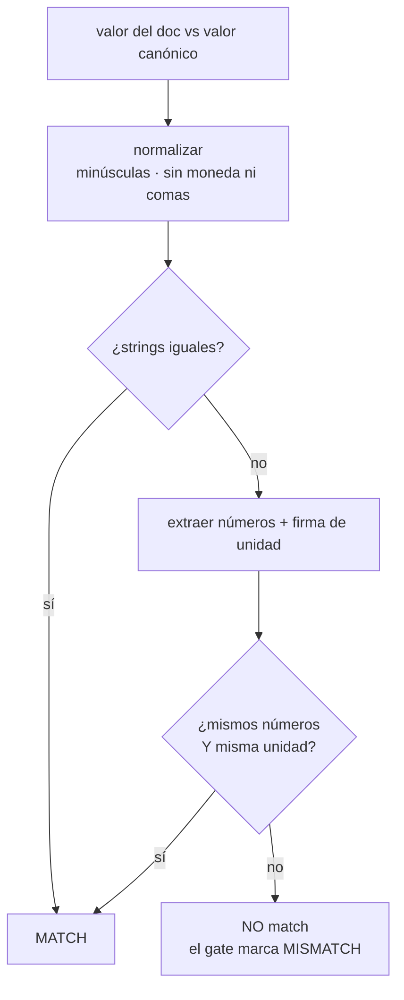
```mermaid
flowchart TD
  IN["valor del doc vs valor canónico"] --> NORM["normalizar<br/>minúsculas · sin moneda ni comas"]
  NORM --> EQ{"¿strings iguales?"}
  EQ -->|"sí"| OK["MATCH"]
  EQ -->|"no"| NUMS["extraer números + firma de unidad"]
  NUMS --> CHK{"¿mismos números<br/>Y misma unidad?"}
  CHK -->|"sí"| OK
  CHK -->|"no"| FAIL["NO match<br/>el gate marca MISMATCH"]
```

- **Regla dura:** la comparación numérica **exige** firma de unidad igual (cierra el falso-positivo
  "unit-blind", un hallazgo HIGH de auditoría). Tolerancia numérica 1e-9 (prácticamente exacto).

### 8.3 Frescura: detectar cifras vencidas (`update_facts.py`)

Los números de impuestos caducan: el salario mínimo cambia en enero, las tasas de Banxico en cada
reunión, los límites del IRS en noviembre. Este agente (pensado para un cron, p. ej. semanal) hace
tres cosas: mira el **reloj real de hoy** y dice cuáles cifras ya pasaron su fecha de revisión; para
cada vencida hace **una** consulta a la fuente oficial ("¿este número sigue vigente?"); y escribe un
**reporte de propuestas**. Lo crítico: **no toca la tabla solo** — solo propone; un humano aprueba.

> **Analogía:** el empleado que revisa la alacena con un calendario en la mano y aparta lo caducado en
> una bandeja con nota. No tira ni repone nada por su cuenta: espera que el dueño confirme.

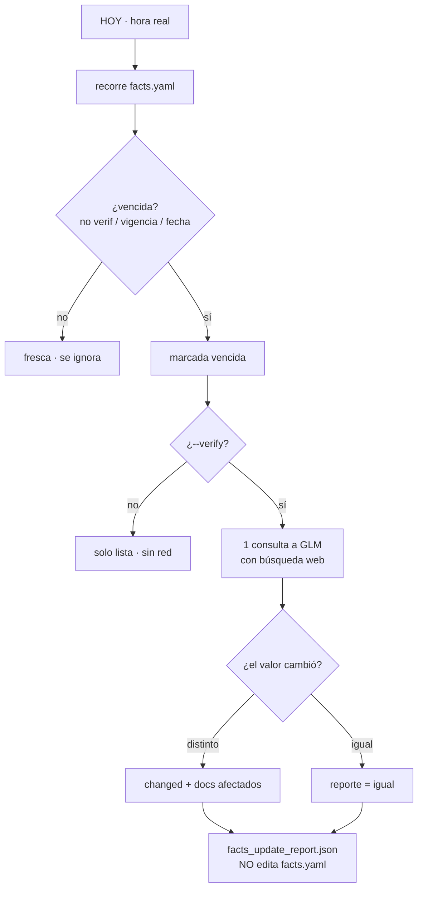
```mermaid
flowchart TD
  HOY["HOY · hora real"] --> LOOP["recorre facts.yaml"]
  LOOP --> DUE{"¿vencida?<br/>no verif / vigencia / fecha"}
  DUE -->|"no"| SKIP["fresca · se ignora"]
  DUE -->|"sí"| FLAG["marcada vencida"]
  FLAG --> MODE{"¿--verify?"}
  MODE -->|"no"| LIST["solo lista · sin red"]
  MODE -->|"sí"| ASK["1 consulta a GLM<br/>con búsqueda web"]
  ASK --> CMP{"¿el valor cambió?"}
  CMP -->|"igual"| REP["reporte = igual"]
  CMP -->|"distinto"| CHG["changed + docs afectados"]
  CHG --> JSON["facts_update_report.json<br/>NO edita facts.yaml"]
  REP --> JSON
```

- **Regla clave:** frescura = **reloj real** (no la fecha "congelada" del build) — esto arregló el bug
  del "reloj congelado" donde nada vencía nunca. Cadencias: static = nunca; low = 24 meses; medium =
  12; high = 3.
- **Ojo con esto:** **no auto-aplica nada** — si nadie lee el reporte, el cerebro se queda con cifras
  viejas. Las cadencias están duplicadas (en `volatility_policy.yaml` y hardcodeadas aquí): pueden
  divergir.

### 8.4 La tabla de caducidad (`volatility_policy.yaml`)

Es el **reglamento de caducidad**: clasifica cada número en cuatro velocidades de cambio y le pone una
fecha de revisión. Lo que nunca cambia (la matemática del interés compuesto) no caduca; los principios
contables cada 2 años; los conceptos económicos cada año; lo que se mueve rápido (tasas, UMA, salario
mínimo) cada 3 meses. Además anota el calendario real: el IRS publica en noviembre, CONASAMI sube el
salario mínimo el 1 de enero, Banxico se reúne ~8 veces al año.

> **Analogía:** la tabla de caducidad por categoría del refrigerador — la sal no caduca, las conservas
> años, los lácteos semanas, la carne fresca días. Y al lado, una nota: "el camión del pan pasa los
> martes".

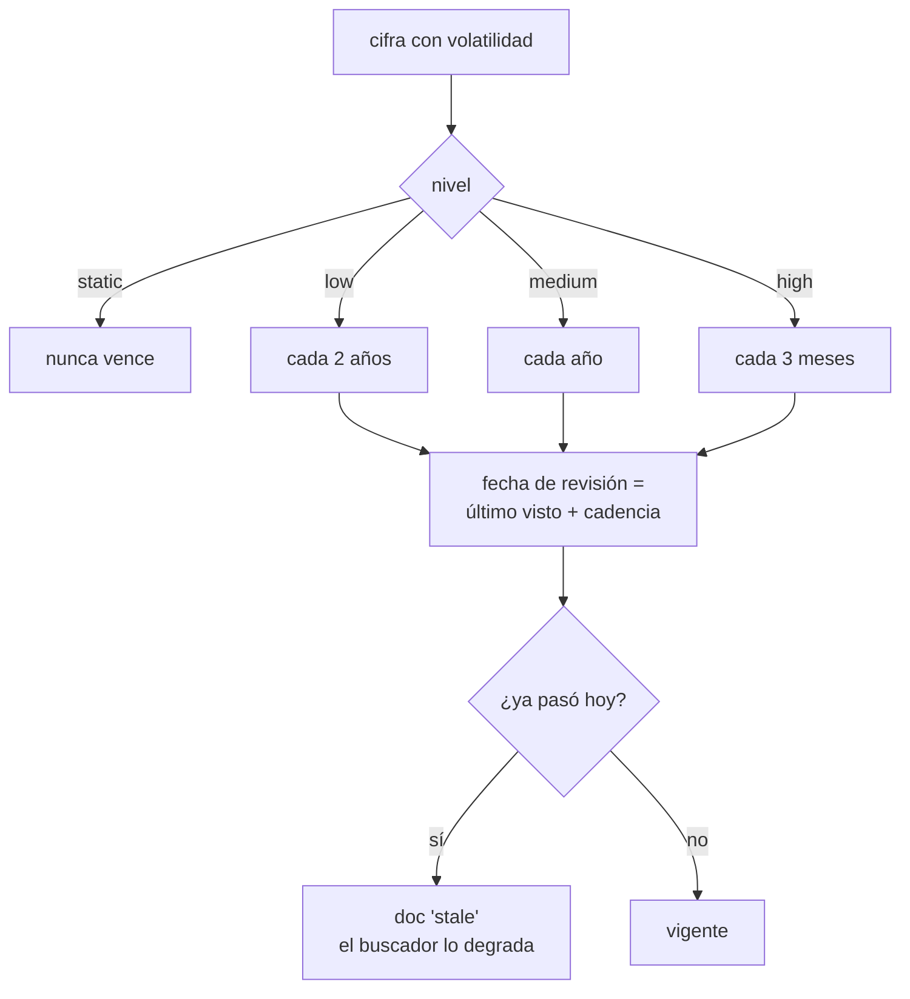
```mermaid
flowchart TD
  CIFRA["cifra con volatilidad"] --> CLASE{"nivel"}
  CLASE -->|"static"| NUN["nunca vence"]
  CLASE -->|"low"| L["cada 2 años"]
  CLASE -->|"medium"| M["cada año"]
  CLASE -->|"high"| H["cada 3 meses"]
  L --> DUE["fecha de revisión =<br/>último visto + cadencia"]
  M --> DUE
  H --> DUE
  DUE --> STALE{"¿ya pasó hoy?"}
  STALE -->|"sí"| DEG["doc 'stale'<br/>el buscador lo degrada"]
  STALE -->|"no"| FRESH["vigente"]
```

- **Ojo con esto:** los "disparadores" (IRS en noviembre, etc.) son **informativos** — el cron usa la
  fecha de revisión derivada, no estos triggers. Hay un `watch` (`us.obbba.temp`) que apunta a un
  concepto **sin fila real** en `facts.yaml`.

---

# Parte III — La corrida

> Esto es lo que pasa cuando se ejecuta `build_dataset.py --run`: el orquestador que escribe el
> corpus, documento por documento, celda por celda.

## 9. El bucle de un documento

Es la **línea de montaje de un solo documento**. El autor escribe ES+EN desde la evidencia; el código
arma el documento con su ficha técnica; y pasa por **cuatro inspecciones**. Si algo falla, vuelve al
autor con la queja concreta y se reintenta (hasta 4 veces). Si tras los reintentos sigue mal, **no se
tira**: se marca "borrador" para un humano. Si pasa todo, queda "en revisión" (nunca publicado solo).

> **Analogía:** una cocina con cuatro inspectores de sanidad en fila. El cocinero prepara el plato
> desde ingredientes reales; antes de salir a la mesa lo revisan el de las cantidades, el de
> presentación, el que prueba bocado a bocado y el que checa el menú. Si algo está mal, vuelve a la
> cocina con la nota; si tras tres intentos sigue fallando, va a la mesa del chef (revisión humana).
> Nada llega solo al comensal.

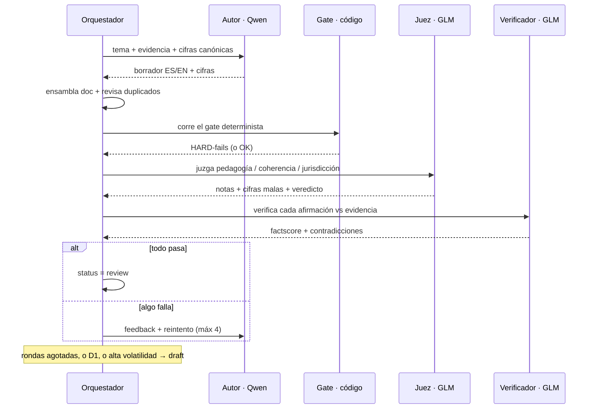
```mermaid
sequenceDiagram
  participant O as Orquestador
  participant A as Autor · Qwen
  participant G as Gate · código
  participant J as Juez · GLM
  participant V as Verificador · GLM
  O->>A: tema + evidencia + cifras canónicas
  A-->>O: borrador ES/EN + cifras
  O->>O: ensambla doc + revisa duplicados
  O->>G: corre el gate determinista
  G-->>O: HARD-fails (o OK)
  O->>J: juzga pedagogía / coherencia / jurisdicción
  J-->>O: notas + cifras malas + veredicto
  O->>V: verifica cada afirmación vs evidencia
  V-->>O: factscore + contradicciones
  alt todo pasa
    O->>O: status = review
  else algo falla
    O->>A: feedback + reintento (máx 4)
  end
  Note over O: rondas agotadas, o D1, o alta volatilidad → draft
```

- **Pasos reales:** ¿ya existe? → recupera evidencia (top-8) → el autor escribe → valida campos y
  registra fuentes → ensambla ES/EN + revisa near-dup → escribe a disco + corre el gate → juez (modo
  LEAN o FACTCHECK) → verificador atómico → reglas finales (alta volatilidad sin cifra → draft; D1
  numeral sin anclar → draft) → si todo pasa: **review**.
- **Números:** hasta **4 intentos** (`max_revise_rounds=3`); piso de **500 palabras**; barra de
  calidad por 8 dimensiones (factual y jurisdicción exigen **5/5**); evidencia top-8; el autor a
  temperatura 0.4, 8.000 tokens, timeout 240s.
- **Reglas duras:** el autor **nunca** se autoverifica (juez y verificador son de otro proveedor); una
  dimensión ausente cuenta como **fallo**, no como "saltada" ("la barra se gana"); un fallo de un
  actor cuesta **solo ese documento**, no la celda.
- **Ojo con esto:** si el **juez o el verificador** fallan (excepción) tras pasar el gate, el doc se
  **degrada a draft** — no reintenta (distinto de un fallo del autor, que sí reintenta). El
  verificador atómico **solo** corre si hay evidencia.

## 10. Las cuatro inspecciones

### 10.1 El gate determinista, por documento (`gate_kb.py`)

Es el **control de calidad automático sin IA**: un checklist de reglas fijas sobre cada documento.
Revisa que tenga todos sus datos de cabecera, que el país/idioma/moneda concuerden entre sí, que no use
palabras demasiado difíciles para la edad, que cada fuente citada exista, y **sobre todo que cada
número importante coincida EXACTAMENTE con la tabla canónica**. Algunas faltas son graves (tumban el
doc); otras son solo advertencias.

> **Analogía:** el inspector de una línea de alimentos. Con una lista fija revisa que la etiqueta diga
> el país correcto, que los ingredientes coincidan con la fórmula maestra al gramo, y que no haya
> alérgenos prohibidos para ese público. Si algo crítico falla, aparta el lote; si es menor, le pone
> nota amarilla.

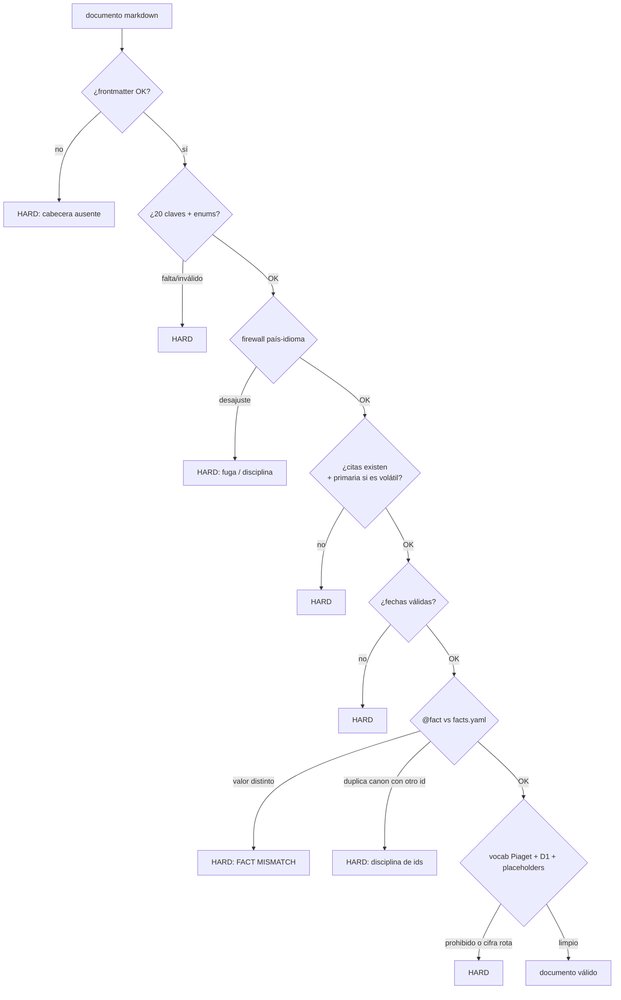
```mermaid
flowchart TD
  A["documento markdown"] --> B{"¿frontmatter OK?"}
  B -->|"no"| H1["HARD: cabecera ausente"]
  B -->|"sí"| C{"¿20 claves + enums?"}
  C -->|"falta/inválido"| H2["HARD"]
  C -->|"OK"| D{"firewall país-idioma"}
  D -->|"desajuste"| H3["HARD: fuga / disciplina"]
  D -->|"OK"| E{"¿citas existen<br/>+ primaria si es volátil?"}
  E -->|"no"| H4["HARD"]
  E -->|"OK"| F{"¿fechas válidas?"}
  F -->|"no"| H5["HARD"]
  F -->|"OK"| G{"@fact vs facts.yaml"}
  G -->|"valor distinto"| H6["HARD: FACT MISMATCH"]
  G -->|"duplica canon con otro id"| H7["HARD: disciplina de ids"]
  G -->|"OK"| I{"vocab Piaget + D1 + placeholders"}
  I -->|"prohibido o cifra rota"| H8["HARD"]
  I -->|"limpio"| V["documento válido"]
```

- **Dos niveles de severidad:** **HARD-FAIL** (rompe, exit 1) y **advertencia** (no rompe). Tres
  banderas endurecen advertencias a duras: `--strict-facts`, `--strict-numerals`, `--warnings`.
- **Reglas que hace cumplir:** carpeta = país; jurisdicción y moneda derivadas del país; `doc_id` =
  ruta; idioma = sufijo del archivo; cada cita en `sources.yaml`; un `@fact` nunca cita una fuente de
  otra jurisdicción; **todo `@fact` con id canónico debe tener el valor exacto**; un `@fact`
  fuera-de-tabla que **duplica** una cantidad canónica con otro id = HARD (disciplina de ids); paridad
  de cifras ES/EN; ningún placeholder `[[fact:…]]` sin resolver.
- **Ojo con esto:** si falta una clave de cabecera, el gate **corta** y no ves los demás errores hasta
  arreglarla. El gate **no** usa JSON-Schema: reimplementa las reglas a mano (algunas reglas
  declarativas de `schema.json` no se revisan). La fecha "hoy" sale del `date_anchor` del build, **no
  del reloj**.

### 10.2 El gate a nivel corpus (`gate_kb.py main`)

El gate también corre sobre **todo el corpus a la vez**: junta las fichas, decide cuáles revisar
(todas, un subárbol, o solo las "servibles" dejando los borradores **en cuarentena**), y hace dos
chequeos que **cruzan fichas**: que cada ficha en inglés tenga su gemela en español, y que los números
no se contradigan entre ES y EN. Al final dice **VERDE** o **FALLO**.

> **Analogía:** el jefe de auditoría que recibe todos los expedientes, separa los borradores
> (incompletos), revisa que cada traducción tenga su original, compara que las cifras de ambas
> versiones cuadren, y firma el dictamen. Un solo expediente grave hace que el dictamen completo sea
> "rechazado".

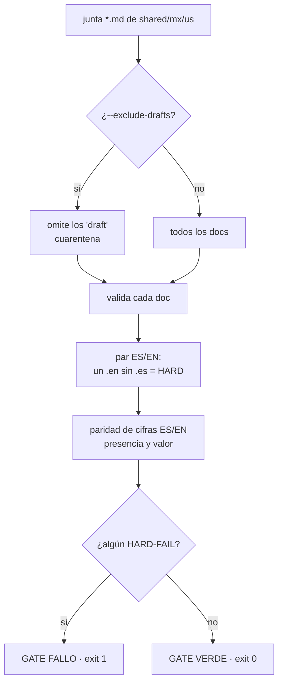
```mermaid
flowchart TD
  A["junta *.md de shared/mx/us"] --> D{"¿--exclude-drafts?"}
  D -->|"sí"| E["omite los 'draft'<br/>cuarentena"]
  D -->|"no"| F["todos los docs"]
  E --> G["valida cada doc"]
  F --> G
  G --> H["par ES/EN:<br/>un .en sin .es = HARD"]
  H --> I["paridad de cifras ES/EN<br/>presencia y valor"]
  I --> K{"¿algún HARD-FAIL?"}
  K -->|"sí"| X["GATE FALLO · exit 1"]
  K -->|"no"| V["GATE VERDE · exit 0"]
```

- **Clave para entender el estado del proyecto:** `--exclude-drafts` (alias `--servible-only`) es lo
  que produce el **GO/NO-GO del "corpus servible"**: cambia *qué* se valida (sin borradores) pero **no
  relaja** la severidad. Esto es lo que el preflight usa como check duro.
- **Ojo con esto:** el veredicto es **binario y global** — un solo HARD en cualquier doc pone FALLO a
  toda la corrida.

### 10.3 D1: el cazador de números sueltos (`scan_unanchored_numerals`)

Es la red contra el error **más peligroso**: un ejemplo que usa un número oficial (un tramo de
impuesto) del **año equivocado**. El gate solo revisa los números etiquetados como `@fact`; el
verificador trata los ejemplos como ilustrativos y los ignora. Así un bracket falso podría colarse
"limpio". D1 escanea el cuerpo final buscando números con pinta de dato oficial **en secciones de
ejemplo** que no estén anclados. Si encuentra alguno, **no** intenta que el autor lo arregle (no puede
anclar algo que no está en la tabla): manda el documento directo a **borrador** para que el SME lo
ancle en `facts.yaml`, y `--retry-drafts` lo regenera ya anclado.

> **Analogía:** un cajero que detecta un billete que parece auténtico pero no está en el registro de
> seriales: no discute ni lo reimprime, lo aparta para el supervisor. Mejor un billete apartado
> honestamente que uno falso aceptado.

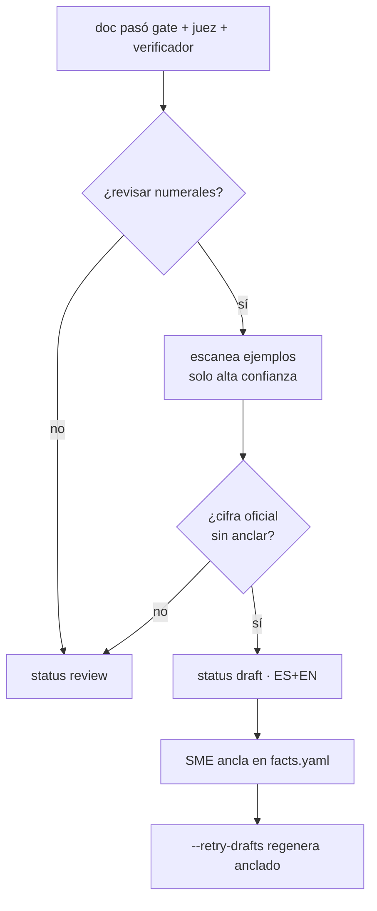
```mermaid
flowchart TD
  PASS["doc pasó gate + juez + verificador"] --> D1{"¿revisar numerales?"}
  D1 -->|"no"| REVIEW["status review"]
  D1 -->|"sí"| SCAN["escanea ejemplos<br/>solo alta confianza"]
  SCAN --> FOUND{"¿cifra oficial<br/>sin anclar?"}
  FOUND -->|"no"| REVIEW
  FOUND -->|"sí"| DRAFT["status draft · ES+EN"]
  DRAFT --> SME["SME ancla en facts.yaml"]
  SME --> RETRY["--retry-drafts regenera anclado"]
```

- **Por qué importa (caso real):** en el smoke de Fase 1, un documento con **factscore 1.0** tenía 6
  cifras del año equivocado (un bracket de 2024 en un doc de 2026). **El factscore/NLI NO lo atrapó;
  lo atrapó D1.** Por eso D1 es necesario *además* del verificador atómico.
- **Es intencional** que D1 suba el draft-rate de docs fiscales **hasta** que `facts.yaml` tenga los
  brackets del año (trabajo de SME). "Mejor un draft honesto que servir un bracket del año equivocado
  como review."
- **Ojo con esto (confianza media):** es una **heurística de regex** que depende de pistas de línea
  ("tasa", "tramo"); un numeral oficial sin esas pistas podría escapársele.

### 10.4 El verificador atómico (`atomic_verify.py`)

En vez de preguntarle a un experto "¿está bien el folleto?" (a lo que tiende a responder "sí,
perfecto"), corta el folleto en **frases sueltas** y por cada una pregunta: "¿los documentos oficiales
que tenemos dicen esto, dicen lo contrario, o no hablan de esto?". Una frase que **contradice** la
fuente es falla grave. Una **confirmada** cuenta a favor. Una que la fuente **no cubre** no cuenta. Al
final saca una nota (factscore) sobre las frases que **sí** se pudieron juzgar.

> **Analogía:** un maestro que no califica de un vistazo, sino que subraya cada oración y la coteja
> contra el libro de texto abierto: "esto sí está", "esto el libro lo dice al revés", "de esto el
> libro no habla". Solo cuentan las que pudo cotejar.

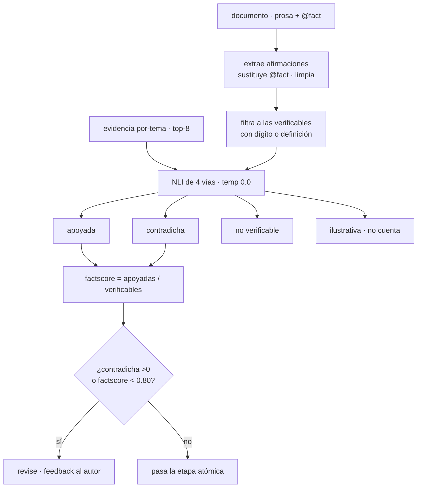
```mermaid
flowchart TD
  DOC["documento · prosa + @fact"] --> EXT["extrae afirmaciones<br/>sustituye @fact · limpia"]
  EXT --> FILT["filtra a las verificables<br/>con dígito o definición"]
  EV["evidencia por-tema · top-8"] --> NLI
  FILT --> NLI["NLI de 4 vías · temp 0.0"]
  NLI --> SUP["apoyada"]
  NLI --> CON["contradicha"]
  NLI --> UNV["no verificable"]
  NLI --> ILU["ilustrativa · no cuenta"]
  SUP --> SC["factscore = apoyadas / verificables"]
  CON --> SC
  SC --> GATE{"¿contradicha &gt;0<br/>o factscore &lt; 0.80?"}
  GATE -->|"sí"| REV["revise · feedback al autor"]
  GATE -->|"no"| OK["pasa la etapa atómica"]
```

- **Reglas duras:** independencia (verificador ≠ autor); el NLI evalúa **solo contra la evidencia
  dada**, sin conocimiento externo; los ejemplos ilustrativos **no se penalizan** (el contrato exige
  ejemplos); temperatura 0.0 (determinismo).
- **El límite honesto (no marketing):** ~**89% de la prosa sale "no verificable"** porque es
  paráfrasis pedagógica fiel sobre evidencia léxica, no copia literal. Por eso esa tasa es solo
  **advisory** y el **único** disparo duro por defecto hoy es **una contradicción** (`contradicted>0`).
  Es una limitación de **arquitectura**, no del modelo: **cambiar GLM→MiniMax no lo arregla** (solo da
  paridad de capacidad + menor costo). El umbral 0.80 vive en `build_policy.yaml`, no en el código.

### 10.5 Bake-off de jueces (`judge_bakeoff.py`)

Antes de cambiar el evaluador oficial por uno más barato, una **competencia cara a cara**: toma un
documento real y se lo da varias veces a cada candidato (**sin caché**, para ver cuánto varía), y mide
dos cosas: ¿el modelo barato **distingue** calidad o le pone 5/5 a todo (sello de goma inútil)? y
¿**coincide** con GLM en el veredicto? Solo si **discrimina Y concuerda** se considera reemplazo.

> **Analogía:** una cata a ciegas para elegir un juez más económico. Le das el mismo platillo tres
> veces y ves si su puntaje se mueve (¿discrimina o aplaude todo?) y si llega al mismo fallo que el
> titular. Si pone diez en todo o se contradice solo, te quedas con el titular.

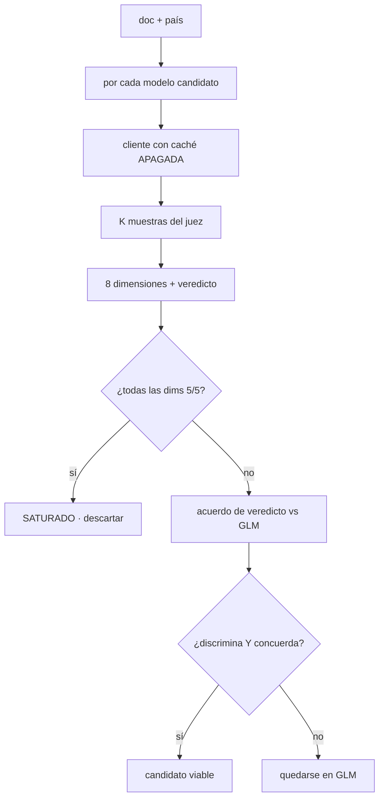
```mermaid
flowchart TD
  DOC["doc + país"] --> LOOP["por cada modelo candidato"]
  LOOP --> CLI["cliente con caché APAGADA"]
  CLI --> RUN["K muestras del juez"]
  RUN --> SC["8 dimensiones + veredicto"]
  SC --> SAT{"¿todas las dims 5/5?"}
  SAT -->|"sí"| MAL["SATURADO · descartar"]
  SAT -->|"no"| AGR["acuerdo de veredicto vs GLM"]
  AGR --> DEC{"¿discrimina Y concuerda?"}
  DEC -->|"sí"| OK["candidato viable"]
  DEC -->|"no"| GLM["quedarse en GLM"]
```

- **Las 8 dimensiones:** exactitud factual, andamiaje pedagógico, corrección de país, fidelidad de
  traducción, engagement, completitud, ejemplo trabajado, calidad de citas.
- **Esto es lo que bloquea la migración a MiniMax** hasta tener la key: sin ella, el cliente del juez
  candidato ni se construye.

### 10.6 El teléfono compartido (`llm_qwen.py`)

Es el **teléfono con el que todo el pipeline llama a los modelos**. Aunque el archivo se llama "qwen"
por historia, marca a **cuatro** proveedores según el nombre del modelo (Qwen, GLM, DeepSeek,
MiniMax). Tiene tres mañas para ahorrar y no equivocarse: **caché por huella** (si vuelves a hacer la
misma pregunta exacta, no vuelve a pagar), **búsqueda web solo cuando el rol la pide** (nunca por
defecto), y **anti-veneno**: cuando espera un JSON, si la respuesta viene rota **no la guarda ni la
reutiliza**. Cuenta los tokens reales aparte de los aciertos de caché y **nunca imprime la clave**.

> **Analogía:** una recepcionista políglota con memoria fotográfica. Marca al proveedor correcto,
> recuerda respuestas idénticas para no volver a llamar (ni pagar), solo pide "busquen en internet"
> cuando el jefe lo autoriza, y si le dictan un recado mal formado lo rompe en vez de archivarlo.

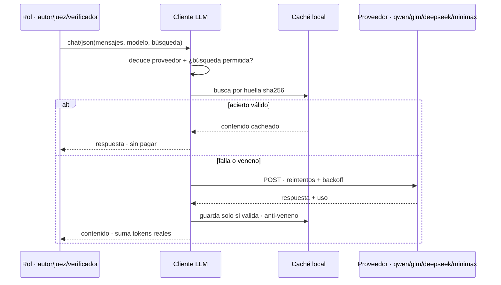
```mermaid
sequenceDiagram
  participant R as Rol · autor/juez/verificador
  participant Q as Cliente LLM
  participant C as Caché local
  participant P as Proveedor · qwen/glm/deepseek/minimax
  R->>Q: chat/json(mensajes, modelo, búsqueda)
  Q->>Q: deduce proveedor + ¿búsqueda permitida?
  Q->>C: busca por huella sha256
  alt acierto válido
    C-->>Q: contenido cacheado
    Q-->>R: respuesta · sin pagar
  else falla o veneno
    Q->>P: POST · reintentos + backoff
    P-->>Q: respuesta + uso
    Q->>C: guarda solo si valida · anti-veneno
    Q-->>R: contenido · suma tokens reales
  end
```

- **Reglas duras:** nunca imprime la API key; DeepSeek y MiniMax **no** hacen búsqueda web aunque se
  pida; la búsqueda nunca se activa por defecto; uso bajo lock (cliente compartido entre 8
  trabajadores); JSON inválido nunca se cachea.
- **Ojo con esto:** **MiniMax está cableado pero sin key** → sin `MINIMAX_API_KEY` el cliente lanza
  error. La caché es por payload **exacto**: cambiar un prompt invalida los aciertos y **re-paga** (por
  eso un tweak de código encarece el resume).

## 11. La orquestación

Por encima del bucle de un documento, hay un cerebro que decide **en qué orden** se escribe todo,
**cuándo parar** y **cuánto se puede gastar**.

### 11.1 Amplitud antes que profundidad (breadth-first)

La estrategia es "ancho antes que hondo": primero una pasada por **todas** las celdas generando solo 2
documentos cada una (un baseline para tocar todos los temas); la segunda pasada sube a 5; la tercera
quita el tope y genera **todos** los temas del mapa. Como ese "todo" puede ser enorme, se expande en
incrementos de 8 (13, 21, 29…) para poder checkpointear cobertura y presupuesto. Y las celdas de MX,
US y `shared` se **intercalan** para que ninguna acapare a los trabajadores.

> **Analogía:** pintar una casa entera — primero **una** mano a todas las paredes (que ninguna quede
> sin color), luego una segunda más cuidada, y al final detallar cuarto por cuarto. Alternando entre
> los tres pisos para no dejar unos en obra negra.

```mermaid
flowchart TD
  START["run_all"] --> PASSES["pasadas 2 · 5 · todo"]
  PASSES --> EXP["expande 'todo' en pasos de 8"]
  EXP --> LOOP{"por cada pasada"}
  LOOP --> STOP{"¿parar?<br/>cobertura / tamaño / presupuesto"}
  STOP -->|"sí"| FIN["status + cobertura final"]
  STOP -->|"no"| JOBS["celdas intercaladas mx/us/shared"]
  JOBS --> SUB["build_subdomain<br/>tope = total de la celda"]
  SUB --> TOPIC["build_topic por tema"]
  TOPIC --> LOOP
```

- **Números:** pasadas `[2, 5, 0]` (0 = sin tope = todo el mapa) · paso de expansión 8 · 4 trabajadores
  por defecto.
- **Ojo con esto:** el cap es "docs en disco totales por celda", así que subir el cap entre pasadas
  hace crecer cada celda. Si una celda ya alcanzó su cap, **no** se replanea (ahorra tokens) — clave
  para que el resume sea barato.

### 11.2 Parar por cobertura VERIFICADA

El criterio para decir "ya terminé" **no** es megabytes ni número de archivos: es la **cobertura real
del mapa de conceptos**. El sistema cuenta cuántos temas tienen un documento **aprobado** (review o
published) y deliberadamente **no cuenta los borradores** (un borrador falló alguna verificación). Si
contara drafts, podría declararse completo lleno de documentos no verificados.

> **Analogía:** un check-list de obra donde solo tachas las habitaciones que **ya pasaron
> inspección**, no las que están a medias. La obra no se entrega por tener muchos ladrillos, sino
> porque cada cuarto del plano está terminado **y aprobado**.

```mermaid
flowchart TD
  PASADA["inicio de pasada"] --> MC["cuenta temas del mapa"]
  MC --> FILT["solo docs review/published<br/>los drafts NO cuentan"]
  FILT --> CC{"¿cubiertos &gt;= total?"}
  CC -->|"no"| SIGUE["ejecuta la pasada"]
  CC -->|"sí"| RFB{"¿amplitud total?"}
  RFB -->|"no"| STOP["COBERTURA COMPLETA · STOP"]
  RFB -->|"sí"| BASE{"¿toda celda con baseline?"}
  BASE -->|"sí"| STOP
  BASE -->|"no"| SIGUE
```

- **Regla clave (explica el mapa que te llamó la atención):** un documento degradado a **draft RESTA
  de la cobertura** aunque exista en disco. Por eso hoy la cobertura "verificada" es ~0,3% aunque haya
  archivos: muchos están en draft. Subir cobertura exige que `--retry-drafts` los regenere a review.
- **Ojo con esto:** si el `concept_map` estuviera vacío, **no hay parada por cobertura** y la corrida
  dependería solo del presupuesto (por eso el preflight exige que el mapa tenga celdas).

### 11.3 El cerrojo de presupuesto (cost guard)

Dos cerrojos financieros que se accionan justo antes de una corrida masiva. El primero impide arrancar
si el **autor** (que cobra directo a la tarjeta) no tiene ningún tope. El segundo calcula cuánto
costaría **TERMINAR** la corrida completa y, si los topes no alcanzan, **aborta** con un mensaje claro.
Evita el peor escenario: un `--run` que muere al 3% por falta de saldo pero parece haberse detenido
"por cobertura". Convierte un *GO-para-arrancar* en un *GO-para-terminar*.

> **Analogía:** un piloto que antes de un vuelo largo verifica que el tanque alcanza para **llegar**,
> no solo para arrancar. Si no alcanza, no despega: pide recargar. Pero si firmas un permiso explícito
> de "sé que voy corto", te deja despegar (aterrizaje controlado, no choque).

```mermaid
flowchart TD
  RUN["--run"] --> GA{"¿el autor tiene tope?"}
  GA -->|"no"| AB1["ABORTO · autor sin tope"]
  GA -->|"sí"| MASS{"¿corrida masiva?"}
  MASS -->|"no · slice"| GO["arranca"]
  MASS -->|"sí"| PROJ["proyección de costo · margen 1.3"]
  PROJ --> CMP{"¿los topes cubren?"}
  CMP -->|"sí"| GO
  CMP -->|"no"| AB2["ABORTO · presupuesto insuficiente"]
  GO --> GUARD["vigila topes durante la corrida"]
```

- **Números:** topes actuales deepseek $7.5 / glm $9 / qwen $60; margen ×1.3; alerta cuando quedan
  <$3. Proyección de la corrida completa ~$900–964 (estimación viva).
- **Ojo con esto:** el smoke (`--only`/`--max-docs`) **no** pasa por este cerrojo, solo la corrida
  masiva. Si la proyección misma falla, el cerrojo **no** bloquea (es raíl de seguridad, no dogma) —
  puede desactivarse en silencio. GLM es el cuello de botella (~76-88% del costo).

### 11.4 Reanudar y caché (resume)

La corrida puede cortarse en cualquier momento (presupuesto, error, apagón) y retomarse **sin perder
trabajo ni re-pagar**. El "checkpoint" es el **disco mismo**: si un documento ya existe, se salta. Cada
respuesta de la IA se guarda en una caché por contenido. Las escrituras son **atómicas** (a un temporal
y luego renombrar), así un corte a media escritura nunca deja un documento corrupto. Y `--retry-drafts`
hace que los borradores se **vuelvan a intentar** en lugar de saltarlos.

> **Analogía:** guardar partida en un videojuego. Si se apaga la consola, retomas donde quedaste sin
> repetir niveles. La caché es tener fotos de cada jefe que ya venciste para no volver a pelearlos.

```mermaid
flowchart TD
  START["build_topic"] --> EX{"¿el archivo existe?"}
  EX -->|"no"| BUILD["construir doc"]
  EX -->|"sí"| DR{"¿draft y --retry-drafts?"}
  DR -->|"no"| SKIP["saltar · 'exists'"]
  DR -->|"sí"| BUILD
  BUILD --> CACHE["llamada LLM vía caché por contenido"]
  CACHE --> ATOMIC["escritura atómica .tmp + rename"]
  ATOMIC --> STATE["guarda estado bajo lock"]
  STATE --> DONE["review o draft"]
```

- **Ojo con esto:** el checkpoint es "existe el archivo", no "el doc está bien" — un draft existente se
  salta como hecho a menos que pidas `--retry-drafts`. La caché (`index/llm_cache/`) está gitignored:
  borrarla pierde el resume gratis (se vuelve a pagar).

## 12. El ciclo de vida de un documento

Todo documento nace **"en revisión" (review)**: pasó los controles automáticos pero no tiene firma
humana. Si no logró pasar algún control tras los reintentos —o tiene una cifra oficial sin anclar, o es
de alta volatilidad sin ninguna cifra anclada— se marca **"borrador" (draft)** para que un experto lo
arregle. El paso final, **"publicado" (published)**, **NUNCA** lo escribe el código: solo el SME
humano lo aprueba.

> **Analogía:** un artículo de revista. El redactor IA entrega un borrador "listo para edición"
> (review) o uno "falta verificar datos" (draft). Pero **ningún** artículo sale impreso sin que el
> editor en jefe humano lo firme (published). El robot nunca tiene la llave de la imprenta.

```mermaid
stateDiagram-v2
  [*] --> review: el pipeline crea status review
  review --> draft: falla gate/juez/verificador (rondas agotadas)
  review --> draft: D1 · numeral oficial sin anclar
  review --> draft: alta volatilidad sin cifra anclada
  draft --> review: SME ancla en facts.yaml + retry-drafts
  review --> published: SME aprueba (humano)
  draft --> published: SME aprueba (humano)
  published --> [*]
```

- **Reglas duras:** el pipeline solo escribe **review** o **draft**, jamás **published**; "draft" es
  siempre una **degradación explícita**, nunca el estado inicial; un draft **nunca se borra** (es la
  válvula de revisión humana); solo review/published cuentan para la cobertura.
- **Etiqueta de honestidad:** cada review lleva un `grounding_tier` — `anchored` (mayoría de cifras
  ancladas), `partially_anchored`, `llm_reviewed` (sin ancla; juez + fuentes) o `conceptual`. Un doc
  puede quedar en review con tier `llm_reviewed`: es "pendiente de firma SME", **no** "datos 100%
  reales". El frontmatter nunca regala "anchored" por una sola cifra.

---

# Parte IV — Curar, servir y evaluar

> Después de la corrida, el corpus se limpia, se vuelve buscable y se examina antes de servirse.

## 13. Anti-repetición

### 13.1 Dedup léxico, dentro de la celda (`dedup.py`)

Si el pipeline escribe dos textos que terminan diciendo **casi lo mismo**, ocupan espacio sin sumar
conocimiento. Esta herramienta compara el documento nuevo contra los ya existentes de su **misma
celda** y mide qué tan parecidos son palabra por palabra (shingles de 4 palabras, índice Jaccard). Si
el parecido supera 0,70, lo marca como casi-duplicado y el orquestador no lo guarda. Solo atrapa copias
casi literales; lo "mismo dicho con otras palabras" lo ve su hermano semántico.

> **Analogía:** un maestro que recibe dos ensayos del mismo grupo y, antes de calificarlos, los pone
> uno al lado del otro: si comparten frases casi idénticas, sabe que uno es copia.

```mermaid
flowchart TD
  A["doc nuevo"] --> B["limpia · quita @fact · minúsculas"]
  B --> C["shingles de 4 palabras"]
  D["docs existentes · misma celda"] --> E["shingles de cada uno"]
  C --> F["Jaccard: intersección / unión"]
  E --> F
  F --> G["similitud máxima 0..1"]
  G --> H{"¿&gt;= 0.70?"}
  H -->|"sí"| I["casi-duplicado · descartar"]
  H -->|"no"| J["conservar"]
```

- **Reglas:** siempre dentro de la misma celda (nunca cruza países); solo stdlib (corre en cualquier
  máquina). · **Ojo:** es **ciego a la paráfrasis** — para eso está semdedup.

### 13.2 Dedup semántico, cruzando celdas (`semdedup.py`)

La pasada de curación de verdad: convierte cada documento en un **vector de significado** y agrupa los
que se parecen demasiado **aunque usen palabras distintas**. De cada grupo de gemelos conserva el
**mejor** (más cifras ancladas; en empate, el más largo; en empate, el id menor) y, con `--demote`,
baja los demás a draft. Por defecto solo reporta. Necesita embeddings reales (fastembed).

> **Analogía:** un editor que descubre que tres autores escribieron el mismo artículo sobre "interés
> compuesto" con palabras diferentes: se queda con el mejor y manda los otros dos a "revisar".

```mermaid
flowchart TD
  A["corpus · un idioma"] --> B["agrupa por país+idioma · firewall"]
  B --> C["embedding por doc · fastembed"]
  C --> D["pares con coseno &gt;= 0.92"]
  D --> E["clusters de &gt;1 miembro"]
  E --> F["ordena: más anclado · más largo · id menor"]
  F --> G["KEEP el primero"]
  F --> H["DUP el resto"]
  H --> I{"¿--demote?"}
  I -->|"sí"| J["baja a draft · ES+EN"]
  I -->|"no"| K["solo reportar"]
```

- **Reglas:** compara solo dentro de (país, idioma) — una traducción EN **no** es duplicado de su ES;
  por defecto dry-run. · **Ojo:** con embedder `hash` el resultado **no es fiable** (lo advierte dos
  veces).

### 13.3 Descontaminación del eval (`decontaminate.py`)

Si un documento contiene **literalmente la misma pregunta** que usamos para evaluarlo, la evaluación se
vuelve una trampa (el corpus "encuentra" la pregunta y "pasa" sin demostrar nada). Esta herramienta
busca solapamientos de frases largas (13 palabras) entre las **preguntas** de eval y el corpus. Ojo:
las **respuestas** canónicas (como "16%") **sí** deben estar; lo que no debe pasar es que el corpus
repita las **preguntas**.

> **Analogía:** un profesor que se asegura de que las preguntas del examen final no estén copiadas
> dentro del libro de texto que los alumnos pueden consultar.

```mermaid
flowchart TD
  A["preguntas de eval"] --> C["n-gramas de 13 palabras"]
  E["corpus"] --> F["n-gramas del cuerpo"]
  C --> G{"¿n-grama compartido?"}
  F --> G
  G -->|"sí"| H["contaminación · hit"]
  G -->|"no"| N["limpio"]
  H --> L{"¿hits y --strict?"}
  L -->|"sí"| M["exit 1 · frena CI"]
  L -->|"no"| R["exit 0 · solo reporte"]
```

- **Ojo con esto:** sin `--strict` es **solo informativo** — un GO de CI podría ignorar contaminación
  si se olvida la bandera.

## 14. Construir el índice buscable

El markdown es la **fuente de verdad**; el índice `.db` es un artefacto derivado y regenerable. Esta
herramienta recorre el corpus, corta cada documento en **pedazos por sección** (un chunk por
encabezado/edad), convierte cada pedazo en un vector con un modelo multilingüe real (**mpnet**) y
guarda todo en SQLite: una tabla de chunks con metadata + embedding, una tabla **FTS5** para búsqueda
por palabra (BM25), y una tabla de metadatos del build. En modo `--production` **se niega a usar el
embedder `hash`** (un placeholder léxico que no sirve para RAG semántico).

> **Analogía:** convertir una biblioteca de libros en un fichero de tarjetas: cada tarjeta resume un
> capítulo, lleva etiquetas (país, tema, edad) y una "huella" del significado, para encontrar el
> capítulo correcto en segundos. En producción se prohíben las tarjetas hechas con fotocopiadora
> barata.

```mermaid
flowchart TD
  A["--production --embedder fastembed"] --> B{"¿embedder hash?"}
  B -->|"sí · en producción"| C["abortar · return 2"]
  B -->|"no"| D["borra el .db previo"]
  D --> E["trocea por encabezados / edad"]
  E --> F["antepone metadata al texto"]
  F --> G["embedding mpnet · L2-normalizado"]
  G --> H["inserta chunks + vector"]
  H --> I["tabla FTS5 · BM25"]
  I --> J["metadatos: modelo · dim · fecha"]
  J --> K["index/kb.db servible"]
```

- **Modelo real:** `paraphrase-multilingual-mpnet-base-v2` (768d, ES+EN). · **Reglas:** las secciones
  de andamiaje ("For future Claude") se excluyen del índice; los vectores siempre L2-normalizados.
- **Ojo con esto:** el **default** del embedder es `hash` (no servible) — sin `--embedder fastembed`
  obtienes un índice de juguete; `--production` es el único guardia que lo impide.

### 14.1 La caja de herramientas compartida (`kb_common.py`)

Es el **juego de cuchillos y tablas** de la cocina compartida: no es un platillo, pero el indexador, el
buscador y el evaluador usan las mismas utilidades para leer el frontmatter, recorrer el corpus, partir
en chunks y convertir texto en vectores. Detalle clave: **ambos** vectorizadores normalizan a longitud
1 para que la búsqueda por coseno no premie injustamente a los textos largos.

- **Ojo con esto:** la normalización L2 del branch fastembed es **crítica** y se agregó por un bug
  (mpnet no garantiza vectores unitarios; sin ella, los chunks densos ganan por norma, no por
  relevancia). Un frontmatter sin las claves obligatorias revienta con error (no hay defaults).

## 15. Recuperar

Este es el **buscador del cerebro**. Antes de medir cualquier parecido, aplica un filtro obligatorio:
solo deja pasar chunks del idioma pedido y del país pedido (o `shared`). **Un query de EE.UU. JAMÁS
verá un chunk de México**: ese es el cortafuegos, y no tiene ruta para saltarse (país e idioma son
argumentos sin valor por defecto). Sobre los sobrevivientes combina dos rankings — uno por **significado**
(vectores) y otro por **palabras** (BM25) — con *Reciprocal Rank Fusion*, da un empujoncito al tier de
edad pedido, y devuelve cada resultado con sus fuentes y su fecha.

> **Analogía:** un bibliotecario bilingüe con dos llaves. Primero cierra con llave la sección del país
> equivocado (nadie entra), y dentro de la sección correcta combina dos formas de buscar — por tema y
> por palabra exacta — marcando los libros desactualizados.

```mermaid
flowchart TD
  A["query + país + idioma"] --> B["PRE-FILTRO DURO<br/>idioma y país IN (target, shared)"]
  B --> C{"¿candidatos?"}
  C -->|"no"| D["vacío"]
  C -->|"sí"| E["opcional: descarta vencidos"]
  E --> F["ranking por significado · coseno"]
  E --> G["ranking por palabras · BM25"]
  F --> H["RRF fusiona ambos"]
  G --> H
  H --> I["+ empujón si la edad coincide"]
  I --> J["top-k con fuentes y marca 'stale'"]
```

- **Reglas duras:** país+idioma = **filtro DURO** pre-similitud (no depende del embedding); `shared`
  sí entra, el país opuesto **nunca**; staleness contra **tiempo real**.
- **Ojo con esto:** `--exclude-stale` es **opt-in** — por defecto devuelve chunks vencidos, solo los
  marca. Los scores mezclan rangos, no similitudes crudas: comparar scores entre queries distintas no
  es significativo.

## 16. Medir cobertura y evaluar

### 16.1 El tablero de avance (`coverage_report.py`)

Convierte "¿ya cubrimos todo?" en **números diffables**. Para cada celda cuenta los documentos en
español y la pinta vacía (rojo), baseline (amarillo) o deep (verde). El número estrella es **GRID_Φ**:
el % de celdas con al menos el mínimo de documentos. También señala la celda **peor cubierta** (el
siguiente trabajo) y mide **CONCEPT_RECALL**: de una lista de términos clave por país (IVA/ISR/SAT;
IRS/401(k)/IRA), cuántos ya aparecen.

> **Analogía:** el tablero de una enciclopedia en construcción — una cuadrícula que se ilumina de rojo
> a verde según cuántos artículos tiene cada casilla, con un foco rojo sobre la más rezagada.

```mermaid
flowchart TD
  A["rejilla de celdas"] --> B["cuenta *.es.md por celda"]
  B --> C{"núm. de docs"}
  C -->|"0"| D["vacía · rojo"]
  C -->|"&gt;= 8"| E["deep · verde"]
  C -->|"resto"| F["baseline · amarillo"]
  D --> G["GRID_Φ = baseline+deep / total"]
  E --> G
  F --> G
  B --> H["GRID_μ · celda peor"]
  I["corpus por país"] --> J["CONCEPT_RECALL · términos clave"]
  G --> L["coverage_report.json"]
  H --> L
  J --> L
```

- **Estado real hoy:** GRID_Φ ≈ **5.8%** (15 de 257 celdas con baseline; 242 vacías). · **Ojo:** las
  menciones cruzadas MX↔US son **informativas**, no fuga (el firewall duro lo hace el gate). Solo
  cuenta `.es.md`: una celda con solo inglés aparecería vacía.

### 16.2 El examen final (`run_kb_eval.py`)

Es el examen del cerebro antes de servirlo. Cuatro pruebas: **(A) Golden Q&A** — para preguntas
conocidas, ¿el buscador trae la fuente correcta y el hecho esperado? **(B) Fuga de jurisdicción** — la
prueba crítica y dura: que ningún chunk del país prohibido aparezca, y de forma astuta verifica primero
que **sí existía** contenido fugable (si no, marca "inconcluso" en vez de un falso verde). **(C)
Frescura** — que el contenido volátil tenga fecha de revisión futura. **(D) Competency recall** — ¿cada
celda con contenido responde sus propias preguntas? Antes de todo, valida que el índice sea de
**producción** (fastembed real, normalizado, modelo correcto).

> **Analogía:** el examen de certificación de un guía turístico bilingüe — le preguntan datos, le
> tienden trampas para ver si filtra el país equivocado (y verifican que la trampa era real), revisan
> que su info esté vigente, y comprueban que sepa de cada zona que dice cubrir. No le dan el carnet si
> su manual es una fotocopia barata.

```mermaid
flowchart TD
  A["index/kb.db"] --> B["valida: fastembed + normalizado + modelo"]
  B --> C{"¿require-production y no servible?"}
  C -->|"sí"| Z["exit 1"]
  C -->|"no"| D["Suite A · Golden: grounding + hecho"]
  D --> E["Suite B · Fuga · HARD able-to-fail"]
  E --> F["Suite D · Competency recall"]
  F --> G["Suite C · Frescura"]
  G --> H{"¿algún fallo?"}
  H -->|"sí"| Z
  H -->|"no"| Y["EVAL VERDE · exit 0"]
```

- **Reglas duras:** la Suite B (Fuga) **siempre** bloquea; un PASS de fuga solo cuenta si **existía**
  contenido opuesto fugable (si no, INCONCLUSO — nada de falsos verdes). Competency bloquea solo con
  `--strict-recall`.
- **Ojo con esto:** el CI solo construye el índice `hash`; un GO podría servir vectores no-servibles —
  por eso hay que **acordarse** de pasar `--require-production`.

---

# Parte V — Guardas operativas

> Las redes de seguridad que rodean la corrida cara. No producen contenido: deciden si es seguro
> arrancar y vigilan que las piezas no se rompan.

## 17. Guardas operativas

### 17.1 Preflight GO/NO-GO (`preflight.py`)

Es la **lista de chequeo antes de despegar**. Antes de la corrida cara, revisa una por una: que estén
las llaves de las APIs, que los archivos de configuración carguen, que las cifras de oro no estén en
blanco, que el presupuesto alcance, que las APIs **respondan de verdad**, y que el corpus actual pase
el control de calidad. Divide los hallazgos en **DUROS** (si fallan, NO se despega) y **AVISOS**.

> **Analogía:** la inspección pre-vuelo de un piloto — combustible, frenos, instrumentos, radio. Si
> algo crítico falla (motor), no despega; si es menor (una luz de cortesía), lo anota pero vuela.

```mermaid
flowchart TD
  START["preflight.py"] --> ENV{"¿carga build_policy?"}
  ENV -->|"no"| NOGO["NO-GO · exit 1"]
  ENV -->|"sí"| CRED["1 · claves .env por rol"]
  CRED --> CONTR["2 · contratos + concept_map"]
  CONTR --> FACTS["3 · facts.yaml sin PENDING"]
  FACTS --> COST["3c · AVISO · proyección de costo"]
  COST --> NET{"¿--no-net?"}
  NET -->|"no"| PING["4 · pings planner/autor/juez"]
  NET -->|"sí"| GATE
  PING --> GATE["5 · gate VERDE servible"]
  GATE --> REP{"¿algún DURO falló?"}
  REP -->|"sí"| NOGO
  REP -->|"no"| GO["GO · exit 0"]
```

- **Reglas duras:** solo los checks DUROS bloquean; valida la key del proveedor de **cada** rol
  (incluido el verificador, clave para la migración a MiniMax); las cifras `verified+enforce` no pueden
  estar PENDING ni en blanco; el gate debe estar VERDE sobre el corpus **servible** (los drafts en
  cuarentena no bloquean).
- **Ojo con esto (matiz importante):** el check de **costo aquí es solo AVISO**, no bloquea el GO. El
  bloqueo real lo hace el *cost guard* dentro de `build_dataset` (§11.3). Un preflight **GO** puede
  convivir con topes insuficientes.

### 17.2 Proyección de costo (`cost_projection.py`)

Antes de gastar dinero real escribiendo miles de documentos, calcula cuánto costará **toda** la obra y
si el saldo de cada API alcanza. Toma lo que costó **en promedio** cada documento hasta ahora (de un
log real), suma estimaciones conservadoras del juez y la verificación, lo multiplica por los temas que
faltan, agrega un margen y compara contra el tope de cada proveedor. Si alguno se queda corto, **grita**.

> **Analogía:** planear la gasolina para un viaje costa a costa. No basta llenar el tanque para
> arrancar: calculas los kilómetros totales, el rendimiento **real** medido en tu carro, sumas un
> colchón y confirmas que cubre **todo** el viaje. Si no, recargas antes de salir, no a mitad del
> desierto.

```mermaid
flowchart TD
  LOG["build_log.jsonl<br/>gasto real del autor"] --> OBS["promedio por documento"]
  CM["concept_map.yaml"] --> NT["temas restantes · 7.950"]
  OBS --> PROJ["proyección · margen 1.3"]
  NT --> PROJ
  POL["precios + búsqueda"] --> PROJ
  PROJ --> BYP["suma por proveedor<br/>× n_docs × margen"]
  BYP --> CMP{"¿el tope cubre<br/>por proveedor?"}
  CAPS["topes configurados"] --> CMP
  CMP -->|"sí"| OK["VEREDICTO cubre · exit 0"]
  CMP -->|"no"| BAD["INSUFICIENTE · exit 1<br/>sube los topes"]
```

- **Números:** margen ×1.3; el juez y el verificador se cobran **ambos** a GLM (~76% del total);
  proyección real hoy ~$927 (glm ~$703 + qwen ~$224) — **estimación viva** que cambia con cada doc.
- **Ojo con esto:** con los topes **actuales** ($9 glm / $60 qwen) el veredicto es **INSUFICIENTE** por
  ~10-78× — los topes de config son raíles anti-runaway para el smoke, **no** para la corrida masiva
  (hay que recargar antes). Si se migra a MiniMax sin poner su precio, el costo se subestimaría a $0.

### 17.3 La suite de invariantes (`test_pipeline.py`)

Es la **red de pruebas automáticas** que verifica que las piezas delicadas sigan funcionando **sin
llamar a ninguna API**. Cada prueba **congela un bug real** que ya costó caro: que demover un doc a
borrador sí cambie el archivo, que el presupuesto del autor nunca quede sin tope, que la corrida masiva
se rehúse si el dinero no alcanza, que la etiqueta de "qué tan fundado está esto" sea honesta, que el
verificador no se ahogue con JSON cortado, que MiniMax esté bien cableado. Si alguien rompe una regla
al editar, la prueba falla **antes** de gastar dinero.

> **Analogía:** los cinturones y las pruebas de choque del auto, hechas con maniquíes (sin red ni
> LLM). Cada prueba recrea un accidente que ya pasó y confirma que el airbag salta. Si un mecánico
> desconecta un airbag sin querer, la prueba lo detecta.

```mermaid
flowchart TD
  RUN["corre 26 pruebas"] --> G1["status/draft · round-trip"]
  RUN --> G2["cost guard · aborta si falta saldo"]
  RUN --> G3["cobertura · expansión y STOP"]
  RUN --> G4["grounding honesto"]
  RUN --> G5["D1 · numerales sin anclar"]
  RUN --> G6["verificador · anti-veneno"]
  RUN --> G7["retriever · vencidos + normalización"]
  RUN --> G8["costo por rol + juez LEAN"]
  RUN --> G9["MiniMax · cableado + falla limpia"]
  G1 --> RES{"¿alguna falló?"}
  G9 --> RES
  RES -->|"sí"| FAIL["exit 1"]
  RES -->|"no"| OK["26/26 · exit 0"]
```

- **Estado real:** **26/26 pasan** hoy. · **Reglas:** 100% deterministas (sin red, sin LLM; clientes
  mockeados); cada prueba lockea un bug nombrado de una auditoría para evitar regresiones silenciosas.
- **Ojo con esto:** algunas pruebas hacen *short-circuit* silencioso si falta estado del repo (p. ej.
  si `concept_map`/`facts` están vacíos, "pasan" sin probar nada). Corren en el mismo proceso: una
  prueba que reviente antes de su `finally` podría ensuciar el estado de las siguientes.

---

# Parte VI — Referencia

## 18. Los invariantes que NUNCA se negocian

Estas reglas atraviesan **todo** el sistema. Si alguna se rompe, hay un bug:

1. **País + idioma = filtro DURO.** Se aplica al sembrar evidencia, al recuperarla, en el gate, en el
   dedup, en el buscador y en el eval. Un query US **jamás** toca un chunk MX. `shared` es neutro.
2. **Las cifras volátiles viven en `facts.yaml`.** El LLM las copia, no las inventa. Un valor distinto
   al canónico = HARD-FAIL. Un `@fact` fuera-de-tabla que duplica una cifra canónica = HARD-FAIL.
3. **La prosa se funda en evidencia, no en memoria** (RAG-to-write), y se verifica afirmación por
   afirmación (NLI).
4. **Nada se auto-publica.** El pipeline escribe `review`/`draft`; solo un humano (SME) aprueba →
   `published`.
5. **Independencia de roles.** El autor (Qwen) nunca se autoevalúa: juez y verificador son de otro
   proveedor.
6. **AP1 — ningún claim de calidad sin medición real** (tokens pagados). No se cambia un modelo por
   razonamiento; se cambia con un bake-off.
7. **AP8 — leer el contenido, no celebrar la telemetría.** Un factscore 1.0 o un juez 5/5 **no**
   garantizan un documento correcto (de ahí D1).
8. **Cobertura = docs VERIFICADOS ÷ temas del mapa.** Los borradores no cuentan.
9. **No comitear** `.env`, `evidence/`, `index/`, `.venv/`. La evidencia es insumo con copyright, no
   producto.
10. **Límite honesto del verificador atómico:** ~89% de la prosa es "no verificable" por arquitectura
    (RAG-to-write sobre evidencia léxica). Cambiar GLM→MiniMax **no** lo arregla.

## 19. Glosario humano

| Término | En cristiano |
|---------|--------------|
| **RAG** | "Generación aumentada por recuperación": escribir/responder usando documentos recuperados, no solo la memoria del modelo. |
| **RAG-to-write** | Que el **autor** escriba desde evidencia recuperada por-tema, no de memoria. |
| **Celda** | Una casilla del plano: la combinación país × dominio × subdominio. Hay 257. |
| **Concept map / espinazo** | La lista exhaustiva de temas por celda. 7.950 temas = "todo el conocimiento". |
| **`@fact`** | Una marca en el texto que dice "este número viene de la tabla canónica con este id". |
| **Canónico / anclado** | Una cifra que está en `facts.yaml` y se compara exactamente. Lo único "100% real". |
| **`enforce` vs `verified`** | `verified` = ¿se usa? · `enforce` = ¿se compara carácter por carácter? |
| **Gate** | El control de calidad **de código** (sin IA): reglas fijas, HARD-FAIL o advertencia. |
| **Verificador atómico / FActScore** | Cortar la prosa en frases y checar cada una contra la evidencia (NLI). |
| **NLI** | "Inferencia de lenguaje natural": decidir si un texto **apoya**, **contradice** o **no habla** de una afirmación. |
| **factscore** | De las frases verificables, qué fracción está apoyada (apoyadas ÷ verificables). |
| **D1** | La regla que manda a borrador los ejemplos con números oficiales sin anclar. |
| **grounding_tier** | Etiqueta de honestidad por documento: `anchored` / `partially_anchored` / `llm_reviewed` / `conceptual`. |
| **Breadth-first** | Cubrir todo a un baseline antes de profundizar. |
| **STOP por cobertura** | Parar cuando el mapa está 100% cubierto por docs **verificados**. |
| **Cost guard** | El cerrojo que rehúsa arrancar si el presupuesto no cubre TERMINAR la corrida. |
| **Resume / caché LLM** | Retomar una corrida cortada sin re-pagar lo ya hecho. |
| **Firewall / fuga de jurisdicción** | El cortafuegos país+idioma; "fuga" = que se cuele contenido del país equivocado. |
| **SME** | *Subject-Matter Expert*: el experto humano que ancla cifras y aprueba a `published`. |
| **mpnet / fastembed** | El modelo multilingüe real que convierte texto en vectores para el buscador. |
| **BM25 / RRF** | Ranking por palabras (BM25) y la fusión de dos rankings (Reciprocal Rank Fusion). |

## 20. Mapa de archivos ↔ procesos

| Archivo | Proceso(s) en este doc |
|---------|------------------------|
| `_meta/taxonomy.yaml` | [§6.1](#61-la-taxonomía-taxonomyyaml) |
| `tools/build_concept_map.py` | [§6.2](#62-el-generador-del-mapa-build_concept_mappy-deepseek) |
| `tools/normalize_concept_map.py` | [§6.3](#63-el-normalizador--de-bloat-normalize_concept_mappy) |
| `tools/mapgen_bakeoff.py` | [§6.4](#64-el-bake-off-del-planeador-mapgen_bakeoffpy) |
| `tools/build_evidence.py` | [§7.1](#71-ingesta-de-evidencia-build_evidencepy) |
| `tools/discover_notebooklm.py` | [§7.2](#72-el-control-manual-de-notebooklm-discover_notebooklmpy) |
| `tools/evidence_rag.py` | [§7.3](#73-rag-to-write-recuperar-evidencia-por-tema-evidence_ragpy) |
| `_meta/sources.yaml` | [§7.4](#74-el-catálogo-de-fuentes-sourcesyaml) |
| `_meta/facts.yaml` | [§8.1](#81-la-tabla-de-la-verdad-factsyaml) |
| `tools/facts_table.py` | [§8.2](#82-el-cargador-y-comparador-facts_tablepy) |
| `tools/update_facts.py` | [§8.3](#83-frescura-detectar-cifras-vencidas-update_factspy) |
| `_meta/volatility_policy.yaml` | [§8.4](#84-la-tabla-de-caducidad-volatility_policyyaml) |
| `tools/build_dataset.py` | [§9](#9-el-bucle-de-un-documento), [§11](#11-la-orquestación), [§12](#12-el-ciclo-de-vida-de-un-documento) |
| `tools/gate_kb.py` | [§10.1](#101-el-gate-determinista-por-documento-gate_kbpy), [§10.2](#102-el-gate-a-nivel-corpus-gate_kbpy-main), [§10.3](#103-d1-el-cazador-de-números-sueltos-scan_unanchored_numerals) |
| `_meta/schema.json` | [§10.1](#101-el-gate-determinista-por-documento-gate_kbpy) |
| `tools/atomic_verify.py` | [§10.4](#104-el-verificador-atómico-atomic_verifypy) |
| `tools/judge_bakeoff.py` | [§10.5](#105-bake-off-de-jueces-judge_bakeoffpy) |
| `tools/llm_qwen.py` | [§10.6](#106-el-teléfono-compartido-llm_qwenpy) |
| `_meta/build_policy.yaml` | [§4](#4-los-tres-actores), [§11](#11-la-orquestación), [§17](#17-guardas-operativas) |
| `tools/dedup.py` | [§13.1](#131-dedup-léxico-dentro-de-la-celda-deduppy) |
| `tools/semdedup.py` | [§13.2](#132-dedup-semántico-cruzando-celdas-semdeduppy) |
| `tools/decontaminate.py` | [§13.3](#133-descontaminación-del-eval-decontaminatepy) |
| `tools/build_index.py` | [§14](#14-construir-el-índice-buscable) |
| `tools/kb_common.py` | [§14.1](#141-la-caja-de-herramientas-compartida-kb_commonpy) |
| `tools/retriever.py` | [§15](#15-recuperar) |
| `tools/coverage_report.py` | [§16.1](#161-el-tablero-de-avance-coverage_reportpy) |
| `eval/run_kb_eval.py` | [§16.2](#162-el-examen-final-run_kb_evalpy) |
| `tools/preflight.py` | [§17.1](#171-preflight-gono-go-preflightpy) |
| `tools/cost_projection.py` | [§17.2](#172-proyección-de-costo-cost_projectionpy) |
| `tools/test_pipeline.py` | [§17.3](#173-la-suite-de-invariantes-test_pipelinepy) |

## 21. Cómo mantener este documento vivo

Este documento es **autoridad de contexto** para humanos y agentes. Para que nunca mienta:

1. **Regla pre-commit (no negociable).** Si tu cambio toca un proceso del pipeline —cualquier
   `knowledge/tools/*.py` o `knowledge/_meta/*.yaml`— **actualiza en el MISMO commit** la sección
   correspondiente: el **esquema Mermaid** y el **paso afectado**, además de los números si cambiaron.
   El [§20 Mapa de archivos ↔ procesos](#20-mapa-de-archivos--procesos) te dice qué sección tocar.
2. **Si agregas o quitas una herramienta:** añade/borra su proceso aquí, actualiza el §20 y el mapa de
   pájaro del [§3](#3-mapa-de-pájaro).
3. **Si cambian cifras clave** (nº de celdas, temas, fuentes, costo, umbrales): este doc las cita en
   varias secciones — búscalas y sincronízalas con `PIPELINE.md`/`ARCHITECTURE_V4.md`.
4. **Espejo de reglas:** las menciones a este doc en `CLAUDE.md` y `AGENTS.md` deben quedar
   **idénticas** entre sí (regla de espejo de esa carpeta).
5. **Cómo regenerar el material base:** este documento nació de una auditoría de código por-proceso.
   Si haces una reescritura grande, re-audita leyendo cada `tools/*.py` y confirma cada esquema contra
   el código real (no inventes mecánica: cada paso, umbral y nombre debe existir).

> **Recordatorio honesto:** un esquema bonito que ya no refleja el código es **peor** que no tener
> esquema, porque la gente confía en él. Mantenerlo al día es parte del trabajo, no un extra.
